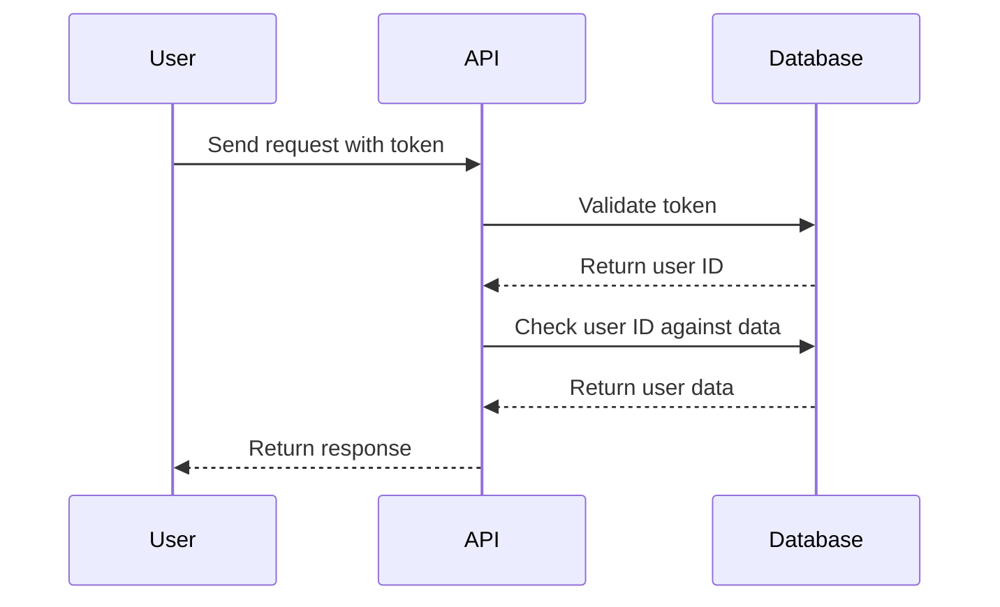
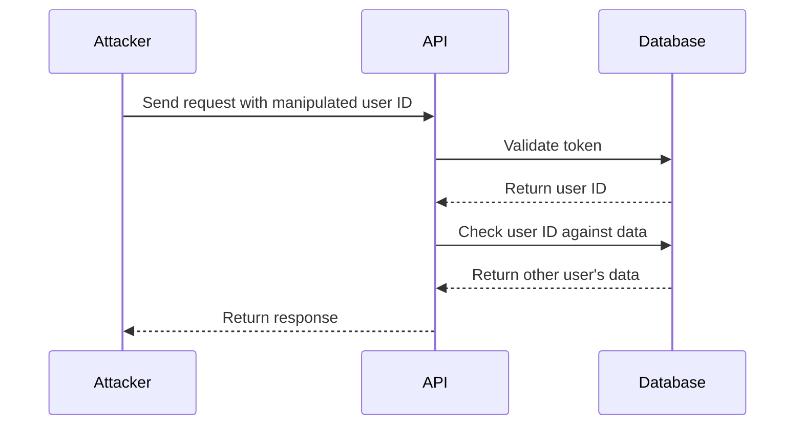

## Introduction to Broken Object-Level Authorization (BOLA)

Broken Object-Level Authorization (BOLA) is a critical security issue that arises when an application fails to properly restrict access to resources based on the user's identity or role. In essence, BOLA vulnerabilities allow unauthorized users to access sensitive data or perform actions that should be restricted to specific roles or identities. This chapter will delve deeply into the concept of BOLA, its implications, and how to effectively prevent and defend against such vulnerabilities.

### Background Theory

To understand BOLA, it's essential to first grasp the concept of authorization in web applications. Authorization is the process of determining whether a user is allowed to access a particular resource or perform a specific action. Typically, this involves checking the user's identity and role against predefined rules or policies.

In a well-designed system, authorization should be enforced at both the application level and the object level. Application-level authorization ensures that a user can only access certain parts of the application based on their role. Object-level authorization, on the other hand, ensures that a user can only access specific instances of objects based on their identity or role.

#### Example Scenario

Consider a banking application where users can view their account details. A typical scenario might involve the following:

- **User Identity**: Each user has a unique identifier (e.g., `user_id`).
- **Resource Access**: Users should only be able to view their own account details, not those of other users.

If the application fails to enforce proper object-level authorization, a malicious user could potentially access other users' account details by manipulating the request parameters.

### Real-World Examples

Recent real-world examples of BOLA vulnerabilities include:

- **CVE-2021-38647**: A vulnerability in the WordPress plugin "WP Simple Pay" allowed attackers to access sensitive payment information by manipulating the `order_id` parameter.
- **CVE-2022-22965**: A vulnerability in the Atlassian Jira application allowed unauthorized users to access sensitive project data by manipulating the `project_id` parameter.

These examples highlight the importance of enforcing proper object-level authorization to prevent unauthorized access to sensitive data.

### Detailed Explanation of BOLA

Let's break down the concept of BOLA using a detailed example. Consider a FastAPI application that allows users to view their email addresses. The application uses a bearer token for authentication and expects the `Authorization` header to contain the token.

#### Example Code

Here is a simplified version of the FastAPI application:

```python
from fastapi import FastAPI, Depends, HTTPException, status
from pydantic import BaseModel
from typing import List

app = FastAPI()

class User(BaseModel):
    id: int
    email: str

users = [
    {"id": 1, "email": "user1@example.com"},
    {"id": 2, "email": "user2@example.com"}
]

def get_current_user(token: str = Depends(oauth2_scheme)):
    # Simulate token validation
    if token == "valid_token":
        return {"id": 1}
    raise HTTPException(status_code=status.HTTP_401_UNAUTHORIZED, detail="Invalid token")

@app.get("/users/me")
async def read_users_me(current_user: dict = Depends(get_current_user)):
    user_id = current_user["id"]
    for user in users:
        if user["id"] == user_id:
            return user
    raise HTTPException(status_code=404, detail="User not found")
```

#### Explanation

1. **Token Validation**: The `get_current_user` function simulates token validation. If the token is valid, it returns the user's ID; otherwise, it raises an `HTTPException`.
2. **Endpoint**: The `/users/me` endpoint retrieves the current user's email address based on the user's ID obtained from the token.
3. **Object-Level Authorization**: The application checks if the user's ID matches the ID in the `users` list. If a match is found, it returns the user's email address; otherwise, it raises a `404` error.

### Pitfalls and Common Mistakes

Despite the seemingly straightforward implementation, several pitfalls can lead to BOLA vulnerabilities:

1. **Insufficient Token Validation**: If the token validation logic is weak or bypassable, an attacker can craft a valid-looking token to gain unauthorized access.
2. **Missing Object-Level Checks**: If the application fails to check the user's ID against the actual user data, an attacker can manipulate the request parameters to access other users' data.
3. **Inconsistent Authorization Logic**: If different parts of the application enforce authorization differently, it can lead to inconsistent and insecure behavior.

### Real-World Exploit Example

Consider a scenario where an attacker discovers a BOLA vulnerability in a FastAPI application. The attacker can exploit this vulnerability by manipulating the `user_id` parameter to access other users' data.

#### Exploit Steps

1. **Identify the Vulnerability**: The attacker identifies that the `/users/me` endpoint does not properly validate the `user_id` parameter.
2. **Craft the Request**: The attacker crafts a request with a manipulated `user_id` parameter to access another user's data.
3. **Execute the Attack**: The attacker sends the crafted request to the server and retrieves the sensitive data.

#### Example HTTP Request

```http
GET /users/me HTTP/1.1
Host: example.com
Authorization: Bearer valid_token
User-Agent: Mozilla/5.0
Accept: */*
```

#### Example HTTP Response

```http
HTTP/1.1 200 OK
Date: Mon, 20 Mar 2023 12:00:00 GMT
Content-Type: application/json
Content-Length: 37

{"id": 2, "email": "user2@example.com"}
```

### How to Prevent / Defend Against BOLA

Preventing and defending against BOLA vulnerabilities requires a combination of proper design, implementation, and testing practices.

#### Secure Coding Practices

1. **Strong Token Validation**: Ensure that the token validation logic is robust and cannot be bypassed. Use strong cryptographic algorithms and secure storage mechanisms.
2. **Consistent Authorization Logic**: Enforce consistent authorization logic across all parts of the application. Ensure that every endpoint checks the user's identity and role before granting access to resources.
3. **Input Validation**: Validate all input parameters to ensure they are within expected ranges and formats. Use parameterized queries and input sanitization techniques to prevent injection attacks.

#### Example Secure Code

Here is an example of secure code that enforces proper object-level authorization:

```python
from fastapi import FastAPI, Depends, HTTPException, status
from pydantic import BaseModel
from typing import List

app = FastAPI()

class User(BaseModel):
    id: int
    email: str

users = [
    {"id": 1, "email": "user1@example.com"},
    {"id": 2, "email": "user2@example.com"}
]

def get_current_user(token: str = Depends(oauth2_scheme)):
    # Simulate token validation
    if token == "valid_token":
        return {"id": 1}
    raise HTTPException(status_code=status.HTTP_401_UNAUTHORIZED, detail="Invalid token")

@app.get("/users/me")
async def read_users_me(current_user: dict = Depends(get_current_user)):
    user_id = current_user["id"]
    for user in users:
        if user["id"] == user_id:
            return user
    raise HTTPException(status_code=404, detail="User not found")
```

#### Detection and Prevention Techniques

1. **Static Analysis Tools**: Use static analysis tools like SonarQube, Bandit, or ESLint to identify potential BOLA vulnerabilities in the codebase.
2. **Dynamic Analysis Tools**: Use dynamic analysis tools like Burp Suite, OWASP ZAP, or OWASP Dependency-Check to test the application for runtime vulnerabilities.
3. **Penetration Testing**: Conduct regular penetration testing to simulate real-world attacks and identify potential BOLA vulnerabilities.

### Mermaid Diagrams

#### Authorization Flow Diagram



#### Attack Chain Diagram



### Hands-On Labs

For hands-on practice with BOLA vulnerabilities, consider the following labs:

- **PortSwigger Web Security Academy**: Offers interactive labs on various web security topics, including BOLA.
- **OWASP Juice Shop**: A deliberately insecure web application for practicing web security skills.
- **DVWA (Damn Vulnerable Web Application)**: A PHP/MySQL web application that contains numerous security vulnerabilities.

### Conclusion

Broken Object-Level Authorization (BOLA) is a serious security issue that can lead to unauthorized access to sensitive data. By understanding the underlying concepts, identifying common pitfalls, and implementing secure coding practices, developers can effectively prevent and defend against BOLA vulnerabilities. Regular testing and penetration testing are crucial to ensuring the security of web applications.

---

This expanded chapter provides a comprehensive overview of BOLA, covering the theoretical background, real-world examples, detailed explanations, and practical steps to prevent and defend against such vulnerabilities.

---
<!-- nav -->
[[API Security/06-Broken Object Level Authorization issues/04-BOLA Demonstration/01-Introduction to Broken Object Level Authorization (BOLA)|Introduction to Broken Object Level Authorization (BOLA)]] | [[API Security/06-Broken Object Level Authorization issues/04-BOLA Demonstration/00-Overview|Overview]] | [[API Security/06-Broken Object Level Authorization issues/04-BOLA Demonstration/03-Practice Questions & Answers|Practice Questions & Answers]]
