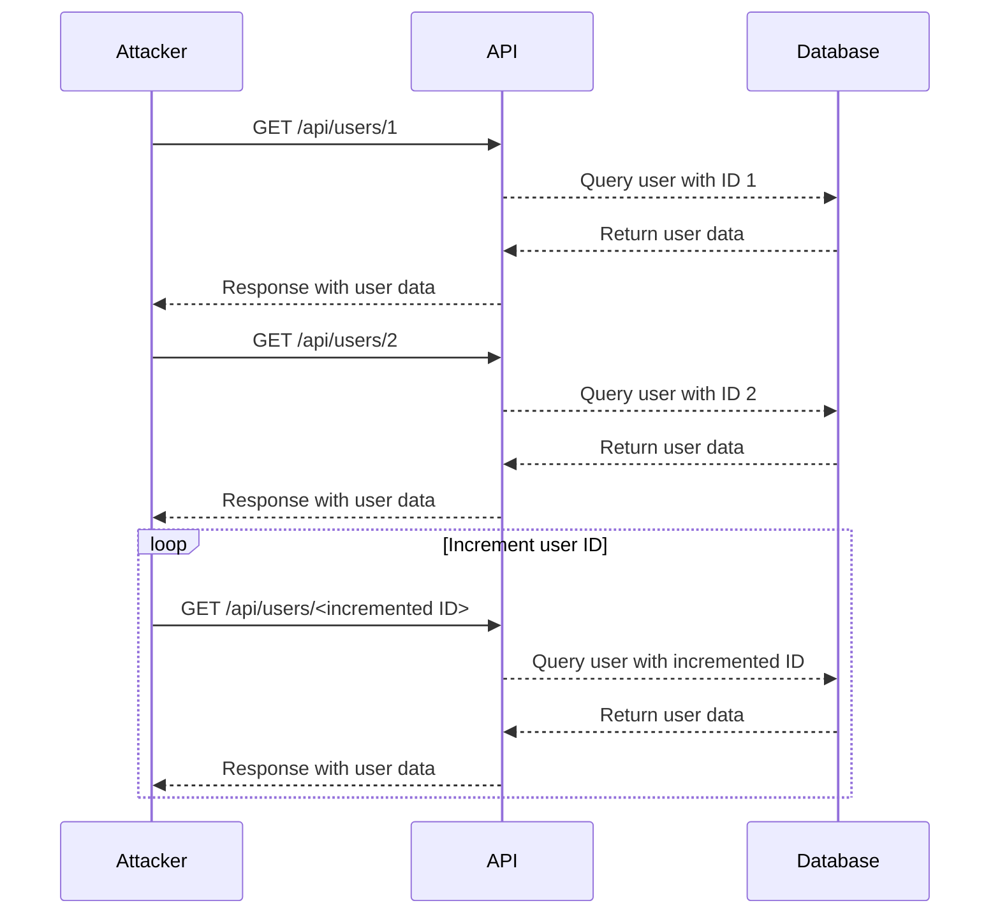

## Broken Object Level Authorization (BOLA) User Enumeration Through Object IDs

### Introduction to Broken Object Level Authorization (BOLA)

Broken Object Level Authorization (BOLA) is a critical security issue that arises when an application fails to properly restrict access to objects based on the user's permissions. In other words, a user should only be able to access objects that they are authorized to interact with. However, in the case of BOLA, unauthorized users can access sensitive data by manipulating object identifiers (IDs).

This vulnerability can lead to significant security risks, including unauthorized data access, user enumeration, and potentially more severe attacks such as privilege escalation. Understanding and mitigating BOLA is crucial for securing APIs and web applications.

### Background Theory

To understand BOLA, it's essential to delve into the concepts of authorization and object-level access control.

#### Authorization

Authorization is the process of determining whether a user is allowed to perform a specific action within an application. This typically involves checking the user's role and permissions against the resource they are attempting to access.

#### Object-Level Access Control

Object-level access control refers to the practice of restricting access to individual objects (such as records in a database) based on the user's permissions. This ensures that even if a user is authenticated, they can only access the objects they are authorized to interact with.

### Real-World Examples of BOLA

Recent real-world examples of BOLA vulnerabilities include:

- **CVE-2021-21972**: A BOLA vulnerability was discovered in the WordPress REST API, allowing unauthorized users to access sensitive data by manipulating object IDs.
- **CVE-2020-14882**: Another BOLA issue was found in the Atlassian Jira Software, where unauthorized users could access project details by manipulating project IDs.

These vulnerabilities highlight the importance of proper object-level access control in preventing unauthorized data access.

### Detailed Example: BOLA User Enumeration Through Object IDs

Let's explore a detailed example of how BOLA can be exploited through user enumeration using object IDs.

#### Setting Up the Environment

For this example, we will use a hypothetical API endpoint that allows users to retrieve user information based on their unique IDs. We will assume the following setup:

- **API Endpoint**: `http://labs.example.com/api/users`
- **User IDs**: Each user has a unique ID, such as `1`, `2`, `3`, etc.

#### Making Requests to the API

First, let's make a request to the API to retrieve user information.

```http
GET /api/users/1 HTTP/1.1
Host: labs.example.com
Accept: application/json
```

The response might look like this:

```http
HTTP/1.1 200 OK
Content-Type: application/json

{
  "id": 1,
  "username": "john_doe",
  "email": "john@example.com"
}
```

Now, let's try to enumerate users by incrementing the user ID.

```http
GET /api/users/2 HTTP/1.1
Host: labs.example.com
Accept: application/json
```

Response:

```http
HTTP/1.1 200 OK
Content-Type: application/json

{
  "id": 2,
  "username": "jane_smith",
  "email": "jane@example.com"
}
```

By systematically incrementing the user ID, an attacker can enumerate all users in the system.

### Mermaid Diagram: User Enumeration Attack Chain

A visual representation of the user enumeration attack chain can help illustrate the process:



### Pitfalls and Common Mistakes

When implementing object-level access control, several common mistakes can lead to BOLA vulnerabilities:

1. **Insufficient Authentication**: Failing to properly authenticate users before allowing them to access objects.
2. **Weak Authorization Checks**: Not performing thorough checks to ensure that a user is authorized to access a specific object.
3. **Inconsistent Access Control**: Implementing access control inconsistently across different parts of the application.

### How to Prevent / Defend Against BOLA

#### Detection

Detecting BOLA vulnerabilities requires monitoring and analyzing access patterns to identify unauthorized access attempts. Tools such as intrusion detection systems (IDS) and security information and event management (SIEM) systems can help in detecting suspicious activity.

#### Prevention

Preventing BOLA involves implementing robust authentication and authorization mechanisms. Here are some key steps:

1. **Strong Authentication**: Ensure that users are properly authenticated before granting access to any resources.
2. **Role-Based Access Control (RBAC)**: Implement RBAC to restrict access to objects based on the user's role and permissions.
3. **Consistent Access Control**: Apply consistent access control policies across the entire application.

#### Secure Coding Fixes

Here is an example of how to implement secure coding practices to prevent BOLA:

**Vulnerable Code**

```python
@app.route('/api/users/<int:user_id>', methods=['GET'])
def get_user(user_id):
    user = User.query.get(user_id)
    return jsonify(user.to_dict())
```

**Secure Code**

```python
from flask import abort

@app.route('/api/users/<int:user_id>', methods=['GET'])
@login_required
def get_user(user_id):
    current_user = get_current_user()
    user = User.query.get(user_id)
    
    if user and user.id == current_user.id:
        return jsonify(user.to_dict())
    else:
        abort(403)
```

In the secure code, we check if the current user is authorized to access the requested user object. If not, we return a `403 Forbidden` error.

### Configuration Hardening

Hardening the application configuration can also help mitigate BOLA vulnerabilities. For example, in an Nginx server, you can configure access control using the `allow` and `deny` directives:

**Nginx Configuration**

```nginx
server {
    listen 80;
    server_name example.com;

    location /api/users/ {
        allow 192.168.1.0/24;  # Allow access from trusted IP range
        deny all;              # Deny access from all other IPs
    }
}
```

### Hands-On Labs

To practice and reinforce your understanding of BOLA, consider the following hands-on labs:

- **PortSwigger Web Security Academy**: Offers interactive labs on broken object level authorization.
- **OWASP Juice Shop**: Provides a vulnerable web application for practicing various security vulnerabilities, including BOLA.
- **DVWA (Damn Vulnerable Web Application)**: A deliberately insecure web application for practicing penetration testing and security assessments.

### Conclusion

Understanding and mitigating BOLA is crucial for securing APIs and web applications. By implementing strong authentication, role-based access control, and consistent access control policies, you can prevent unauthorized access to sensitive data. Regularly monitoring and analyzing access patterns can help detect and respond to potential BOLA attacks.

---
<!-- nav -->
[[API Security/06-Broken Object Level Authorization issues/05-BOLA User Enumeration Through Object IDs Part 2/00-Overview|Overview]] | [[02-Understanding Broken Object-Level Authorization (BOLA)|Understanding Broken Object-Level Authorization (BOLA)]]
