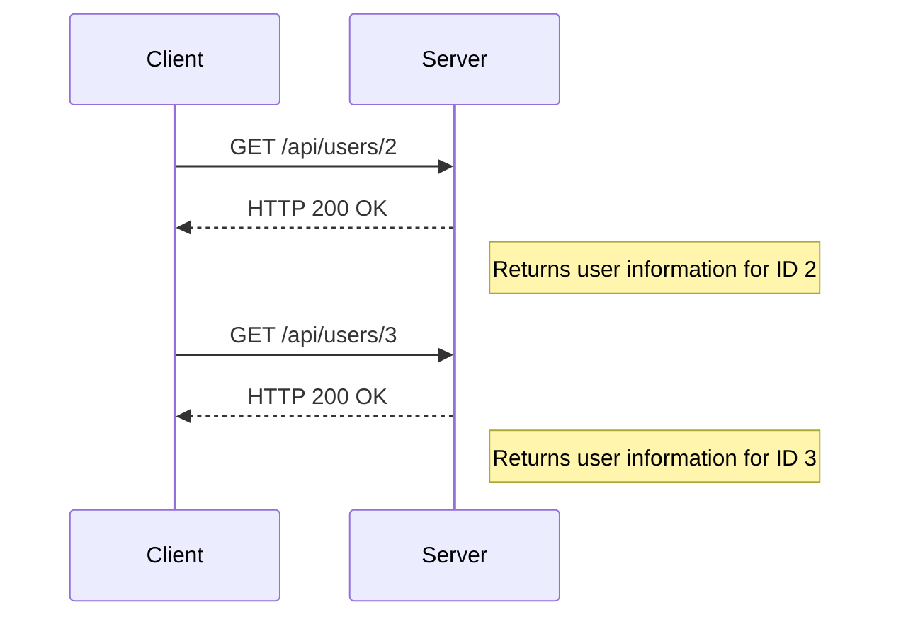

## Understanding Broken Object-Level Authorization (BOLA)

Broken Object-Level Authorization (BOLA) is a critical security issue that arises when an application fails to properly restrict access to sensitive objects based on the user's privileges. This vulnerability allows unauthorized users to access or manipulate objects that should be restricted to specific roles or users. In the context of web applications, these objects could be database records, files, or any other resource managed by the application.

### What is BOLA?

BOLA occurs when an application does not enforce proper authorization checks at the object level. Typically, an application might verify that a user is authenticated and authorized to perform certain actions, but it may fail to ensure that the user is also authorized to access specific objects. This oversight can lead to scenarios where an attacker can enumerate or access objects that belong to other users.

### Why Does BOLA Matter?

BOLA is significant because it can lead to data exposure, privilege escalation, and other serious security breaches. For instance, if an attacker can enumerate user IDs and access their corresponding objects, they can potentially steal sensitive information or manipulate data in ways that compromise the integrity of the system.

### How Does BOLA Work Under the Hood?

To understand BOLA, consider a typical scenario where an application exposes resources via API endpoints. Each resource is identified by a unique identifier, such as a user ID. If the application does not properly validate whether the requesting user is authorized to access a particular user ID, an attacker can exploit this to gain unauthorized access.

#### Example Scenario

Imagine an application with an endpoint `/api/users/{userId}`. An attacker can attempt to access different user IDs by manipulating the `userId` parameter. If the application does not enforce proper authorization checks, the attacker can successfully retrieve data for any user ID they specify.

### Real-World Examples of BOLA

Several real-world vulnerabilities have been reported due to BOLA. One notable example is the case of a popular social media platform that allowed attackers to enumerate user IDs and access private profiles. This vulnerability was exploited to steal sensitive personal information from millions of users.

Another example is a recent CVE (Common Vulnerabilities and Exposures) entry related to a financial application that allowed unauthorized access to user accounts. The application did not properly validate user permissions, leading to a situation where an attacker could access any user's account details.

### Detailed Analysis of the Lecture Chunk

Let's delve into the specific scenario described in the lecture chunk. The scenario involves an API endpoint that accepts a `user_id` parameter and returns information about the specified user. The goal is to determine whether the API properly enforces authorization checks.

#### Step-by-Step Mechanics

1. **Identify the Endpoint**: The endpoint in question is `/api/users/{userId}`.
2. **Test Different User IDs**: The lecturer attempts to access different user IDs by manipulating the `userId` parameter.
3. **Observe Responses**: The lecturer observes the responses to determine whether the API properly enforces authorization checks.



### Full HTTP Request and Response

Let's examine a complete HTTP request and response for accessing a user ID:

#### Request

```http
GET /api/users/2 HTTP/1.1
Host: example.com
Authorization: Bearer <access_token>
```

#### Response

```http
HTTP/1.1 200 OK
Content-Type: application/json
Cache-Control: no-cache
Pragma: no-cache

{
    "id": 2,
    "username": "john_doe",
    "email": "john@example.com"
}
```

### Common Pitfalls and Mistakes

One common mistake is assuming that authentication alone is sufficient to protect against unauthorized access. Authentication verifies that a user is who they claim to be, but it does not necessarily ensure that the user is authorized to access specific resources. Proper authorization checks must be implemented to prevent BOLA.

### How to Prevent / Defend Against BOLA

#### Detection

To detect BOLA, you can perform automated scans using tools like Burp Suite, OWASP ZAP, or custom scripts that test various user IDs and observe the responses. Look for patterns where unauthorized access is possible.

#### Prevention

1. **Implement Proper Authorization Checks**: Ensure that the application enforces authorization checks at the object level. This means verifying that the requesting user is authorized to access the specific object they are attempting to access.
2. **Use Role-Based Access Control (RBAC)**: Implement RBAC to define and enforce roles and permissions. This ensures that users can only access objects that are within their assigned roles.
3. **Audit Logs**: Maintain detailed audit logs to track access attempts and identify any unauthorized access patterns.

#### Secure Coding Fixes

Here’s an example of how to implement proper authorization checks in a Python Flask application:

##### Vulnerable Code

```python
from flask import Flask, request

app = Flask(__name__)

@app.route('/api/users/<int:user_id>', methods=['GET'])
def get_user(user_id):
    # Vulnerable code: No authorization check
    return {"id": user_id, "username": "john_doe", "email": "john@example.com"}
```

##### Secure Code

```python
from flask import Flask, request

app = Flask(__name__)

# Mock user data
users = {
    1: {"id": 1, "username": "alice", "email": "alice@example.com"},
    2: {"id": 2, "username": "bob", "email": "bob@example.com"}
}

# Mock current user
current_user = {"id": 1, "role": "admin"}

@app.route('/api/users/<int:user_id>', methods=['GET'])
def get_user(user_id):
    if current_user['role'] == 'admin' or current_user['id'] == user_id:
        return users[user_id]
    else:
        return {"error": "Unauthorized"}, 403
```

### Configuration Hardening

Ensure that your application server and API gateway configurations enforce strict access controls. For example, in an Nginx configuration, you can set up rules to deny access to unauthorized users:

```nginx
server {
    listen 80;
    server_name example.com;

    location /api/users/ {
        if ($arg_user_id != $cookie_user_id) {
            return 403;
        }
        proxy_pass http://backend;
    }
}
```

### Hands-On Labs

For hands-on practice, consider using the following labs:

- **PortSwigger Web Security Academy**: Offers interactive labs to practice identifying and exploiting BOLA vulnerabilities.
- **OWASP Juice Shop**: A deliberately insecure web application for practicing web security skills, including BOLA.
- **DVWA (Damn Vulnerable Web Application)**: Provides a variety of web application vulnerabilities, including BOLA, for educational purposes.

By thoroughly understanding and implementing the preventive measures outlined above, you can significantly reduce the risk of BOLA vulnerabilities in your applications.

---
<!-- nav -->
[[01-Broken Object Level Authorization (BOLA) User Enumeration Through Object IDs|Broken Object Level Authorization (BOLA) User Enumeration Through Object IDs]] | [[API Security/06-Broken Object Level Authorization issues/05-BOLA User Enumeration Through Object IDs Part 2/00-Overview|Overview]] | [[API Security/06-Broken Object Level Authorization issues/05-BOLA User Enumeration Through Object IDs Part 2/03-Practice Questions & Answers|Practice Questions & Answers]]
