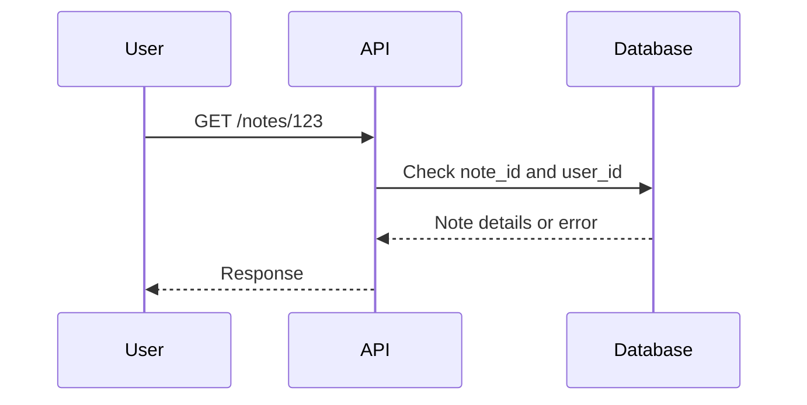

## Introduction to Broken Object Level Authorization (BOLA)

Broken Object Level Authorization (BOLA) is a critical security issue in APIs where the authorization checks are insufficient to prevent unauthorized access to sensitive resources. This often leads to scenarios where an attacker can enumerate objects or access data they should not be able to. In this chapter, we will delve deep into one specific aspect of BOLA: user enumeration through object IDs.

### Background Theory

APIs are designed to provide a structured interface for applications to interact with each other. They typically expose endpoints that allow clients to perform operations such as creating, reading, updating, and deleting (CRUD) resources. Each resource is uniquely identified by an identifier, often referred to as an object ID.

In a properly secured API, each operation should be authorized based on the identity and permissions of the user making the request. However, if the authorization logic is flawed, an attacker might be able to bypass these checks and gain unauthorized access to sensitive data.

### User Enumeration Through Object IDs

User enumeration occurs when an attacker can determine the existence of a user account by probing the API with various inputs. One common method is through object IDs. If the API does not properly validate whether a user has permission to access a particular object, an attacker can iterate through a range of object IDs and observe the responses to infer which IDs correspond to valid user accounts.

#### Example Scenario

Consider an API that allows users to retrieve their notes. Each note is associated with a unique `note_id`. The API endpoint `/notes/{note_id}` returns the note details if the requesting user has permission to view it.

```http
GET /notes/123 HTTP/1.1
Host: api.example.com
Authorization: Bearer <access_token>
```

If the API does not enforce proper authorization checks, an attacker could iterate through a range of `note_id` values and observe the responses to determine which IDs correspond to valid notes.

### Real-World Examples

Recent vulnerabilities related to BOLA and user enumeration include:

- **CVE-2021-21972**: A vulnerability in the WordPress REST API allowed attackers to enumerate user IDs and potentially gain unauthorized access to user data.
- **CVE-2022-22965**: A flaw in the Microsoft Exchange Server allowed attackers to enumerate mailbox IDs and potentially access sensitive email data.

These examples highlight the importance of robust authorization mechanisms in APIs to prevent such attacks.

### Detailed Mechanics

Let's break down the mechanics of how user enumeration through object IDs can occur and how to prevent it.

#### Step-by-Step Mechanics

1. **API Endpoint Definition**:
   - Define the API endpoint that allows users to retrieve their notes.
   - Ensure that the endpoint enforces proper authorization checks.

2. **Authorization Logic**:
   - Implement authorization logic that verifies whether the requesting user has permission to access the specified `note_id`.
   - Use role-based access control (RBAC) or attribute-based access control (ABAC) to enforce fine-grained access controls.

3. **Error Handling**:
   - Properly handle errors to avoid leaking information about the existence of objects.
   - Return consistent error messages regardless of whether the requested object exists or the user has permission to access it.

#### Code Example

Here is a simplified example of how an API endpoint might be implemented in Python using Flask:

```python
from flask import Flask, jsonify, request
from flask_jwt_extended import jwt_required, get_jwt_identity

app = Flask(__name__)

# Sample data structure
notes = {
    1: {"id": 1, "title": "Note 1", "content": "This is note 1", "user_id": 1},
    2: {"id": 2, "title": "Note 2", "content": "This is note 2", "user_id": 2}
}

@app.route('/notes/<int:note_id>', methods=['GET'])
@jwt_required()
def get_note(note_id):
    current_user_id = get_jwt_identity()
    
    if note_id in notes and notes[note_id]['user_id'] == current_user_id:
        return jsonify(notes[note_id])
    else:
        return jsonify({"error": "Note not found"}), 404

if __name__ == '__main__':
    app.run(debug=True)
```

### Mermaid Diagrams

#### API Request Flow



### Pitfalls and Common Mistakes

1. **Insufficient Authorization Checks**:
   - Failing to verify whether the requesting user has permission to access the specified object.
   
2. **Leaking Information Through Error Messages**:
   - Returning different error messages depending on whether the requested object exists or the user has permission to access it.
   
3. **Inconsistent Error Handling**:
   - Not handling errors consistently across different scenarios, leading to potential information leakage.

### How to Prevent / Defend

#### Detection

1. **Logging and Monitoring**:
   - Implement logging and monitoring to detect unusual patterns of requests, such as iterating through a range of object IDs.
   
2. **Rate Limiting**:
   - Implement rate limiting to prevent brute-force attacks.

#### Prevention

1. **Robust Authorization Logic**:
   - Enforce proper authorization checks to ensure that users can only access objects they are permitted to.
   
2. **Consistent Error Handling**:
   - Return consistent error messages regardless of whether the requested object exists or the user has permission to access it.
   
3. **Role-Based Access Control (RBAC)**:
   - Use RBAC to enforce fine-grained access controls based on user roles and permissions.

#### Secure Coding Fixes

Here is an example of how to implement secure coding practices to prevent user enumeration through object IDs:

```python
from flask import Flask, jsonify, request
from flask_jwt_extended import jwt_required, get_jwt_identity

app = Flask(__name__)

# Sample data structure
notes = {
    1: {"id": 1, "title": "Note 1", "content": "This is note 1", "user_id": 1},
    2: {"id": 2, "title": "Note 2", "content": "This is note 2", "user_id": 2}
}

@app.route('/notes/<int:note_id>', methods=['GET'])
@jwt_required()
def get_note(note_id):
    current_user_id = get_jwt_identity()
    
    if note_id in notes and notes[note_id]['user_id'] == current_user_id:
        return jsonify(notes[note_id])
    else:
        return jsonify({"error": "Note not found"}), 404

if __name__ == '__main__':
    app.run(debug=True)
```

#### Vulnerable vs. Secure Code

**Vulnerable Code**:

```python
@app.route('/notes/<int:note_id>', methods=['GET'])
@jwt_required()
def get_note(note_id):
    if note_id in notes:
        return jsonify(notes[note_id])
    else:
        return jsonify({"error": "Note not found"}), 404
```

**Secure Code**:

```python
@app.route('/notes/<int:note_id>', methods=['GET'])
@jwt_required()
def get_note(note_id):
    current_user_id = get_jwt_identity()
    
    if note_id in notes and notes[note_id]['user_id'] == current_user_id:
        return jsonify(notes[note_id])
    else:
        return jsonify({"error": "Note not found"}), 404
```

### Configuration Hardening

1. **Enable Rate Limiting**:
   - Configure rate limiting to prevent brute-force attacks.
   
2. **Implement Logging and Monitoring**:
   - Set up logging and monitoring to detect unusual patterns of requests.

### Hands-On Labs

For practical experience with API security, consider the following labs:

- **PortSwigger Web Security Academy**: Offers interactive labs on API security, including broken object level authorization.
- **OWASP Juice Shop**: Provides a vulnerable web application for practicing various security techniques, including API security.
- **DVWA (Damn Vulnerable Web Application)**: Another vulnerable web application for practicing security techniques.

By thoroughly understanding and implementing the principles discussed in this chapter, you can significantly enhance the security of your APIs and protect against user enumeration through object IDs.

---
<!-- nav -->
[[API Security/06-Broken Object Level Authorization issues/06-BOLA User Enumeration Through Object IDs/00-Overview|Overview]] | [[API Security/06-Broken Object Level Authorization issues/06-BOLA User Enumeration Through Object IDs/02-Introduction to Broken Object-Level Authorization (BOLA)|Introduction to Broken Object-Level Authorization (BOLA)]]
