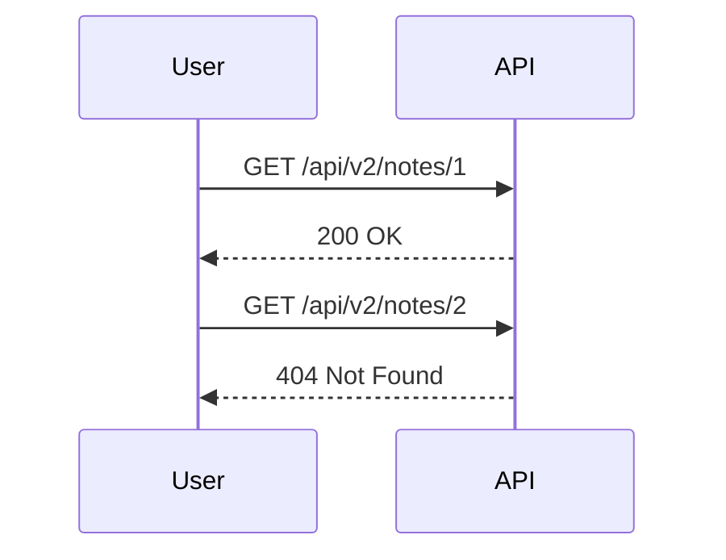

## Introduction to Broken Object-Level Authorization (BOLA)

Broken Object-Level Authorization (BOLA) is a critical security issue that arises when an application fails to properly restrict access to objects based on the user's permissions. This can lead to unauthorized access to sensitive data, deletion of important records, and other malicious activities. In this chapter, we will delve deep into one specific aspect of BOLA: user enumeration through object IDs.

### What is User Enumeration?

User enumeration occurs when an attacker can determine whether a given username or user ID exists within the system. This can be achieved through various means, such as observing differences in error messages, response times, or the presence of certain data fields. In the context of BOLA, user enumeration often happens through the manipulation of object IDs.

### Why Does User Enumeration Matter?

User enumeration is a significant security concern because it can be used as a stepping stone for more sophisticated attacks. Once an attacker knows which user IDs exist, they can attempt to guess passwords, perform brute-force attacks, or even craft targeted phishing campaigns. This makes user enumeration a crucial vector for initial compromise in many security breaches.

### How Does User Enumeration Through Object IDs Work?

In the scenario described in the lecture, the application exposes an API endpoint that allows users to retrieve and manipulate notes based on their unique IDs. If the application does not properly enforce authorization checks, an attacker can enumerate valid user IDs and potentially access or modify data belonging to other users.

### Background Theory

To understand BOLA and user enumeration, it's essential to grasp the underlying principles of authorization and authentication in web applications.

#### Authentication vs. Authorization

- **Authentication**: The process of verifying the identity of a user. Common methods include username/password combinations, multi-factor authentication (MFA), and OAuth tokens.
- **Authorization**: The process of determining what actions a user is permitted to perform once authenticated. This typically involves checking the user's role, permissions, and access controls.

#### Role-Based Access Control (RBAC)

RBAC is a widely used authorization model where permissions are assigned to roles, and roles are assigned to users. This allows for granular control over what actions different types of users can perform.

### Real-World Examples

Recent vulnerabilities and breaches have highlighted the importance of proper authorization controls. Here are a few notable examples:

- **CVE-2021-21972**: A vulnerability in the WordPress REST API allowed unauthenticated users to enumerate user IDs and gain unauthorized access to posts and comments.
- **CVE-2020-14182**: A flaw in the Atlassian Jira Software allowed attackers to enumerate user IDs and access sensitive project data.

### Complete Example: User Enumeration Through Object IDs

Let's walk through a detailed example using the scenario described in the lecture.

#### API Endpoint Description

The application exposes an API endpoint `/api/v2/notes/{id}` that allows users to retrieve and delete notes based on their unique IDs.



#### Raw HTTP Requests and Responses

Here are the full HTTP requests and responses for retrieving notes with different IDs:

**Request for ID 1:**

```http
GET /api/v2/notes/1 HTTP/1.1
Host: example.com
Authorization: Bearer <access_token>
```

**Response for ID 1:**

```http
HTTP/1.1 200 OK
Content-Type: application/json
Cache-Control: no-cache
Pragma: no-cache

{
    "id": 1,
    "name": "test",
    "body": "This is a test note.",
    "user_id": 1
}
```

**Request for ID 2:**

```http
GET /api/v2/notes/2 HTTP/1.1
Host: example.com
Authorization: Bearer <access_token>
```

**Response for ID 2:**

```http
HTTP/1.1 404 Not Found
Content-Type: application/json
Cache-Control: no-cache
Pragma: no-cache

{
    "error": "Note not found"
}
```

### Pitfalls and Common Mistakes

Many developers fall into the trap of assuming that simply checking if an object exists is sufficient for authorization. However, this approach can lead to subtle vulnerabilities. Here are some common mistakes:

- **Insufficient Authorization Checks**: Failing to verify that the requesting user has the necessary permissions to access or modify the object.
- **Hardcoded Error Messages**: Using generic error messages that reveal too much information about the existence of objects.
- **Inconsistent Response Handling**: Returning different HTTP status codes or error messages based on the existence of an object, which can be exploited for enumeration.

### How to Prevent / Defend Against User Enumeration Through Object IDs

#### Detection

To detect potential user enumeration vulnerabilities, you can use automated tools and manual testing techniques:

- **Automated Tools**: Tools like Burp Suite, OWASP ZAP, and WAPT can help identify inconsistencies in error messages and response times.
- **Manual Testing**: Manually test the API endpoints with a range of object IDs and observe the responses for patterns that indicate enumeration.

#### Prevention

To prevent user enumeration through object IDs, follow these best practices:

- **Strict Authorization Checks**: Ensure that every request to access or modify an object is accompanied by a strict authorization check. Verify that the requesting user has the necessary permissions.
- **Consistent Error Handling**: Return consistent error messages and HTTP status codes regardless of whether the requested object exists. For example, return a generic "Access denied" message for both non-existent and existing objects.
- **Rate Limiting**: Implement rate limiting to prevent attackers from making rapid requests to enumerate object IDs.

#### Secure Coding Fixes

Here is an example of how to implement these best practices in code:

**Vulnerable Code:**

```python
@app.route('/api/v2/notes/<int:id>', methods=['GET'])
def get_note(id):
    note = Note.query.get(id)
    if note:
        return jsonify(note.to_dict())
    else:
        return jsonify({"error": "Note not found"}), 404
```

**Secure Code:**

```python
@app.route('/api/v2/notes/<int:id>', methods=['GET'])
@login_required
def get_note(id):
    note = Note.query.filter_by(id=id, user_id=current_user.id).first()
    if note:
        return jsonify(note.to_dict())
    else:
        return jsonify({"error": "Access denied"}), 403
```

### Complete Example: Deleting Notes

Similarly, the application should enforce strict authorization checks when deleting notes:

**Vulnerable Code:**

```python
@app.route('/api/v2/notes/<int:id>', methods=['DELETE'])
def delete_note(id):
    note = Note.query.get(id)
    if note:
        db.session.delete(note)
        db.session.commit()
        return jsonify({"message": "Note deleted"})
    else:
        return jsonify({"error": "Note not found"}), 404
```

**Secure Code:**

```python
@app.route('/api/v2/notes/<int:id>', methods=['DELETE'])
@login_required
def delete_note(id):
    note = Note.query.filter_by(id=id, user_id=current_user.id).first()
    if note:
        db.session.delete(note)
        db.session.commit()
        return jsonify({"message": "Note deleted"})
    else:
        return jsonify({"error": "Access denied"}), 403
```

### Conclusion

Properly handling authorization and preventing user enumeration through object IDs is crucial for maintaining the security of web applications. By implementing strict authorization checks, consistent error handling, and rate limiting, you can significantly reduce the risk of such vulnerabilities. Always remember to test your application thoroughly and use automated tools to detect potential issues.

### Hands-On Labs

For practical experience with API security and BOLA, consider the following labs:

- **PortSwigger Web Security Academy**: Offers interactive labs on API security, including user enumeration and broken object-level authorization.
- **OWASP Juice Shop**: A deliberately insecure web application for practicing web security skills, including API security.
- **DVWA (Damn Vulnerable Web Application)**: Another popular web application for learning and testing web security concepts.

By engaging with these labs, you can gain hands-on experience and deepen your understanding of API security and BOLA.

---
<!-- nav -->
[[API Security/06-Broken Object Level Authorization issues/06-BOLA User Enumeration Through Object IDs/01-Introduction to Broken Object Level Authorization (BOLA)|Introduction to Broken Object Level Authorization (BOLA)]] | [[API Security/06-Broken Object Level Authorization issues/06-BOLA User Enumeration Through Object IDs/00-Overview|Overview]] | [[03-Understanding Broken Object-Level Authorization (BOLA)|Understanding Broken Object-Level Authorization (BOLA)]]
