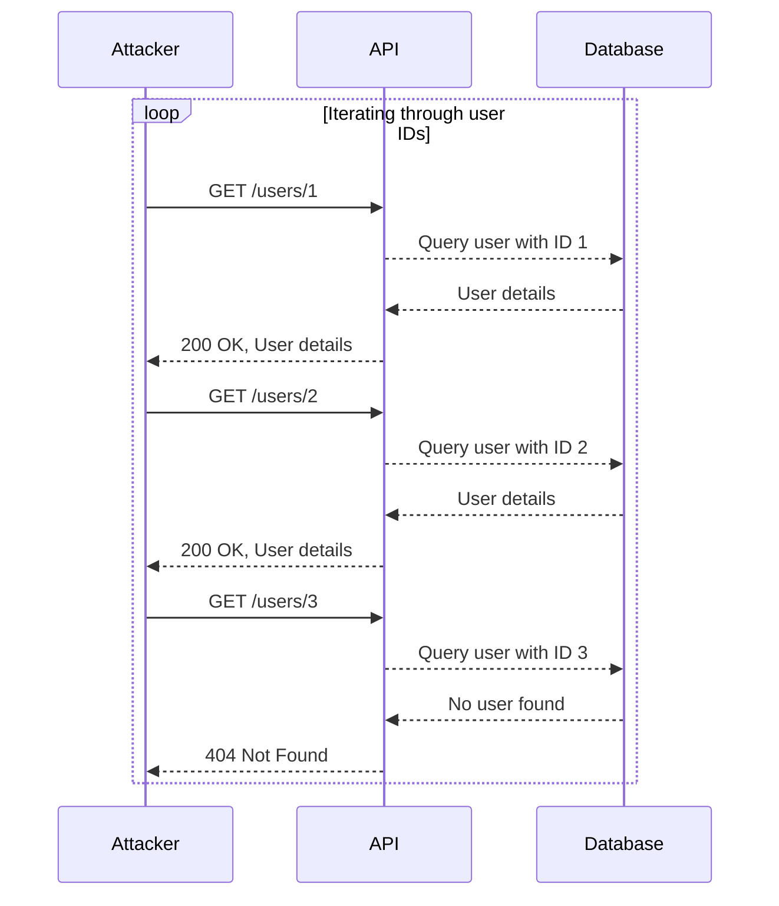

## Understanding Broken Object-Level Authorization (BOLA)

Broken Object-Level Authorization (BOLA) is a critical security issue that arises when an application fails to properly restrict access to specific objects based on user permissions. This vulnerability allows unauthorized users to access sensitive data or perform actions they should not be able to. One common manifestation of BOLA is through user enumeration via object IDs.

### What is User Enumeration?

User enumeration occurs when an attacker can determine whether a given username or user ID exists within the system. This can be achieved through various means, such as observing differences in error messages, response times, or HTTP status codes. In the context of BOLA, an attacker might use object IDs to enumerate users.

### How Does User Enumeration Through Object IDs Work?

When an application exposes unique identifiers (such as user IDs) and does not enforce proper authorization checks, an attacker can systematically test these IDs to discover valid ones. This process can reveal the existence of legitimate user accounts, which can then be targeted for further attacks, such as brute-force password guessing or social engineering.

#### Example Scenario

Consider an API endpoint `/users/{userId}` that returns user details. If the application does not check whether the requesting user has permission to view the specified user's information, an attacker can iterate through possible `userId` values to identify valid ones.



In this scenario, the attacker can infer that user IDs 1 and 2 exist, while user ID 3 does not.

### Real-World Examples

Recent vulnerabilities related to BOLA and user enumeration include:

- **CVE-2021-21972**: A vulnerability in the WordPress REST API allowed attackers to enumerate user IDs and potentially gain unauthorized access to user data.
- **CVE-2022-22965**: A flaw in the Microsoft Exchange Server exposed user IDs, enabling attackers to enumerate users and potentially exploit other vulnerabilities.

These examples highlight the importance of implementing robust authorization mechanisms to prevent such attacks.

### Full HTTP Request and Response Example

Let's consider a hypothetical API endpoint `/users/{userId}` and demonstrate how an attacker might exploit BOLA through user enumeration.

#### Vulnerable Code

```python
@app.route('/users/<int:userId>', methods=['GET'])
def get_user(userId):
    user = db.query(User).filter_by(id=userId).first()
    if user:
        return jsonify(user.to_dict())
    else:
        return jsonify({"error": "User not found"}), 404
```

#### HTTP Request and Response

```http
GET /users/1 HTTP/1.1
Host: example.com
Authorization: Bearer <valid_token>

HTTP/1.1 200 OK
Content-Type: application/json
{
  "id": 1,
  "name": "Alice",
  "email": "alice@example.com"
}
```

```http
GET /users/2 HTTP/1.1
Host: example.com
Authorization: Bearer <valid_token>

HTTP/1.1 200 OK
Content-Type: application/json
{
  "id": 2,
  "name": "Bob",
  "email": "bob@example.com"
}
```

```http
GET /users/3 HTTP/1.1
Host: example.com
Authorization: Bearer <valid_token>

HTTP/1.1 404 Not Found
Content-Type: application/json
{
  "error": "User not found"
}
```

### How to Prevent / Defend Against BOLA

#### Detection

To detect BOLA vulnerabilities, you can:

1. **Review Access Control Mechanisms**: Ensure that all API endpoints properly validate user permissions before returning sensitive data.
2. **Monitor API Logs**: Look for patterns of unauthorized access attempts, such as repeated requests for non-existent user IDs.
3. **Use Security Tools**: Employ tools like Burp Suite, OWASP ZAP, or custom scripts to automate the detection of BOLA vulnerabilities.

#### Prevention

To prevent BOLA vulnerabilities, follow these best practices:

1. **Implement Proper Authorization Checks**: Always verify that the requesting user has the necessary permissions to access the requested resource.
2. **Use Role-Based Access Control (RBAC)**: Define roles and permissions to ensure that users can only access resources they are authorized to access.
3. **Return Consistent Error Messages**: Avoid leaking information through error messages. Return generic error messages for both existing and non-existing resources.

#### Secure Coding Fixes

Here is an example of how to implement proper authorization checks in Python using Flask:

```python
from flask import Flask, jsonify, request
from functools import wraps

app = Flask(__name__)

# Mock database and current user
db = {
    1: {"id": 1, "name": "Alice", "email": "alice@example.com"},
    2: {"id": 2, "name": "Bob", "email": "bob@example.com"}
}

current_user_id = 1  # Simulate current user

def requires_auth(f):
    @wraps(f)
    def decorated_function(*args, **kwargs):
        userId = kwargs.get('userId')
        if userId != current_user_id:
            return jsonify({"error": "Unauthorized"}), 403
        return f(*args, **kwargs)
    return decorated_function

@app.route('/users/<int:userId>', methods=['GET'])
@requires_auth
def get_user(userId):
    user = db.get(userId)
    if user:
        return jsonify(user)
    else:
        return jsonify({"error": "User not found"}), 404

if __name__ == '__main__':
    app.run(debug=True)
```

#### Comparison of Vulnerable and Secure Code

**Vulnerable Code**

```python
@app.route('/users/<int:userId>', methods=['GET'])
def get_user(userId):
    user = db.query(User).filter_by(id=userId).first()
    if user:
        return jsonify(user.to_dict())
    else:
        return jsonify({"error": "User not found"}), 404
```

**Secure Code**

```python
@app.route('/users/<int:userId>', methods=['GET'])
@requires_auth
def get_user(userId):
    user = db.get(userId)
    if user:
        return jsonify(user)
    else:
        return jsonify({"error": "User not found"}), 404
``

---
<!-- nav -->
[[API Security/06-Broken Object Level Authorization issues/06-BOLA User Enumeration Through Object IDs/02-Introduction to Broken Object-Level Authorization (BOLA)|Introduction to Broken Object-Level Authorization (BOLA)]] | [[API Security/06-Broken Object Level Authorization issues/06-BOLA User Enumeration Through Object IDs/00-Overview|Overview]] | [[API Security/06-Broken Object Level Authorization issues/06-BOLA User Enumeration Through Object IDs/04-Practice Questions & Answers|Practice Questions & Answers]]
