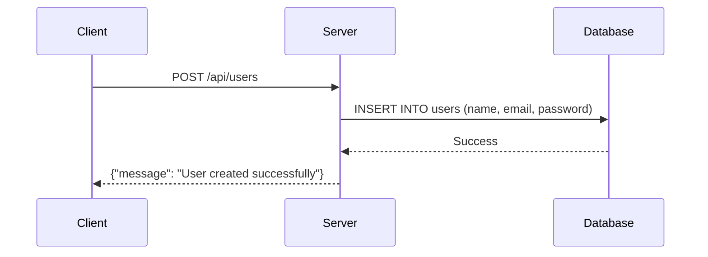
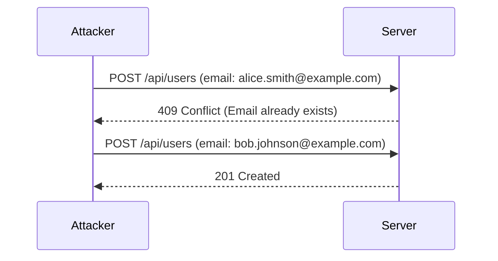

## Broken Authentication Demonstration

### Introduction to Broken Authentication

Broken authentication is a critical security issue that arises when an application fails to properly authenticate users. This can lead to unauthorized access, data breaches, and other severe security vulnerabilities. In this section, we will delve into the specifics of broken authentication, including how it manifests, its implications, and how to prevent it.

### Understanding the Scenario

In the given scenario, we are dealing with an API that allows the creation of user accounts. The process involves sending a POST request to the server with user details such as name, email, and password. However, there are several issues that arise during this process, which we will explore in detail.

#### Initial POST Request

Let's start by examining the initial POST request to create a user account:

```http
POST /api/users HTTP/1.1
Host: example.com
Content-Type: application/json

{
  "name": "John Doe",
  "email": "john.doe@example.com"
}
```

This request is missing the `password` field, which leads to an SQL error. The server responds with an error message indicating that the `password` field does not have a default value.

#### SQL Error and Default Values

The SQL error occurs because the `password` field is required but was not provided in the request. In many databases, fields can be configured to have default values, but in this case, the `password` field is mandatory and must be explicitly set.

```sql
CREATE TABLE users (
  id INT PRIMARY KEY,
  name VARCHAR(255),
  email VARCHAR(255),
  password VARCHAR(255) NOT NULL
);
```

Here, the `NOT NULL` constraint ensures that the `password` field must always have a value.

#### Correcting the Request

To resolve the issue, we need to include the `password` field in the request:

```http
POST /api/users HTTP/1.1
Host: example.com
Content-Type: application/json

{
  "name": "John Doe",
  "email": "john.doe@example.com",
  "password": "VAC"
}
```

Upon sending this corrected request, the server should respond with a success message, indicating that the user account has been created.

### User Enumeration Vulnerability

Another significant issue highlighted in the scenario is user enumeration. User enumeration occurs when an attacker can determine whether a specific username or email exists within the system by analyzing the responses from the server.

#### Example of User Enumeration

Consider the following scenario where an attacker attempts to create multiple user accounts with different email addresses:

```http
POST /api/users HTTP/1.1
Host: example.com
Content-Type: application/json

{
  "name": "Alice Smith",
  "email": "alice.smith@example.com",
  "password": "VAC"
}
```

If the email address already exists in the database, the server will return an error message indicating a constraint violation:

```http
HTTP/1.1 409 Conflict
Content-Type: application/json

{
  "error": "Email already exists"
}
```

By analyzing these responses, an attacker can determine which email addresses are valid and potentially launch further attacks.

### Real-World Examples

Several real-world breaches have been attributed to broken authentication and user enumeration vulnerabilities. One notable example is the LinkedIn breach in 2012, where attackers exploited weak authentication mechanisms to gain access to millions of user accounts.

### How to Prevent / Defend Against Broken Authentication

#### Secure Coding Practices

1. **Validate Input**: Ensure that all input fields are validated and sanitized to prevent SQL injection and other types of attacks.
2. **Use Strong Password Policies**: Implement strong password policies that require users to choose complex passwords and enforce regular password changes.
3. **Implement Rate Limiting**: Limit the number of login attempts to prevent brute-force attacks.
4. **Use Multi-Factor Authentication (MFA)**: Require users to provide additional forms of identification, such as a one-time code sent to their mobile device.

#### Database Constraints

1. **Ensure Required Fields**: Configure your database schema to ensure that all required fields have default values or are marked as `NOT NULL`.
2. **Unique Constraints**: Apply unique constraints to fields like email addresses to prevent duplicate entries.

#### Server Responses

1. **Consistent Error Messages**: Return consistent error messages regardless of whether the user exists or not. This prevents attackers from determining valid usernames or email addresses.
2. **Rate Limiting**: Implement rate limiting on login attempts to prevent brute-force attacks.

### Code Examples

#### Vulnerable Code

```python
@app.route('/api/users', methods=['POST'])
def create_user():
    data = request.get_json()
    name = data['name']
    email = data['email']
    password = data.get('password')  # Missing validation

    # Insert into database
    cursor.execute("INSERT INTO users (name, email, password) VALUES (%s, %s, %s)", (name, email, password))
    db.commit()

    return jsonify({"message": "User created successfully"})
```

#### Secure Code

```python
@app.route('/api/users', methods=['POST'])
def create_user():
    data = request.get_json()
    name = data['name']
    email = data['email']
    password = data['password']  # Ensure password is provided

    # Validate input
    if not validate_input(name, email, password):
        return jsonify({"error": "Invalid input"}), 400

    # Hash password
    hashed_password = hash_password(password)

    # Insert into database
    cursor.execute("INSERT INTO users (name, email, password) VALUES (%s, %s, %s)", (name, email, hashed_password))
    db.commit()

    return jsonify({"message": "User created successfully"})
```

### Mermaid Diagrams

#### User Creation Flow



#### User Enumeration Attack



### Practice Labs

For hands-on practice with API security, consider the following labs:

- **PortSwigger Web Security Academy**: Offers comprehensive modules on API security, including broken authentication.
- **OWASP Juice Shop**: A deliberately insecure web application for practicing web security skills.
- **DVWA (Damn Vulnerable Web Application)**: Provides various levels of security vulnerabilities, including broken authentication.

By thoroughly understanding and implementing the practices outlined above, you can significantly enhance the security of your applications and protect against broken authentication vulnerabilities.

---
<!-- nav -->
[[03-Introduction to Broken Functional Level Authorization (BFLA)|Introduction to Broken Functional Level Authorization (BFLA)]] | [[API Security/07-BFLA Issues/02-Broken Authentication Demonstration/00-Overview|Overview]] | [[API Security/07-BFLA Issues/02-Broken Authentication Demonstration/05-Practice Questions & Answers|Practice Questions & Answers]]
