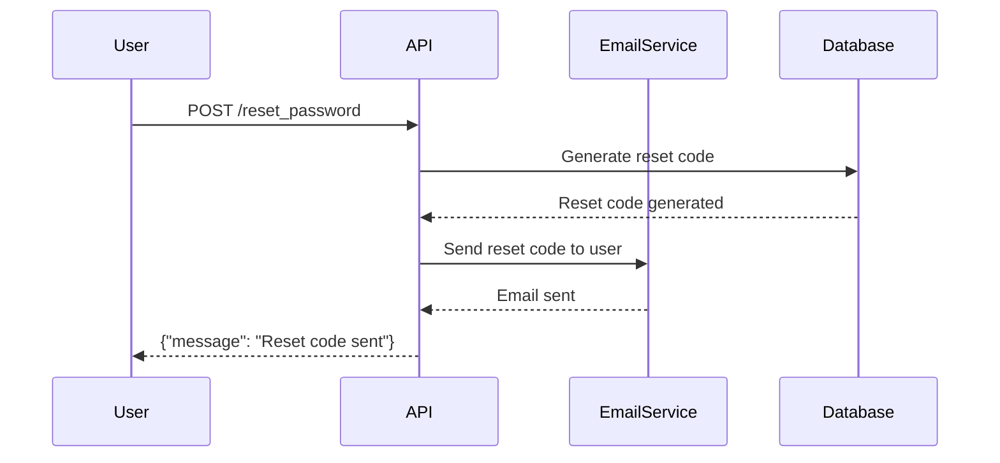

## Background Concept: Excessive Data Exposure

### Introduction to Excessive Data Exposure

Excessive data exposure is a critical security issue that occurs when an application or API returns more information than necessary in its responses. This can lead to sensitive data being exposed to unauthorized users, which can have severe consequences such as identity theft, financial loss, and reputational damage. In the context of APIs, this vulnerability often arises due to improper handling of data or insufficient validation mechanisms.

### Understanding the Vulnerability

The vulnerability described in the lecture involves an API that sends a secret reset code in the response when a user requests a password reset. This is a classic case of excessive data exposure, where sensitive information (the secret reset code) is unnecessarily included in the response. Let's break down the components involved:

1. **User Request**: The user enters their email address and triggers a password reset request.
2. **API Response**: The API generates a secret reset code and includes it in the response sent back to the client.
3. **Data Exposure**: The secret reset code is exposed in the response, potentially allowing an attacker to intercept and misuse it.

#### Real-World Example: CVE-2021-21972

A real-world example of excessive data exposure is CVE-2021-21972, which affected the WordPress REST API. In this case, the API endpoint `/wp-json/wp/v2/users` returned detailed information about all users, including their roles and capabilities, even when accessed by unauthorized users. This exposed sensitive data and allowed attackers to gather information about the site's structure and potential vulnerabilities.

### Detailed Explanation of the Vulnerability

Let's delve deeper into the mechanics of the vulnerability described in the lecture:

1. **Password Reset Mechanism**:
    - A user enters their email address and requests a password reset.
    - The system generates a secret reset code and sends it to the provided email address.
    - The API should only return a confirmation message or a generic response indicating that the reset code has been sent.

2. **Improper Handling of Data**:
    - Instead of returning a generic response, the API includes the secret reset code in the response.
    - This exposes the sensitive reset code to anyone who can intercept the response.

#### Example Code

Here is a simplified example of how this might occur in practice:

```python
@app.route('/reset_password', methods=['POST'])
def reset_password():
    email = request.json['email']
    reset_code = generate_reset_code(email)
    send_reset_code_email(email, reset_code)
    return jsonify({"message": "Reset code sent", "reset_code": reset_code})
```

In this example, the `reset_code` is included in the response, leading to excessive data exposure.

### How to Detect Excessive Data Exposure

Detecting excessive data exposure requires thorough testing and analysis of API responses. Here are some steps to identify this vulnerability:

1. **Manual Testing**:
    - Send various requests to the API and examine the responses.
    - Look for unexpected or sensitive data in the responses.

2. **Automated Tools**:
    - Use tools like Burp Suite, OWASP ZAP, or Postman to automate the process.
    - Configure these tools to flag responses containing sensitive data.

3. **Static Analysis**:
    - Perform static code analysis to identify code patterns that may lead to excessive data exposure.
    - Look for functions that return sensitive data without proper validation or sanitization.

### How to Prevent / Defend Against Excessive Data Exposure

Preventing excessive data exposure involves implementing robust security measures and best practices. Here are some strategies to mitigate this vulnerability:

1. **Data Minimization**:
    - Ensure that only the minimum necessary data is included in API responses.
    - Avoid returning sensitive information unless absolutely required.

2. **Input Validation**:
    - Validate all inputs to ensure they meet expected criteria.
    - Use parameterized queries and input sanitization to prevent injection attacks.

3. **Secure Coding Practices**:
    - Implement secure coding practices to avoid exposing sensitive data.
    - Use encryption and hashing techniques to protect sensitive information.

4. **Configuration Hardening**:
    - Harden server configurations to minimize the risk of data exposure.
    - Disable unnecessary features and services that could expose sensitive data.

#### Secure Code Example

Here is an example of how to securely handle the password reset mechanism:

```python
@app.route('/reset_password', methods=['POST'])
def reset_password():
    email = request.json['email']
    reset_code = generate_reset_code(email)
    send_reset_code_email(email, reset_code)
    return jsonify({"message": "Reset code sent"})
```

In this secure version, the `reset_code` is not included in the response, thus preventing excessive data exposure.

### Real-World Examples and Case Studies

#### Case Study: Dream Application

The vulnerability described in the lecture was found in the "Dream" application. The API endpoint responsible for sending reset codes included the secret reset code in the response, leading to excessive data exposure. This allowed attackers to intercept and misuse the reset codes, compromising user accounts.

#### Case Study: WordPress REST API (CVE-2021-21972)

Another notable case is CVE-2021-21972, which affected the WordPress REST API. The `/wp-json/wp/v2/users` endpoint returned detailed information about all users, including their roles and capabilities, even when accessed by unauthorized users. This exposed sensitive data and allowed attackers to gather information about the site's structure and potential vulnerabilities.

### Mermaid Diagrams

#### Sequence Diagram: Password Reset Process



This sequence diagram illustrates the process of requesting a password reset and the steps involved in generating and sending the reset code.

### Conclusion

Excessive data exposure is a serious security issue that can have significant consequences. By understanding the mechanics of this vulnerability and implementing robust security measures, developers can prevent sensitive data from being exposed. Regular testing and adherence to secure coding practices are essential to maintaining the integrity and security of APIs and applications.

### Practice Labs

For hands-on experience with API security and excessive data exposure, consider the following labs:

- **PortSwigger Web Security Academy**: Offers interactive labs to learn about various web security vulnerabilities, including excessive data exposure.
- **OWASP Juice Shop**: A deliberately insecure web application for practicing web security skills.
- **DVWA (Damn Vulnerable Web Application)**: A PHP/MySQL web application that demonstrates web application vulnerabilities.

These labs provide practical scenarios to test and improve your understanding of API security and how to prevent excessive data exposure.

---
<!-- nav -->
[[API Security/08-Excessive Data Exposure/01-Background Concept/00-Overview|Overview]] | [[API Security/08-Excessive Data Exposure/01-Background Concept/02-Excessive Data Exposure in APIs|Excessive Data Exposure in APIs]]
