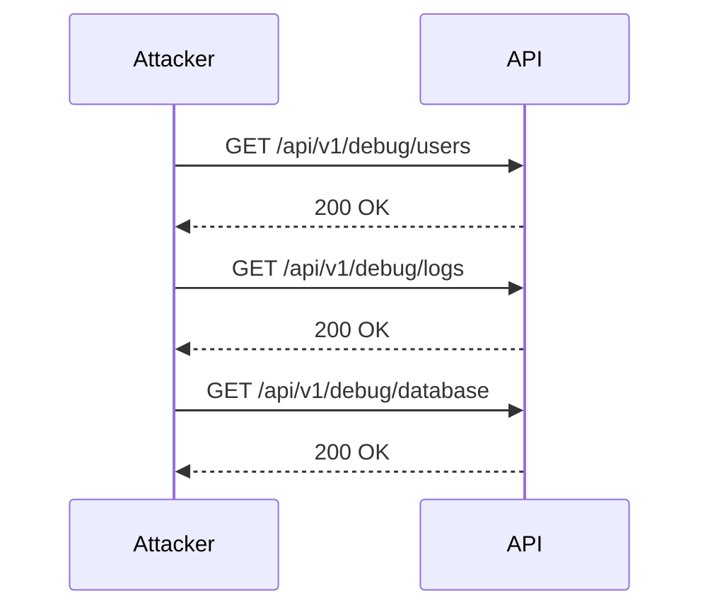
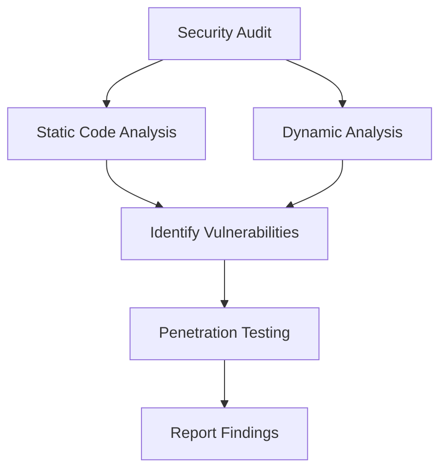
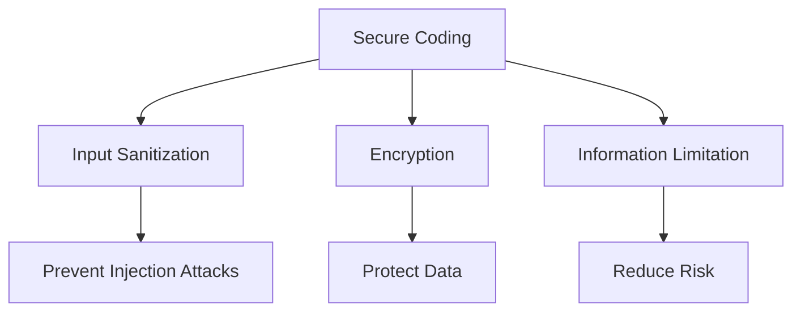
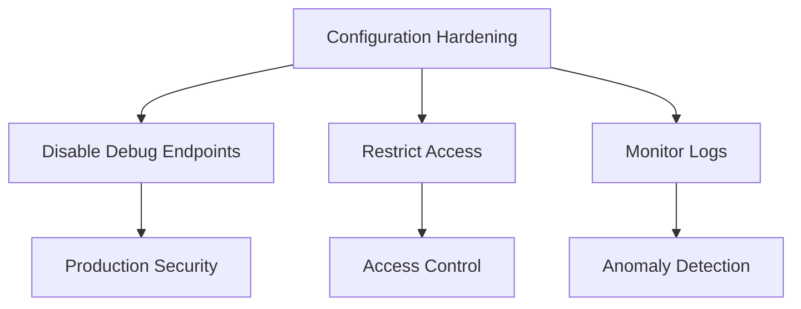

## Excessive Data Exposure at API Debug Endpoints

### Introduction to API Debug Endpoints

APIs (Application Programming Interfaces) are essential components of modern software systems, enabling communication between different applications and services. One critical aspect of API development is the inclusion of debug endpoints. These endpoints are designed to help developers diagnose issues during development and testing phases. However, if these endpoints are not properly secured, they can become a significant security risk, leading to excessive data exposure.

#### What is Excessive Data Exposure?

Excessive data exposure occurs when an application or service inadvertently discloses more information than necessary. This can happen through various means, including poorly configured APIs, insecure endpoints, and insufficient access controls. In the context of API debug endpoints, excessive data exposure can lead to the leakage of sensitive information such as user data, configuration details, and even credentials.

#### Why Does Excessive Data Exposure Matter?

Excessive data exposure is a serious security concern because it can lead to several negative outcomes:

- **Data Breaches**: Sensitive information can be accessed by unauthorized users, leading to data breaches.
- **Compliance Issues**: Many industries have strict regulations regarding data protection (e.g., GDPR, HIPAA). Excessive data exposure can result in non-compliance and legal penalties.
- **Reputation Damage**: Data breaches can severely damage a company's reputation and erode customer trust.

### Understanding API Debug Endpoints

Debug endpoints are special endpoints within an API that provide additional information or functionality to assist developers in debugging and troubleshooting. These endpoints might return detailed error messages, log data, or even allow direct access to internal system states.

#### Example of a Debug Endpoint

Consider an API endpoint `/api/v1/users` that returns a list of users. A corresponding debug endpoint might be `/api/v1/debug/users`. This debug endpoint could return additional information such as internal IDs, timestamps, or even raw database queries.

```http
GET /api/v1/users HTTP/1.1
Host: example.com
```

```http
HTTP/1.1 200 OK
Content-Type: application/json

[
    {
        "id": 1,
        "name": "John Doe",
        "email": "john.doe@example.com"
    },
    {
        "id": 2,
        "name": "Jane Smith",
        "email": "jane.smith@example.com"
    }
]
```

```http
GET /api/v1/debug/users HTTP/1.1
Host: example.com
```

```http
HTTP/1.1 200 OK
Content-Type: application/json

[
    {
        "id": 1,
        "name": "John Doe",
        "email": "john.doe@example.com",
        "internal_id": "abc123",
        "created_at": "2023-01-01T12:00:00Z"
    },
    {
        "id": 2,
        "name": "Jane Smith",
        "email": "jane.smith@example.com",
        "internal_id": "def456",
        "created_at": "2023-01-02T12:00:00Z"
    }
]
```

### Identifying and Exploiting Debug Endpoints

Developers and attackers alike can identify and exploit debug endpoints using various techniques. One common approach is brute-forcing potential debug endpoints.

#### Brute-Forcing Debug Endpoints

Brute-forcing involves systematically trying different combinations of endpoint paths to discover hidden or undocumented endpoints. Tools like Burp Suite's Intruder can automate this process.



#### Real-World Example: CVE-2021-38640

CVE-2021-38640 is a real-world example where a debug endpoint was exploited to gain unauthorized access to sensitive information. In this case, a debug endpoint `/debug/info` exposed detailed server information, including environment variables and configuration settings.

```http
GET /debug/info HTTP/1.1
Host: vulnerable.example.com
```

```http
HTTP/1.1 200 OK
Content-Type: application/json

{
    "environment": {
        "DB_HOST": "localhost",
        "DB_PORT": "5432",
        "DB_USER": "admin",
        "DB_PASSWORD": "secretpassword"
    },
    "configuration": {
        "server_port": 8080,
        "debug_mode": true
    }
}
```

### Common Pitfalls and Mistakes

Several common mistakes can lead to excessive data exposure through debug endpoints:

- **Inadequate Access Controls**: Debug endpoints should be restricted to authorized personnel only. Failure to implement proper access controls can expose them to unauthorized users.
- **Sensitive Information Disclosure**: Debug endpoints often return detailed information that can be used to infer sensitive data. This includes internal IDs, timestamps, and even raw database queries.
- **Improper Documentation**: Undocumented debug endpoints can easily be overlooked during security audits, making them a hidden risk.

### How to Prevent / Defend Against Excessive Data Exposure

#### Detection

To detect excessive data exposure, organizations should perform regular security audits and penetration tests. Automated tools like static code analyzers and dynamic analysis tools can help identify potential vulnerabilities.



#### Prevention

Preventing excessive data exposure requires a multi-layered approach:

- **Access Controls**: Implement strict access controls to ensure that debug endpoints are only accessible to authorized personnel.
- **Least Privilege Principle**: Follow the principle of least privilege by limiting the amount of information returned by debug endpoints.
- **Documentation**: Document all endpoints, including debug endpoints, to ensure they are included in security audits.

#### Secure Coding Practices

Secure coding practices can help mitigate the risk of excessive data exposure:

- **Sanitize Inputs**: Ensure that all inputs are sanitized to prevent injection attacks.
- **Use Encryption**: Encrypt sensitive data both in transit and at rest.
- **Limit Information Disclosure**: Limit the amount of information returned by debug endpoints to only what is necessary for debugging purposes.



#### Configuration Hardening

Configuration hardening involves securing the configuration settings of the API to prevent unauthorized access to debug endpoints.

- **Disable Debug Endpoints**: Disable debug endpoints in production environments unless absolutely necessary.
- **Restrict Access**: Restrict access to debug endpoints using IP whitelisting or other access control mechanisms.
- **Monitor Logs**: Monitor logs for suspicious activity related to debug endpoints.



### Complete Example: Secure vs. Insecure Debug Endpoint

#### Insecure Debug Endpoint

```http
GET /api/v1/debug/users HTTP/1.1
Host: insecure.example.com
```

```http
HTTP/1.1 200 OK
Content-Type: application/json

[
    {
        "id": 1,
        "name": "John Doe",
        "email": "john.doe@example.com",
        "internal_id": "abc123",
        "created_at": "2023-01-01T12:00:00Z",
        "password_hash": "hashed_password"
    },
    {
        "id": 2,
        "name": "Jane Smith",
        "email": "jane.smith@example.com",
        "internal_id": "def456",
        "created_at": "2023-01-02T12:00:00Z",
        "password_hash": "hashed_password"
    }
]
```

#### Secure Debug Endpoint

```http
GET /api/v1/debug/users HTTP/1.1
Host: secure.example.com
Authorization: Bearer <token>
```

```http
HTTP/1.1 200 OK
Content-Type: application/json

[
    {
        "id": 1,
        "name": "John Doe",
        "email": "john.doe@example.com",
        "internal_id": "abc123",
        "created_at": "2023-01-01T12:00:00Z"
    },
    {
        "id": 2,
        "name": "Jane Smith",
        "email": "jane.smith@example.com",
        "internal_id": "def456",
        "created_at": "22023-01-02T12:00:00Z"
    }
]
```

### Hands-On Practice Labs

To practice identifying and securing debug endpoints, consider the following labs:

- **PortSwigger Web Security Academy**: Offers interactive labs to practice identifying and exploiting debug endpoints.
- **OWASP Juice Shop**: Provides a vulnerable web application with debug endpoints that can be exploited.
- **DVWA (Damn Vulnerable Web Application)**: Contains various vulnerabilities, including those related to debug endpoints.

### Conclusion

Excessive data exposure through API debug endpoints is a significant security risk that can lead to data breaches, compliance issues, and reputation damage. By understanding the nature of debug endpoints, identifying common pitfalls, and implementing robust security measures, organizations can effectively mitigate this risk. Regular security audits, secure coding practices, and configuration hardening are essential steps in preventing excessive data exposure.

---
<!-- nav -->
[[API Security/08-Excessive Data Exposure/02-Excessive Data Exposure at API Debug Endpoint/00-Overview|Overview]] | [[API Security/08-Excessive Data Exposure/02-Excessive Data Exposure at API Debug Endpoint/02-Practice Questions & Answers|Practice Questions & Answers]]
