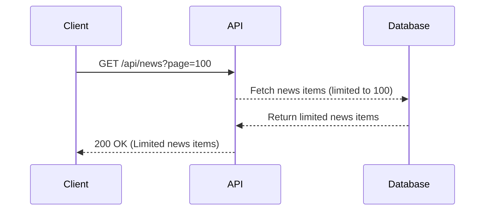
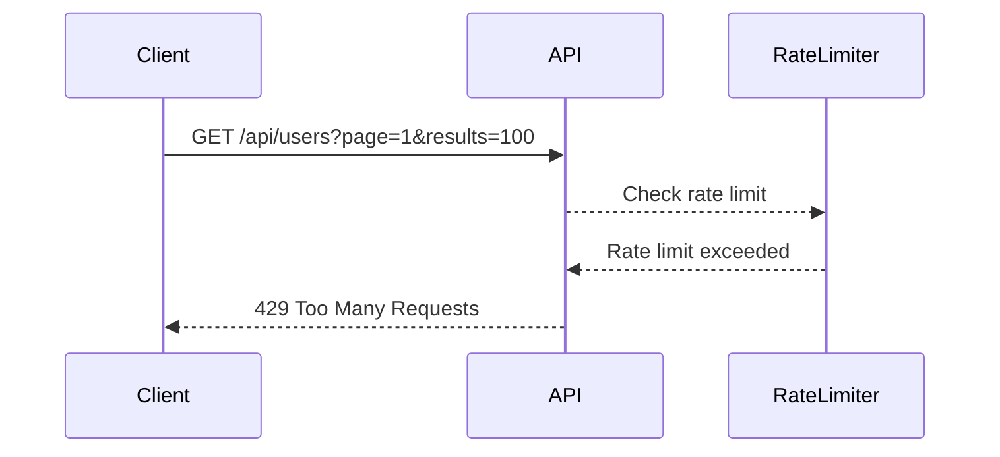

## Lack of Resource & Rate Limiting in API Security

### Introduction

API security is a critical aspect of modern software development, especially as more applications rely on APIs to interact with various services. One common vulnerability in API design is the lack of proper resource and rate limiting. This vulnerability can lead to denial-of-service (DoS) attacks, where an attacker sends a large number of requests to exhaust server resources, making the service unavailable to legitimate users.

### Understanding Resource and Rate Limiting

Resource and rate limiting are mechanisms designed to control the amount of resources (such as CPU, memory, and bandwidth) and the rate at which requests are processed by an API. These controls help prevent abuse and ensure fair usage of resources among different clients.

#### Resource Limiting

Resource limiting involves setting constraints on the amount of resources that can be consumed by a single request or a set of requests. For example, an API might limit the number of records returned by a query to prevent excessive database load.

**Example Scenario:**
Consider an API endpoint `/api/news?page=100`. Here, `page` is a parameter that specifies the page number of news items to retrieve. If the API does not enforce a limit on the number of pages, an attacker could send a request with a very high page number, causing the server to fetch a large number of records from the database, leading to performance degradation.

```http
GET /api/news?page=100 HTTP/1.1
Host: example.com
```

**Response:**
```http
HTTP/1.1 200 OK
Content-Type: application/json
Content-Length: 1024

{
  "news": [
    // Large number of news items
  ]
}
```

Without proper resource limiting, the server might become overwhelmed by such requests, leading to slow response times or even crashes.

#### Rate Limiting

Rate limiting involves controlling the frequency at which requests can be made to an API. This is typically done by setting a maximum number of requests per unit time (e.g., per minute or per hour).

**Example Scenario:**
Consider an API endpoint `/api/users?page=1&results=100`. Here, `page` and `results` are parameters that specify the page number and the number of user records to return, respectively. If the API does not enforce rate limits, an attacker could send a large number of requests in a short period, overwhelming the server.

```http
GET /api/users?page=1&results=100 HTTP/1.1
Host: example.com
```

**Response:**
```http
HTTP/1.1 200 OK
Content-Type: application/json
Content-Length: 1024

{
  "users": [
    // Large number of user records
  ]
}
```

Without proper rate limiting, the server might become overwhelmed by such requests, leading to slow response times or even crashes.

### Real-World Examples

#### Zoom Vulnerability

In 2020, Zoom faced a significant vulnerability related to lack of resource and rate limiting. Attackers were able to create large numbers of meetings and invite participants, leading to server overload and denial-of-service conditions. This vulnerability was exploited to disrupt online classes and meetings.

**CVE Example:**
- **CVE-2020-14882**: This CVE describes a vulnerability in Zoom that allowed attackers to create large numbers of meetings, leading to server overload.

### How to Prevent / Defend

#### Detection

To detect potential resource and rate limiting issues, you can monitor API usage patterns and look for unusual spikes in request volume or resource consumption. Tools like Prometheus and Grafana can be used to visualize and analyze API metrics.

**Prometheus Configuration:**
```yaml
scrape_configs:
  - job_name: 'api-metrics'
    static_configs:
      - targets: ['localhost:8080']
```

**Grafana Dashboard:**
Create a dashboard to visualize API request rates and resource usage over time.

#### Prevention

To prevent resource and rate limiting issues, implement the following measures:

1. **Set Resource Limits:**
   - Limit the number of records returned by queries.
   - Set maximum values for request parameters.

2. **Implement Rate Limiting:**
   - Use middleware to enforce rate limits.
   - Configure rate limits based on IP addresses or API keys.

3. **Use Throttling Mechanisms:**
   - Implement exponential backoff for retry attempts.
   - Use tokens or credits to manage request quotas.

#### Secure Coding Fixes

**Vulnerable Code:**
```python
@app.route('/api/news')
def get_news():
    page = int(request.args.get('page', 1))
    news_items = News.query.paginate(page, per_page=10)
    return jsonify(news_items.items)
```

**Fixed Code:**
```python
@app.route('/api/news')
@limiter.limit("100/minute")
def get_news():
    page = int(request.args.get('page', 1))
    if page > 100:
        abort(400, description="Page number exceeds limit.")
    news_items = News.query.paginate(page, per_page=10)
    return jsonify(news_items.items)
```

### Mermaid Diagrams

#### Resource Limiting Sequence Diagram


#### Rate Limiting Sequence Diagram


### Practice Labs

For hands-on practice with API security, consider the following labs:

- **PortSwigger Web Security Academy:** Offers interactive labs on API security, including resource and rate limiting.
- **OWASP Juice Shop:** A deliberately insecure web application for learning about web security vulnerabilities, including API-related issues.
- **DVWA (Damn Vulnerable Web Application):** Provides a range of web application vulnerabilities, including those related to API security.

By implementing proper resource and rate limiting, you can significantly enhance the security and reliability of your API, ensuring it remains available and performant under normal and abusive conditions.

---
<!-- nav -->
[[API Security/09-Lack of Resource & Rate Limiting/01-Background Concept/00-Overview|Overview]] | [[02-Lack of Resource & Rate Limiting in APIs|Lack of Resource & Rate Limiting in APIs]]
