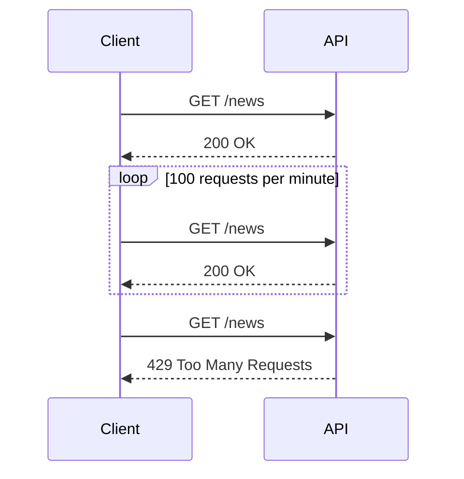

## Lack of Resource & Rate Limiting in APIs

### Introduction

In the realm of API security, one of the most critical vulnerabilities is the lack of resource and rate limiting. This issue arises when an API does not enforce restrictions on the number of requests a client can make within a certain time frame or the amount of resources a client can consume. Without these limits, attackers can exploit the API by sending an overwhelming number of requests, leading to denial-of-service (DoS) attacks or resource exhaustion.

### Understanding Resource and Rate Limiting

#### What is Resource Limiting?

Resource limiting refers to the practice of setting boundaries on the amount of system resources (such as CPU, memory, disk space, etc.) that an API can utilize. This ensures that the API does not consume more resources than necessary, which could lead to performance degradation or even system crashes.

#### Why is Resource Limiting Important?

Resource limiting is crucial because it helps prevent resource exhaustion attacks. An attacker can send a large number of requests to an API, causing it to consume excessive resources. This can result in the API becoming unresponsive or even crashing, thereby denying legitimate users access to the service.

#### How Does Resource Limiting Work?

Resource limiting typically involves setting thresholds for various types of resources. For example, an API might limit the amount of memory it can use or the number of threads it can spawn. When these thresholds are exceeded, the API should take appropriate action, such as rejecting additional requests or terminating excess processes.

#### What is Rate Limiting?

Rate limiting is the process of restricting the number of requests a client can make to an API within a specified time period. This helps prevent abuse and ensures fair usage of the API.

#### Why is Rate Limiting Important?

Rate limiting is essential because it prevents attackers from overwhelming the API with too many requests. Without rate limiting, an attacker could flood the API with requests, causing it to become slow or unresponsive. This can also lead to denial-of-service attacks, where legitimate users are unable to access the API.

#### How Does Rate Limiting Work?

Rate limiting typically involves setting a maximum number of requests that a client can make within a specific time window. For example, an API might allow a client to make up to 100 requests per minute. Once this limit is reached, the API will reject additional requests until the time window resets.

### Real-World Examples

#### Recent Breaches and CVEs

One notable example of a lack of resource and rate limiting leading to a security breach is the 2017 Equifax data breach. In this case, attackers exploited a vulnerability in the Apache Struts framework, which did not have proper rate limiting in place. This allowed the attackers to send a large number of requests, eventually leading to the exposure of sensitive personal information of millions of individuals.

Another example is the 2019 Capital One data breach, where an attacker was able to exploit a misconfigured server that lacked proper rate limiting. This allowed the attacker to access sensitive customer data by making a large number of requests to the server.

### Complete Example: News API

Let's consider a hypothetical scenario involving a news API that displays news results. Suppose this API does not have proper resource and rate limiting in place.

#### Vulnerable Code Example

```python
from flask import Flask, jsonify, request

app = Flask(__name__)

@app.route('/news', methods=['GET'])
def get_news():
    # Simulate fetching news data
    news_data = [
        {"title": "Breaking News", "content": "Some breaking news content"},
        {"title": "Latest Updates", "content": "Some latest updates content"}
    ]
    return jsonify(news_data)

if __name__ == '__main__':
    app.run()
```

#### Explanation of Vulnerability

In this example, the `get_news` function fetches news data and returns it as a JSON response. However, there are no limits on the number of requests a client can make to this endpoint. An attacker could exploit this by sending a large number of requests, causing the server to become overwhelmed and potentially crash.

### Detection and Prevention

#### How to Detect Lack of Resource and Rate Limiting

To detect whether an API lacks proper resource and rate limiting, you can perform the following steps:

1. **Monitor API Usage**: Use monitoring tools to track the number of requests made to the API and the resources consumed.
2. **Load Testing**: Perform load testing to simulate a large number of requests and observe the behavior of the API.
3. **Review Configuration**: Check the API configuration to ensure that resource and rate limiting settings are properly configured.

#### How to Prevent Lack of Resource and Rate Limiting

To prevent lack of resource and rate limiting, you can implement the following measures:

1. **Set Resource Limits**: Configure the API to set limits on the amount of system resources it can use.
2. **Implement Rate Limiting**: Set rate limits on the number of requests a client can make within a specified time window.
3. **Use Middleware**: Utilize middleware components that can automatically enforce resource and rate limiting.

#### Secure Coding Fix

Here is an example of how to implement rate limiting using Flask middleware:

```python
from flask import Flask, jsonify, request
from flask_limiter import Limiter

app = Flask(__name__)
limiter = Limiter(app, key_func=lambda: request.remote_addr)

@app.route('/news', methods=['GET'])
@limiter.limit("100 per minute")
def get_news():
    # Simulate fetching news data
    news_data = [
        {"title": "Breaking News", "content": "Some breaking news content"},
        {"title": "Latest Updates", "content": "Some latest updates content"}
    ]
    return jsonify(news_data)

if __name__ == '__main__':
    app.run()
```

#### Explanation of Secure Code

In this example, the `limiter.limit` decorator is used to set a rate limit of 100 requests per minute for the `/news` endpoint. This ensures that clients cannot make more than 100 requests within a minute, preventing abuse and ensuring fair usage of the API.

### Full HTTP Request and Response

#### HTTP Request

```http
GET /news HTTP/1.1
Host: example.com
User-Agent: curl/7.64.1
Accept: */*
```

#### HTTP Response

```http
HTTP/1.1 200 OK
Date: Mon, 20 Nov 2023 12:00:00 GMT
Content-Type: application/json
Content-Length: 123
Connection: keep-alive

[
    {
        "title": "Breaking News",
        "content": "Some breaking news content"
    },
    {
        "title": "Latest Updates",
        "content": "Some latest updates content"
    }
]
```

### Mermaid Diagrams

#### Sequence Diagram



#### Network Topology


### Hands-On Labs

For hands-on practice with API security, including lack of resource and rate limiting, you can use the following labs:

- **PortSwigger Web Security Academy**: Offers interactive labs on API security, including rate limiting and resource exhaustion.
- **OWASP Juice Shop**: Provides a vulnerable web application with various security issues, including lack of rate limiting.
- **DVWA (Damn Vulnerable Web Application)**: Includes scenarios where rate limiting is not enforced, allowing you to practice detecting and preventing such vulnerabilities.

By thoroughly understanding and implementing resource and rate limiting, you can significantly enhance the security of your APIs and protect them from potential attacks.

---
<!-- nav -->
[[API Security/09-Lack of Resource & Rate Limiting/01-Background Concept/01-Lack of Resource & Rate Limiting in API Security|Lack of Resource & Rate Limiting in API Security]] | [[API Security/09-Lack of Resource & Rate Limiting/01-Background Concept/00-Overview|Overview]] | [[API Security/09-Lack of Resource & Rate Limiting/01-Background Concept/03-Practice Questions & Answers|Practice Questions & Answers]]
