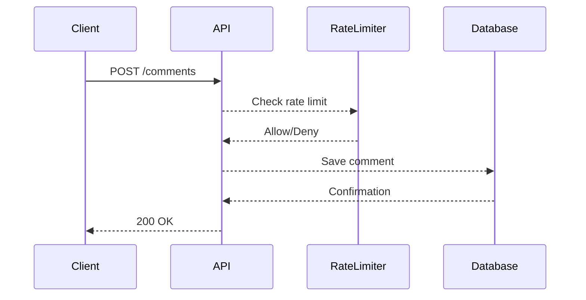

## Lack of Resource & Rate Limiting in API Security

### Introduction

In the realm of API security, one of the critical vulnerabilities that can lead to significant disruptions is the lack of resource and rate limiting. This issue arises when APIs do not enforce limits on the number of requests a client can make within a given time frame. Without these controls, malicious actors can exploit the API by sending an overwhelming number of requests, leading to denial-of-service (DoS) attacks, data corruption, or even financial losses.

### Background Theory

#### What is Resource and Rate Limiting?

Resource and rate limiting are mechanisms designed to control the usage of resources and the frequency of requests made to an API. These controls help ensure that the API remains responsive and available to legitimate users while preventing abuse.

- **Resource Limiting**: This refers to setting limits on the amount of data or resources a client can access or modify through the API. For example, limiting the number of records a user can retrieve or update in a single request.
  
- **Rate Limiting**: This involves setting limits on the number of requests a client can make within a specific time period. For instance, allowing only 100 requests per minute from a single IP address.

#### Why is Resource and Rate Limiting Important?

Without proper resource and rate limiting, an API can become vulnerable to several types of attacks:

- **Denial-of-Service (DoS)**: An attacker can flood the API with requests, causing it to become unresponsive and unavailable to legitimate users.
  
- **Data Corruption**: Excessive requests can lead to data inconsistencies or corruption, especially if the API does not handle concurrent requests properly.
  
- **Financial Losses**: In financial applications, excessive requests can lead to unauthorized transactions or other financial irregularities.

### Real-World Examples

#### Recent Breaches and CVEs

Several high-profile breaches have highlighted the importance of resource and rate limiting:

- **CVE-2021-21972**: This vulnerability in the Microsoft Exchange Server allowed attackers to bypass rate limiting and perform brute-force attacks against email accounts. The lack of rate limiting allowed attackers to rapidly guess passwords and gain unauthorized access.

- **Twitter API Breach (2020)**: In this incident, an attacker exploited a flaw in the Twitter API that lacked proper rate limiting. The attacker was able to send a large number of requests to the API, leading to the exposure of sensitive user data.

### Demonstration: Lack of Rate Limiting in Comment Systems

Let's consider a hypothetical scenario where an API provides a comment system for a blog or forum. The API allows users to add comments via an `addComment` endpoint. Without proper rate limiting, an attacker could exploit this endpoint by sending a large number of requests, potentially overwhelming the server and causing service disruptions.

#### Vulnerable Code Example

```python
@app.route('/comments', methods=['POST'])
def add_comment():
    data = request.get_json()
    comment = data['comment']
    # Save comment to database
    db.save(comment)
    return jsonify({"status": "success"})
```

#### Attack Scenario

An attacker could use a script to send a large number of requests to the `/comments` endpoint, as shown below:

```bash
for i in {1..10000}; do
  curl -X POST http://api.example.com/comments -H "Content-Type: application/json" -d '{"comment": "This is a test comment"}'
done
```

#### Impact

The lack of rate limiting in this scenario would allow the attacker to flood the server with requests, potentially leading to:

- **Server Overload**: The server could become overwhelmed, leading to slow response times or complete unavailability.
  
- **Database Overload**: The database could become overloaded with requests, leading to performance degradation or even crashes.

### How to Prevent / Defend

#### Detection

To detect potential rate-limiting issues, you can monitor API usage patterns and look for unusual spikes in request volume. Tools such as logging and monitoring services (e.g., ELK Stack, Prometheus) can help identify suspicious activity.

#### Prevention

Implementing rate limiting and resource limiting is crucial to prevent abuse. Here are some strategies:

- **Rate Limiting**: Set limits on the number of requests a client can make within a specific time period. This can be done using middleware or libraries that provide rate-limiting functionality.

- **Resource Limiting**: Set limits on the amount of data or resources a client can access or modify through the API.

#### Secure Coding Fixes

Here is an example of how to implement rate limiting using Flask and Flask-Limiter:

```python
from flask import Flask, request, jsonify
from flask_limiter import Limiter

app = Flask(__name__)
limiter = Limiter(app, key_func=get_remote_address)

@app.route('/comments', methods=['POST'])
@limiter.limit("100/minute")  # Limit to 100 requests per minute
def add_comment():
    data = request.get_json()
    comment = data['comment']
    # Save comment to database
    db.save(comment)
    return jsonify({"status": "success"})

def get_remote_address():
    return request.remote_addr
```

#### Hardening Configuration

Ensure that your API server and database are configured to handle high volumes of traffic without becoming overwhelmed. This includes:

- **Scaling**: Use load balancers and auto-scaling groups to distribute traffic across multiple instances.
  
- **Database Optimization**: Optimize database queries and use caching to reduce the load on the database.

### Complete Example: Full HTTP Request and Response

#### Vulnerable Scenario

**HTTP Request**

```http
POST /comments HTTP/1.1
Host: api.example.com
Content-Type: application/json

{
  "comment": "This is a test comment"
}
```

**HTTP Response**

```http
HTTP/1.1 200 OK
Content-Type: application/json

{
  "status": "success"
}
```

#### Secure Scenario

**HTTP Request**

```http
POST /comments HTTP/1.1
Host: api.example.com
Content-Type: application/json

{
  "comment": "This is a test comment"
}
```

**HTTP Response**

```http
HTTP/1.1 200 OK
Content-Type: application/json

{
  "status": "success"
}
```

### Mermaid Diagrams

#### Rate Limiting Architecture



### Practice Labs

For hands-on practice with API security, including rate limiting and resource limiting, consider the following labs:

- **PortSwigger Web Security Academy**: Offers interactive labs on API security, including rate limiting.
- **OWASP Juice Shop**: Provides a vulnerable web application with various security challenges, including API security.
- **DVWA (Damn Vulnerable Web Application)**: Includes scenarios where rate limiting can be implemented to prevent abuse.

By thoroughly understanding and implementing resource and rate limiting, you can significantly enhance the security and reliability of your API.

---
<!-- nav -->
[[API Security/09-Lack of Resource & Rate Limiting/02-Demonstration 1/00-Overview|Overview]] | [[02-Lack of Resource & Rate Limiting|Lack of Resource & Rate Limiting]]
