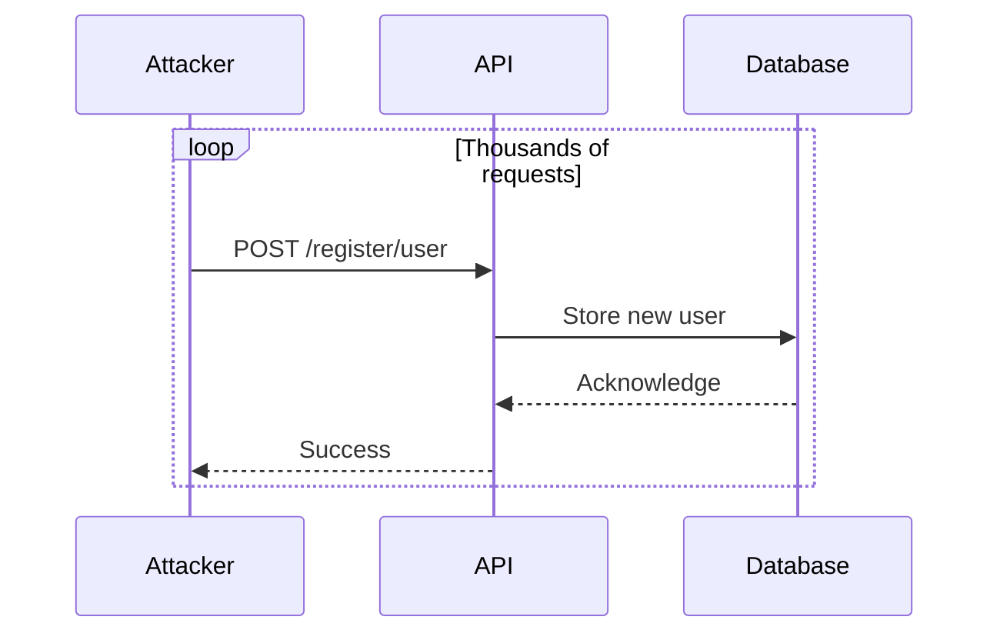
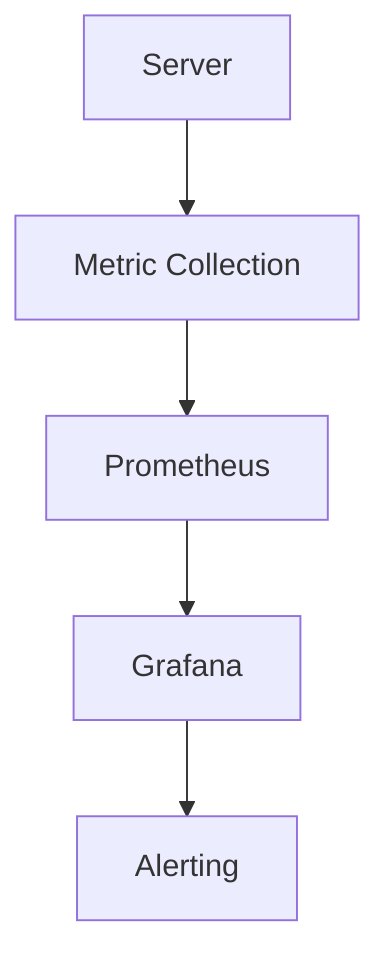

## Lack of Resource & Rate Limiting: Resource Exhaustion

### Introduction

Resource exhaustion attacks occur when an attacker exploits the lack of proper resource and rate limiting mechanisms in an API. This can lead to the depletion of system resources such as CPU, memory, and bandwidth, causing the service to become unresponsive or crash. In this section, we will delve into the details of how resource exhaustion attacks work, their implications, and how to defend against them.

### Understanding Resource Exhaustion

Resource exhaustion occurs when an API endpoint is repeatedly called, leading to the consumption of excessive resources. This can happen due to a lack of proper rate limiting or resource management. Let's consider the example provided in the lecture:

```plaintext
API/register/user
```

In this scenario, an attacker can make repeated calls to the `register/user` endpoint, potentially registering thousands or even tens of thousands of users. This can overwhelm the server's resources, leading to performance degradation or even a complete failure of the service.

#### Example Scenario

Imagine an API endpoint that allows users to register. An attacker could automate the registration process using a script, making thousands of requests in a short period. This would consume significant amounts of server resources, including CPU cycles, memory, and database storage.



### Implications of Resource Exhaustion

The implications of resource exhaustion can be severe. Here are some potential consequences:

1. **Performance Degradation**: The server becomes slow and unresponsive, affecting legitimate users.
2. **Service Unavailability**: The server crashes, leading to downtime and loss of business.
3. **Data Loss**: In extreme cases, the server might lose data due to resource constraints.
4. **Security Risks**: Overloaded servers are more susceptible to other types of attacks.

### Real-World Examples

Several real-world incidents have highlighted the dangers of resource exhaustion attacks:

1. **CVE-2021-21972**: A vulnerability in the Jenkins CI/CD platform allowed attackers to perform resource exhaustion attacks by creating an excessive number of jobs.
2. **CVE-2020-14882**: A vulnerability in the Apache Struts framework allowed attackers to perform resource exhaustion attacks by repeatedly triggering certain actions.

These examples demonstrate the importance of implementing robust resource and rate limiting mechanisms.

### How to Prevent / Defend Against Resource Exhaustion

To prevent resource exhaustion attacks, several strategies can be employed:

1. **Rate Limiting**: Implement rate limiting to restrict the number of requests a client can make within a given time frame.
2. **Resource Management**: Ensure that the server has adequate resources to handle peak loads.
3. **Monitoring and Alerts**: Set up monitoring and alerts to detect unusual activity and take corrective action.
4. **Secure Coding Practices**: Follow secure coding practices to ensure that APIs are resilient to resource exhaustion attacks.

#### Rate Limiting Implementation

Rate limiting can be implemented at various levels, including the application layer, API gateway, or load balancer. Here’s an example of how to implement rate limiting using an API gateway like NGINX:

```nginx
http {
    limit_req_zone $binary_remote_addr zone=one:10m rate=1r/s;

    server {
        listen 80;
        location /register/user {
            limit_req zone=one burst=5 nodelay;
            proxy_pass http://backend;
        }
    }
}
```

In this configuration, NGINX limits the number of requests to `/register/user` to 1 request per second (`rate=1r/s`). The `burst=5` parameter allows a burst of 5 requests before enforcing the rate limit.

#### Secure Coding Practices

When designing APIs, it is crucial to follow secure coding practices to prevent resource exhaustion attacks. Here’s an example of a vulnerable API endpoint and its secure counterpart:

**Vulnerable Code**

```python
@app.route('/register/user', methods=['POST'])
def register_user():
    data = request.get_json()
    username = data['username']
    password = data['password']
    # Save user to database
    return jsonify({"status": "success"})
```

**Secure Code**

```python
from flask import Flask, request, jsonify
from flask_limiter import Limiter

app = Flask(__name__)
limiter = Limiter(app, key_func=lambda: request.remote_addr)

@limiter.limit("1/second", override_defaults=False)
@app.route('/register/user', methods=['POST'])
def register_user():
    data = request.get_json()
    username = data['username']
    password = data['password']
    # Save user to database
    return jsonify({"status": "success"})
```

In the secure code, the `flask_limiter` library is used to enforce a rate limit of 1 request per second.

### Monitoring and Alerts

Setting up monitoring and alerts is essential to detect and respond to resource exhaustion attacks. Tools like Prometheus and Grafana can be used to monitor server metrics and trigger alerts when thresholds are exceeded.



### Hands-On Practice

For hands-on practice, you can use the following labs:

- **PortSwigger Web Security Academy**: Offers a module on rate limiting and resource exhaustion.
- **OWASP Juice Shop**: Contains challenges related to resource exhaustion attacks.
- **DVWA (Damn Vulnerable Web Application)**: Provides scenarios where you can test and learn about resource exhaustion.

By following these guidelines and practicing with real-world tools, you can effectively prevent and mitigate resource exhaustion attacks.

### Conclusion

Resource exhaustion attacks are a serious threat to the availability and performance of APIs. By implementing rate limiting, managing resources effectively, and following secure coding practices, you can significantly reduce the risk of such attacks. Regular monitoring and alerting are also crucial to detect and respond to any unusual activity promptly.

---
<!-- nav -->
[[API Security/09-Lack of Resource & Rate Limiting/03-Resource Exhaustion/00-Overview|Overview]] | [[02-Resource Exhaustion Attacks|Resource Exhaustion Attacks]]
