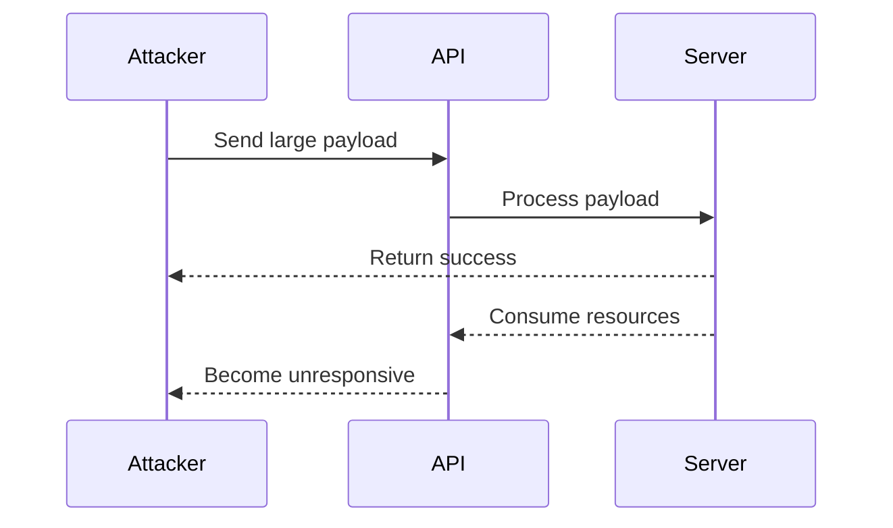
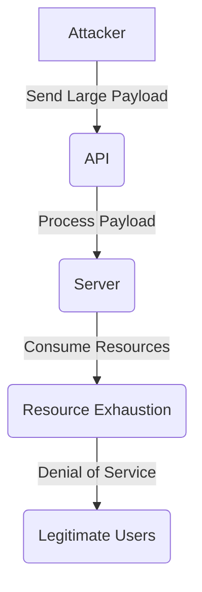

## Resource Exhaustion Attacks

### Introduction

Resource exhaustion attacks are a type of Denial of Service (DoS) attack where an attacker attempts to exhaust the resources of a target system, making it unavailable to legitimate users. These resources can include CPU cycles, memory, disk space, network bandwidth, or other critical system components. In the context of APIs, resource exhaustion attacks often involve sending large amounts of data or requests that consume significant resources, leading to degraded performance or complete unavailability of the service.

### Understanding Resource Exhaustion

#### What is Resource Exhaustion?

Resource exhaustion occurs when an attacker sends a large number of requests or large payloads to an API, causing the server to consume excessive resources. This can lead to the server becoming unresponsive or crashing, thereby denying service to legitimate users. The attacker's goal is to overwhelm the server's capacity to handle normal traffic, effectively shutting down the service.

#### Why Does Resource Exhaustion Matter?

Resource exhaustion attacks are particularly dangerous because they can be executed relatively easily and can have severe consequences. By consuming all available resources, an attacker can render a service unusable, causing financial losses, reputational damage, and potential legal issues for the organization.

#### How Does Resource Exhaustion Work?

In the context of APIs, resource exhaustion typically involves sending large payloads or a high volume of requests. The attacker aims to consume as much of the server's resources as possible, leading to a denial of service. This can be achieved through various methods, such as:

- **Large Payloads:** Sending extremely large payloads in requests, which can consume significant memory and processing power.
- **High Volume Requests:** Sending a large number of requests in a short period, overwhelming the server's ability to process them.
- **Recursive Requests:** Triggering recursive operations that consume resources exponentially.

### Real-World Examples

#### Recent CVEs and Breaches

One notable example of a resource exhaustion attack is the **CVE-2021-3129** vulnerability in the Apache Log4j library. This vulnerability allowed attackers to send specially crafted log messages that could trigger recursive lookups, leading to a resource exhaustion attack. This resulted in widespread exploitation and significant disruptions to services relying on Log4j.

Another example is the **CVE-2020-14882** vulnerability in the VMware vCenter Server. This vulnerability allowed attackers to send large payloads in SOAP requests, leading to resource exhaustion and denial of service.

### Detailed Example: Long String DOS Attack

Let's consider a detailed example of a long string DOS attack against an API endpoint.

#### Scenario

Suppose we have an API endpoint `/register` that accepts user registration requests. The endpoint expects a JSON payload with a `username` field. An attacker decides to send a very long string in the `username` field to exhaust the server's resources.

#### Vulnerable Code

```python
@app.route('/register', methods=['POST'])
def register():
    data = request.get_json()
    username = data['username']
    # Process the username and register the user
    return jsonify({"status": "success"})
```

#### Attacker's Request

The attacker crafts a POST request with a very long string in the `username` field.

```http
POST /register HTTP/1.1
Host: example.com
Content-Type: application/json
Content-Length: 1000000

{
    "username": "A" * 1000000
}
```

#### Server Response

The server processes the request and consumes a significant amount of memory and processing power due to the large payload.

```http
HTTP/1.1 200 OK
Date: Tue, 01 Jan 2024 00:00:00 GMT
Content-Type: application/json
Content-Length: 20

{"status": "success"}
```

#### Impact

The server becomes unresponsive due to the high memory usage and processing time required to handle the large payload. Legitimate users are unable to access the service.

### How to Prevent / Defend Against Resource Exhaustion

#### Detection

To detect resource exhaustion attacks, organizations should implement monitoring and alerting mechanisms to identify unusual patterns of resource consumption. Key metrics to monitor include:

- **CPU Usage:** High CPU usage over a sustained period.
- **Memory Usage:** Significant increases in memory usage.
- **Network Traffic:** Unusual spikes in incoming network traffic.
- **Request Volume:** A sudden increase in the number of requests.

#### Prevention

To prevent resource exhaustion attacks, several strategies can be employed:

##### Resource Limits

Implement resource limits to restrict the amount of resources that can be consumed by a single request or a set of requests. This includes:

- **Payload Size Limits:** Set maximum size limits for incoming payloads.
- **Rate Limiting:** Limit the number of requests a client can make within a given time frame.
- **Concurrency Limits:** Restrict the number of concurrent requests that can be processed.

##### Secure Coding Practices

Use secure coding practices to ensure that the application handles large inputs gracefully. This includes:

- **Input Validation:** Validate input sizes and reject oversized payloads.
- **Error Handling:** Implement robust error handling to prevent crashes due to unexpected inputs.

##### Configuration Hardening

Harden the server configuration to minimize the impact of resource exhaustion attacks. This includes:

- **Tuning Server Settings:** Adjust server settings to optimize resource usage.
- **Using Efficient Libraries:** Use efficient libraries and frameworks that handle large inputs efficiently.

#### Secure Code Fix

Here is an example of how to implement resource limits and secure coding practices in the vulnerable code:

```python
@app.route('/register', methods=['POST'])
def register():
    data = request.get_json()
    
    # Input validation
    if len(data['username']) > 100:
        return jsonify({"error": "Username too long"}), 400
    
    username = data['username']
    # Process the username and register the user
    return jsonify({"status": "success"})
```

#### Complete Example

Here is the complete example including the HTTP request, response, and result:

**Vulnerable Version**

```http
POST /register HTTP/1.1
Host: example.com
Content-Type: application/json
Content-Length: 1000000

{
    "username": "A" * 1000000
}

HTTP/1.1 200 OK
Date: Tue, 01 Jan 2024 00:00:00 GMT
Content-Type: application/json
Content-Length: 20

{"status": "success"}
```

**Secure Version**

```http
POST /register HTTP/1.1
Host: example.com
Content-Type: application/json
Content-Length: 1000000

{
    "username": "A" * 1000000
}

HTTP/1.1 400 Bad Request
Date: Tue, 01 Jan 2024 00:00:00 GMT
Content-Type: application/json
Content-Length: 27

{"error": "Username too long"}
```

### Mermaid Diagrams

#### Attack Chain Diagram



#### Resource Consumption Diagram



### Hands-On Labs

For hands-on practice with resource exhaustion attacks, consider the following labs:

- **PortSwigger Web Security Academy:** Offers interactive labs on resource exhaustion attacks.
- **OWASP Juice Shop:** Provides a vulnerable web application for practicing various types of attacks, including resource exhaustion.
- **DVWA (Damn Vulnerable Web Application):** Contains a variety of vulnerabilities, including resource exhaustion, for educational purposes.

By thoroughly understanding and implementing the preventive measures discussed, organizations can significantly reduce the risk of resource exhaustion attacks and ensure the availability of their services.

---
<!-- nav -->
[[01-Lack of Resource & Rate Limiting Resource Exhaustion|Lack of Resource & Rate Limiting Resource Exhaustion]] | [[API Security/09-Lack of Resource & Rate Limiting/03-Resource Exhaustion/00-Overview|Overview]] | [[03-Resource Exhaustion Vulnerability|Resource Exhaustion Vulnerability]]
