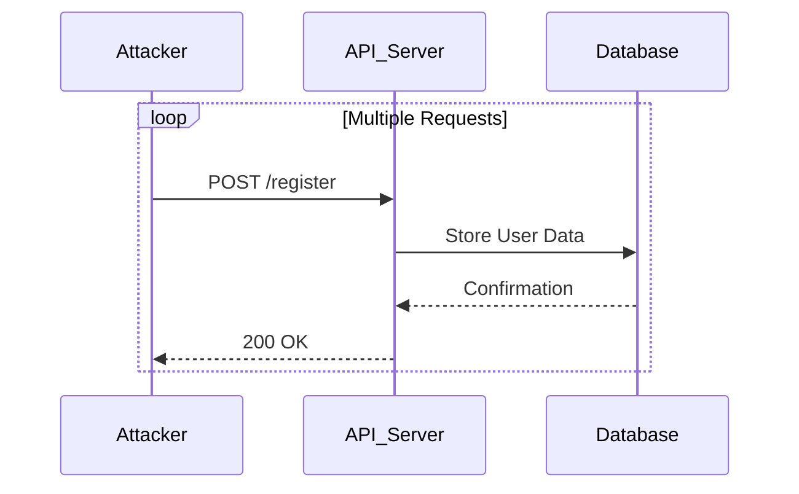

## Resource Exhaustion Vulnerability

### Introduction to Resource Exhaustion

Resource exhaustion vulnerabilities occur when an application allows uncontrolled consumption of resources such as memory, CPU, disk space, or network bandwidth. This can lead to denial-of-service (DoS) conditions where the application becomes unavailable to legitimate users. In the context of APIs, resource exhaustion can be particularly dangerous because APIs often serve as the backbone of modern applications, and their failure can have widespread impacts.

### Understanding Resource Exhaustion

#### What is Resource Exhaustion?

Resource exhaustion happens when an attacker can consume a significant amount of resources, making the system slow or unresponsive. This can be achieved through various methods, including:

- **Memory Consumption**: Allocating large amounts of memory until the system runs out.
- **CPU Usage**: Running computationally intensive tasks to max out CPU usage.
- **Disk Space**: Filling up disk space with large files or logs.
- **Network Bandwidth**: Flooding the network with traffic.

#### Why Does Resource Exhaustion Matter?

Resource exhaustion is critical because it can render an entire system unusable. For example, if an API server runs out of memory, it might crash, leading to service downtime. Similarly, if an attacker can flood a network interface with traffic, legitimate users might be unable to access the service.

### Real-World Examples

#### Recent CVEs and Breaches

One notable example of resource exhaustion is the **CVE-2021-21972** vulnerability in the Apache Log4j library. This vulnerability allowed attackers to perform a denial-of-service attack by consuming excessive memory. Another example is the **CVE-2022-22965** vulnerability in the Spring Framework, which allowed attackers to exhaust server resources by sending specially crafted requests.

### How Resource Exhaustion Works

#### Attack Scenario

Let's consider the scenario described in the lecture transcript. An attacker registers multiple users by sending repeated registration requests. Each request consumes resources, such as memory and CPU, and if the server does not limit these requests, the server can become overwhelmed.



#### Step-by-Step Mechanics

1. **Registration Request**: The attacker sends a POST request to the `/register` endpoint with user data.
2. **Server Processing**: The server processes the request, allocating memory and CPU cycles to handle the request.
3. **Database Interaction**: The server interacts with the database to store the user data.
4. **Response**: The server responds with a confirmation message.

If the attacker repeats this process many times, the server can quickly run out of resources, leading to a denial-of-service condition.

### Complete Example

#### HTTP Request and Response

Here is a complete example of the HTTP request and response for a user registration:

```http
POST /register HTTP/1.1
Host: example.com
Content-Type: application/json
Content-Length: 58

{
  "username": "attacker",
  "password": "pass",
  "email": "attacker@example.com"
}
```

```http
HTTP/1.1 200 OK
Date: Mon, 20 Nov 2023 12:00:00 GMT
Content-Type: application/json
Content-Length: 28

{
  "status": "success",
  "message": "User registered"
}
```

### Pitfalls and Common Mistakes

#### Uncontrolled Resource Consumption

One of the most common mistakes is allowing uncontrolled resource consumption. For example, if an API does not limit the number of registration requests, an attacker can easily overwhelm the server.

#### Lack of Rate Limiting

Another common mistake is the lack of rate limiting. Without rate limiting, an attacker can send an unlimited number of requests, leading to resource exhaustion.

### How to Prevent / Defend

#### Detection

To detect resource exhaustion attacks, you can monitor system metrics such as CPU usage, memory consumption, and network traffic. Tools like Prometheus, Grafana, and ELK stack can help in monitoring and alerting on abnormal behavior.

#### Prevention

To prevent resource exhaustion, implement the following measures:

1. **Rate Limiting**: Limit the number of requests a client can make within a certain time frame.
2. **Resource Limits**: Set limits on the amount of resources a single request can consume.
3. **Throttling**: Implement throttling mechanisms to slow down requests if they exceed a certain threshold.

#### Secure Coding Fixes

Here is an example of how to implement rate limiting using middleware in a Node.js application:

```javascript
const express = require('express');
const rateLimit = require('express-rate-limit');

const app = express();

// Create a rate limiter
const limiter = rateLimit({
  windowMs: 15 * 60 * 1000, // 15 minutes
  max: 100, // limit each IP to 100 requests per windowMs
});

// Apply the rate limiter to all requests
app.use(limiter);

app.post('/register', (req, res) => {
  // Registration logic here
  res.status(200).json({ status: 'success', message: 'User registered' });
});

app.listen(3000, () => {
  console.log('Server is running on port 3000');
});
```

#### Configuration Hardening

Ensure that your server configurations are hardened against resource exhaustion attacks. For example, in an Nginx server, you can configure rate limiting as follows:

```nginx
http {
    limit_req_zone $binary_remote_addr zone=one:10m rate=1r/s;

    server {
        location /register {
            limit_req zone=one burst=5 nodelay;
            proxy_pass http://backend;
        }
    }
}
```

### Conclusion

Resource exhaustion is a serious vulnerability that can lead to denial-of-service conditions. By understanding the mechanics of resource exhaustion and implementing proper defenses, you can protect your systems from such attacks. Always ensure that your systems are monitored and configured to prevent uncontrolled resource consumption.

### Practice Labs

For hands-on practice with API security, consider the following labs:

- **PortSwigger Web Security Academy**: Offers interactive labs on various security topics, including API security.
- **OWASP Juice Shop**: A deliberately insecure web application for security training.
- **DVWA (Damn Vulnerable Web Application)**: A PHP/MySQL web application that is riddled with vulnerabilities for educational purposes.

These labs provide practical experience in identifying and mitigating resource exhaustion vulnerabilities.

---
<!-- nav -->
[[02-Resource Exhaustion Attacks|Resource Exhaustion Attacks]] | [[API Security/09-Lack of Resource & Rate Limiting/03-Resource Exhaustion/00-Overview|Overview]] | [[04-Resource Exhaustion in APIs|Resource Exhaustion in APIs]]
