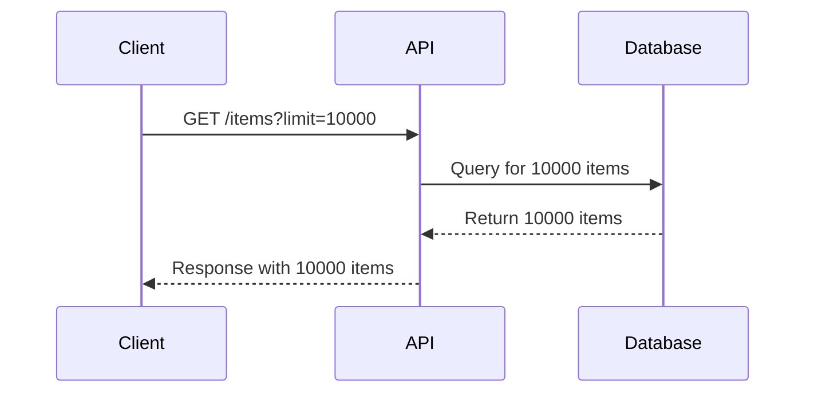

## Resource Exhaustion in APIs

### Introduction

Resource exhaustion attacks occur when an attacker deliberately consumes excessive amounts of resources, such as CPU, memory, or disk space, causing the system to become unresponsive or crash. In the context of APIs, this can lead to denial-of-service (DoS) conditions where legitimate users cannot access the service. This chapter delves into the mechanics of resource exhaustion attacks, their impact, and how to defend against them.

### Understanding Resource Exhaustion

#### What is Resource Exhaustion?

Resource exhaustion occurs when an attacker sends a large number of requests to an API, overwhelming the server's resources. This can result in the server being unable to process legitimate requests, leading to a denial-of-service condition. Common resources that can be exhausted include:

- **CPU**: High processing load can slow down or crash the server.
- **Memory**: Excessive memory usage can lead to out-of-memory errors.
- **Disk Space**: Large file uploads or excessive logging can fill up disk space.
- **Network Bandwidth**: High traffic can saturate network links.

#### Why Does Resource Exhaustion Matter?

Resource exhaustion attacks can have severe consequences, including:

- **Service Unavailability**: Legitimate users cannot access the service.
- **Data Loss**: In extreme cases, the server might crash, leading to data loss.
- **Financial Impact**: Downtime can result in financial losses for businesses.

#### How Does Resource Exhaustion Work?

An attacker typically sends a large number of requests to the API, each consuming a significant amount of resources. For example, an attacker might send a large number of requests to fetch a large dataset, causing the server to consume excessive CPU and memory resources.

### Real-World Examples

#### Recent Breaches and CVEs

One notable example is the **CVE-2021-21972** vulnerability in the **Apache Log4j** library. This vulnerability allowed attackers to execute arbitrary code by injecting malicious log messages, leading to resource exhaustion and potential remote code execution.

Another example is the **CVE-2020-14882** vulnerability in **Microsoft Exchange Server**, which allowed attackers to perform resource exhaustion attacks by sending a large number of requests to the server.

### Detailed Mechanics

#### Example Scenario: Fetching Large Datasets

Consider an API endpoint that allows users to fetch a list of items. Without proper rate limiting, an attacker could send a large number of requests to fetch a large dataset, causing the server to consume excessive resources.



In this scenario, the server would need to process a large number of items, consuming significant CPU and memory resources. If the server is overwhelmed by multiple such requests, it can become unresponsive.

### Full HTTP Request and Response

Here is a complete example of an HTTP request and response for fetching a large dataset:

```http
GET /items?limit=10000 HTTP/1.1
Host: api.example.com
Accept: application/json

HTTP/1.1 200 OK
Content-Type: application/json
Content-Length: 123456

{
  "items": [
    { "id": 1, "name": "Item 1" },
    { "id": 2, "name": "Item 2" },
    ...
    { "id": 10000, "name": "Item 10000" }
  ]
}
```

### How to Prevent / Defend Against Resource Exhaustion

#### Detection

To detect resource exhaustion attacks, you can monitor server metrics such as CPU usage, memory usage, and network traffic. Tools like **Prometheus** and **Grafana** can be used to visualize these metrics and set alerts for abnormal behavior.

#### Prevention

To prevent resource exhaustion attacks, you should implement the following measures:

1. **Rate Limiting**: Limit the number of requests a client can make within a certain time period.
2. **Resource Limits**: Set limits on the amount of resources a single request can consume.
3. **Input Validation**: Validate input parameters to ensure they do not exceed reasonable limits.
4. **Throttling**: Implement throttling mechanisms to slow down requests if the server is under heavy load.

#### Secure Coding Fixes

Here is an example of how to implement rate limiting in a Node.js application using the `express-rate-limit` middleware:

```javascript
const express = require('express');
const rateLimit = require('express-rate-limit');

const app = express();

// Create a rate limiter
const limiter = rateLimit({
  windowMs: 15 * 60 * 1000, // 15 minutes
  max: 100, // limit each IP to 100 requests per windowMs
});

// Apply the rate limiter to all requests
app.use(limiter);

app.get('/items', (req, res) => {
  const limit = parseInt(req.query.limit) || 100;
  if (limit > 1000) {
    return res.status(400).send({ error: 'Limit exceeds maximum allowed value' });
  }
  // Fetch items from the database
  res.send({ items: Array.from({ length: limit }, (_, i) => ({ id: i + 1, name: `Item ${i + 1}` })) });
});

app.listen(3000, () => {
  console.log('Server listening on port 3000');
});
```

### Complete Policy/Config File

Here is an example of an Nginx configuration file that implements rate limiting:

```nginx
http {
  limit_req_zone $binary_remote_addr zone=one:10m rate=1r/s;

  server {
    listen 80;
    server_name example.com;

    location /items {
      limit_req zone=one burst=5 nodelay;
      proxy_pass http://backend;
    }
  }
}
```

### Expected Result/Output

When a client makes a request to the `/items` endpoint, the server will respond with a limited number of items, preventing excessive resource consumption.

### Pitfalls and Common Mistakes

#### Common Mistakes

1. **Not Implementing Rate Limiting**: Failing to implement rate limiting can leave the server vulnerable to resource exhaustion attacks.
2. **Setting Too High Limits**: Setting limits too high can still allow attackers to exhaust resources.
3. **Ignoring Input Validation**: Failing to validate input parameters can allow attackers to bypass rate limiting mechanisms.

### Hands-On Labs

For hands-on practice, consider the following labs:

- **PortSwigger Web Security Academy**: Offers a module on rate limiting and resource exhaustion.
- **OWASP Juice Shop**: Provides a vulnerable API endpoint that can be exploited for resource exhaustion.
- **DVWA (Damn Vulnerable Web Application)**: Includes a vulnerable API endpoint that can be used to practice implementing rate limiting.

By understanding the mechanics of resource exhaustion attacks and implementing proper defenses, you can protect your API from becoming unresponsive due to excessive resource consumption.

---
<!-- nav -->
[[03-Resource Exhaustion Vulnerability|Resource Exhaustion Vulnerability]] | [[API Security/09-Lack of Resource & Rate Limiting/03-Resource Exhaustion/00-Overview|Overview]] | [[API Security/09-Lack of Resource & Rate Limiting/03-Resource Exhaustion/05-Practice Questions & Answers|Practice Questions & Answers]]
