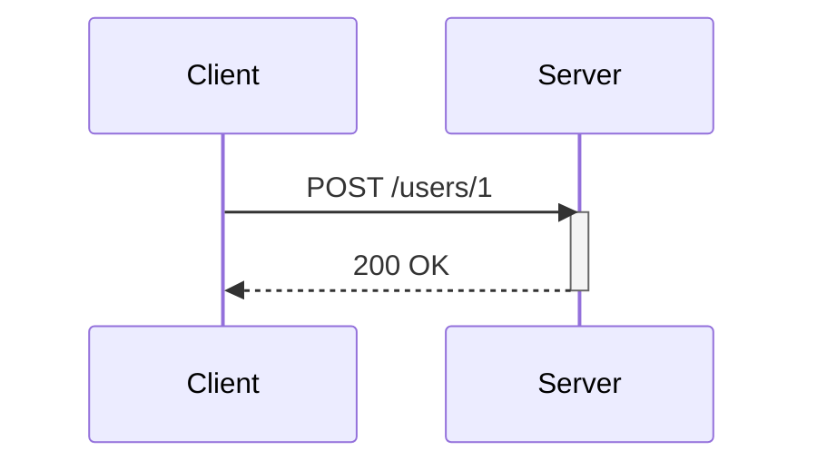
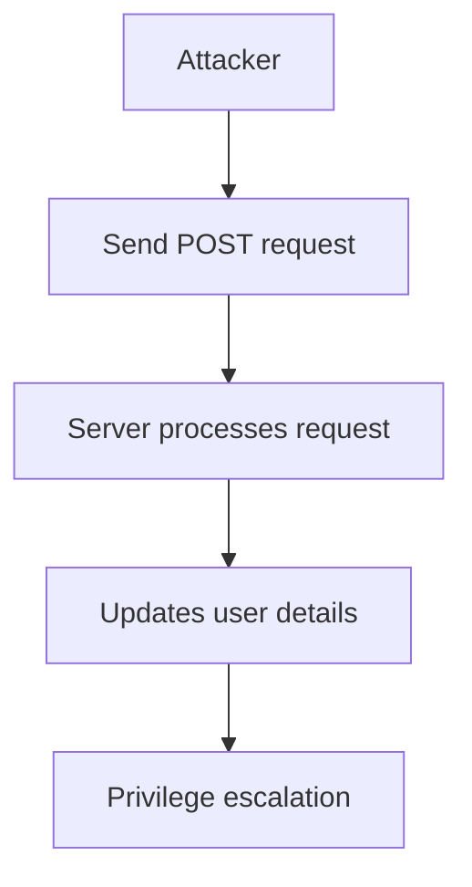

## Introduction to Mass Assignment Vulnerabilities

Mass assignment vulnerabilities occur when an application allows unfiltered input to update multiple attributes of an object, including sensitive ones that should not be modifiable by the user. This can lead to unauthorized privilege escalation, data corruption, and other serious security issues. In the context of APIs, this vulnerability often arises due to the lack of proper validation and sanitization of input data.

### Background Theory

In many web applications, especially those built using frameworks like Ruby on Rails, Django, or Laravel, developers often use ORM (Object-Relational Mapping) libraries to interact with databases. These ORMs allow developers to easily map objects to database tables and perform CRUD (Create, Read, Update, Delete) operations. However, if the developer does not properly restrict which fields can be updated via an API endpoint, an attacker can exploit this to modify sensitive fields.

For instance, consider a `User` model with fields such as `id`, `email`, `role_id`, etc. If the API endpoint allows updating all these fields without proper validation, an attacker could send a request to change the `role_id` to an administrative role, thereby gaining elevated privileges.

### Real-World Examples

#### CVE-2018-14574: Ruby on Rails Mass Assignment Vulnerability

CVE-2018-14574 is a notable example where a mass assignment vulnerability was exploited in a Ruby on Rails application. The vulnerability allowed attackers to modify sensitive attributes of user objects, leading to privilege escalation. This CVE highlights the importance of properly securing API endpoints against such attacks.

#### Recent Breach: Equifax Data Breach

The Equifax data breach in 2017, which exposed sensitive information of millions of customers, involved multiple vulnerabilities, including improper handling of user input. While not solely a mass assignment vulnerability, it underscores the broader risks associated with inadequate input validation and sanitization.

### Example Scenario

Let's consider an API endpoint `/users` that allows updating user details. The API endpoint is designed to accept a JSON payload containing user attributes. Here’s a simplified example:

```json
{
  "id": 1,
  "email": "user@example.com",
  "role_id": 2
}
```

If the server-side code does not properly validate which fields can be updated, an attacker could send a request to change the `role_id` to an administrative role.

### Detailed Walkthrough

#### Building the API Endpoint

Let's assume we have an API endpoint `/users` that allows updating user details. The endpoint is implemented in a Python Flask application using SQLAlchemy for ORM.

```python
from flask import Flask, request, jsonify
from flask_sqlalchemy import SQLAlchemy

app = Flask(__name__)
app.config['SQLALCHEMY_DATABASE_URI'] = 'sqlite:///test.db'
db = SQLAlchemy(app)

class User(db.Model):
    id = db.Column(db.Integer, primary_key=True)
    email = db.Column(db.String(120), unique=True, nullable=False)
    role_id = db.Column(db.Integer, nullable=False)

@app.route('/users/<int:user_id>', methods=['POST'])
def update_user(user_id):
    user = User.query.get(user_id)
    if user:
        user.email = request.json.get('email', user.email)
        user.role_id = request.json.get('role_id', user.role_id)
        db.session.commit()
        return jsonify({"message": "User updated successfully"}), 200
    else:
        return jsonify({"error": "User not found"}), 404

if __name__ == '__main__':
    app.run(debug=True)
```

#### Exploiting the Mass Assignment Vulnerability

An attacker could exploit this vulnerability by sending a POST request to the `/users` endpoint with a payload that includes the `role_id`.

```http
POST /users/1 HTTP/1.1
Host: labs.hackersera.com
Content-Type: application/json

{
  "email": "attacker@example.com",
  "role_id": 1
}
```

The server would process this request and update the user's `email` and `role_id`. If `role_id` 1 corresponds to an administrative role, the attacker would gain elevated privileges.

### How to Prevent / Defend Against Mass Assignment Attacks

#### Secure Coding Practices

To prevent mass assignment attacks, it is crucial to implement proper validation and sanitization of input data. Here are some best practices:

1. **Whitelist Attributes**: Only allow specific attributes to be updated via the API endpoint. For example, in the Flask application above, you can restrict the update to only certain fields.

```python
@app.route('/users/<int:user_id>', methods=['POST'])
def update_user(user_id):
    user = User.query.get(user_id)
    if user:
        user.email = request.json.get('email', user.email)
        # Do not allow role_id to be updated via this endpoint
        db.session.commit()
        return jsonify({"message": "User updated successfully"}), 200
    else:
        return jsonify({"error": "User not found"}), 404
```

2. **Use Strong Input Validation**: Ensure that all input data is validated against expected formats and ranges. For example, validate email addresses and ensure `role_id` is within a valid range.

3. **Role-Based Access Control (RBAC)**: Implement RBAC to restrict which actions a user can perform based on their role. For example, only administrators should be able to update `role_id`.

#### Detection and Monitoring

Regularly monitor API logs for suspicious activity, such as unexpected updates to sensitive fields. Use tools like intrusion detection systems (IDS) and security information and event management (SIEM) systems to detect and respond to potential attacks.

#### Hardening Configuration

Ensure that your application and server configurations are hardened against common vulnerabilities. For example, disable unnecessary services, apply security patches promptly, and configure firewalls to restrict access to sensitive endpoints.

### Complete Example with Secure Code

Here is a complete example showing both the vulnerable and secure versions of the code:

#### Vulnerable Version

```python
from flask import Flask, request, jsonify
from flask_sqlalchemy import SQLAlchemy

app = Flask(__name__)
app.config['SQLALCHEMY_DATABASE_URI'] = 'sqlite:///test.db'
db = SQLAlchemy(app)

class User(db.Model):
    id = db.Column(db.Integer, primary_key=True)
    email = db.Column(db.String(120), unique=True, nullable=False)
    role_id = db.Column(db.Integer, nullable=False)

@app.route('/users/<int:user_id>', methods=['POST'])
def update_user(user_id):
    user = User.query.get(user_id)
    if user:
        user.email = request.json.get('email', user.email)
        user.role_id = request.json.get('role_id', user.role_id)
        db.session.commit()
        return jsonify({"message": "User updated successfully"}), 200
    else:
        return jsonify({"error": "User not found"}), 404

if __name__ == '__main__':
    app.run(debug=True)
```

#### Secure Version

```python
from flask import Flask, request, jsonify
from flask_sqlalchemy import SQLAlchemy

app = Flask(__name__)
app.config['SQLALCHEMY_DATABASE_URI'] = 'sqlite:///test.db'
db = SQLAlchemy(app)

class User(db.Model):
    id = db.Column(db.Integer, primary_key=True)
    email = db.Column(db.String(120), unique=True, nullable=False)
    role_id = db.Column(db.Integer, nullable=False)

@app.route('/users/<int:user_id>', methods=['POST'])
def update_user(user_id):
    user = User.query.get(user_id)
    if user:
        user.email = request.json.get('email', user.email)
        # Do not allow role_id to be updated via this endpoint
        db.session.commit()
        return jsonify({"message": "User updated successfully"}), 200
    else:
        return jsonify({"error": "User not found"}), 404

if __name__ == '__main__':
    app.run(debug=True)
```

### Mermaid Diagrams

#### Request/Response Flow



#### Attack Chain



### Practice Labs

For hands-on practice with mass assignment vulnerabilities, consider the following labs:

- **PortSwigger Web Security Academy**: Offers a series of labs focused on various web security vulnerabilities, including mass assignment.
- **OWASP Juice Shop**: A deliberately insecure web application for security training purposes, featuring several vulnerabilities including mass assignment.
- **DVWA (Damn Vulnerable Web Application)**: Another popular web application for learning about web security vulnerabilities, including mass assignment.

By thoroughly understanding and implementing the best practices outlined above, you can significantly reduce the risk of mass assignment vulnerabilities in your applications.

---
<!-- nav -->
[[API Security/10-Mass Assignment Attack/02-Mass Assignment Demonstration 3/00-Overview|Overview]] | [[02-Understanding Mass Assignment Vulnerabilities|Understanding Mass Assignment Vulnerabilities]]
