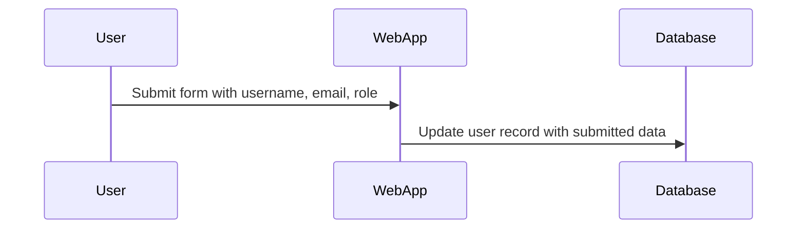

## Understanding Mass Assignment Vulnerabilities

Mass assignment vulnerabilities occur when an application allows unfiltered input to be assigned to object properties, potentially leading to unauthorized data manipulation. This type of vulnerability is particularly dangerous in web applications where user input can be used to modify sensitive data such as user roles or permissions.

### Background Theory

In many web frameworks, objects are often populated using mass assignment techniques. For instance, when a user submits a form, the framework might automatically map the form fields to the corresponding properties of an object. This process can be convenient for developers but poses significant security risks if not properly controlled.

#### How Mass Assignment Works

Consider a typical scenario where a user profile is being updated. The user might submit a form containing various fields such as `username`, `email`, and `role`. In a vulnerable application, these fields could be directly mapped to the corresponding properties of a user object, allowing an attacker to manipulate sensitive fields like `role`.



### Real-World Examples

Recent real-world examples of mass assignment vulnerabilities include:

- **CVE-2021-3427**: A mass assignment vulnerability was found in the WordPress plugin "WP GDPR Compliance." An attacker could exploit this vulnerability to gain administrative privileges by manipulating the `role` field during user updates.
  
- **CVE-2020-14882**: In the Ruby on Rails framework, a mass assignment vulnerability allowed attackers to escalate their privileges by manipulating certain attributes during object creation or update operations.

### Detailed Example: Exploiting Mass Assignment

Let's consider a hypothetical web application where users can update their profiles. The application uses a simple REST API to handle these updates. Here’s a step-by-step breakdown of how an attacker might exploit a mass assignment vulnerability:

#### Vulnerable Code

Suppose the application has a `User` model with properties such as `username`, `email`, and `role`. The `update_user` function in the backend might look something like this:

```python
class User:
    def __init__(self, username, email, role):
        self.username = username
        self.email = email
        self.role = role

def update_user(user_id, data):
    user = get_user_by_id(user_id)
    for key, value in data.items():
        setattr(user, key, value)
    save_user(user)
```

Here, the `update_user` function takes a `user_id` and a dictionary `data` containing the fields to be updated. The function then iterates over the dictionary and sets the corresponding properties of the `User` object.

#### Attacker's Approach

An attacker could craft a request to exploit this vulnerability. For example, they might send a PUT request to update a user's profile:

```http
PUT /api/users/1 HTTP/1.1
Host: example.com
Content-Type: application/json

{
    "username": "attacker",
    "email": "attacker@example.com",
    "role": "admin"
}
```

The server would receive this request and update the user's profile accordingly, potentially elevating the attacker's privileges.

### Full HTTP Request and Response

Here’s a complete example of the HTTP request and response:

#### Request

```http
PUT /api/users/1 HTTP/1.1
Host: example.com
Content-Type: application/json
Authorization: Bearer <access_token>

{
    "username": "attacker",
    "email": "attacker@example.com",
    "role": "admin"
}
```

#### Response

```http
HTTP/1.1 200 OK
Content-Type: application/json

{
    "message": "User updated successfully",
    "user": {
        "id": 1,
        "username": "attacker",
        "email": "attacker@example.com",
        "role": "admin"
    }
}
```

### Common Pitfalls

Developers often overlook the importance of validating and sanitizing input before assigning it to object properties. Some common pitfalls include:

- **Lack of Input Validation**: Not checking whether the input fields are valid or allowed.
- **Automatic Property Binding**: Frameworks that automatically bind input to object properties without proper validation.
- **Insufficient Access Control**: Not enforcing proper access control mechanisms to restrict which fields can be modified.

### How to Prevent / Defend

To prevent mass assignment vulnerabilities, several strategies can be employed:

#### Secure Coding Practices

1. **Whitelist Attributes**: Only allow specific attributes to be updated. For example, in the `update_user` function, explicitly specify which fields can be updated:

    ```python
    def update_user(user_id, data):
        user = get_user_by_id(user_id)
        allowed_fields = ['username', 'email']
        for key, value in data.items():
            if key in allowed_fields:
                setattr(user, key, value)
        save_user(user)
    ```

2. **Use Strong Typing**: Ensure that the types of the input match the expected types of the object properties.

#### Configuration Hardening

1. **Framework Settings**: Configure your web framework to disable automatic property binding unless explicitly enabled. For example, in Ruby on Rails, you can use the `attr_accessible` method to whitelist attributes.

    ```ruby
    class User < ApplicationRecord
      attr_accessible :username, :email
    end
    ```

2. **Access Control**: Implement role-based access control (RBAC) to ensure that only authorized users can modify sensitive fields.

#### Detection

1. **Static Analysis Tools**: Use static analysis tools to scan your codebase for potential mass assignment vulnerabilities. Tools like SonarQube, Bandit, and ESLint can help identify insecure coding practices.

2. **Dynamic Analysis**: Perform dynamic analysis using penetration testing tools like Burp Suite or OWASP ZAP to simulate attacks and detect vulnerabilities in real-time.

### Complete Example: Secure Code vs. Vulnerable Code

#### Vulnerable Code

```python
class User:
    def __init__(self, username, email, role):
        self.username = username
        self.email = email
        self.role = role

def update_user(user_id, data):
    user = get_user_by_id(user_id)
    for key, value in data.items():
        setattr(user, key, value)
    save_user(user)
```

#### Secure Code

```python
class User:
    def __init__(self, username, email, role):
        self.username = username
        self.email = email
        self.role = role

def update_user(user_id, data):
    user = get_user_by_id(user_id)
    allowed_fields = ['username', 'email']
    for key, value in data.items():
        if key in allowed_fields:
            setattr(user, key, value)
    save_user(user)
```

### Practice Labs

For hands-on practice with mass assignment vulnerabilities, consider the following labs:

- **PortSwigger Web Security Academy**: Offers interactive labs on mass assignment vulnerabilities.
- **OWASP Juice Shop**: Provides a vulnerable web application where you can practice identifying and exploiting mass assignment vulnerabilities.
- **DVWA (Damn Vulnerable Web Application)**: Another excellent resource for practicing web security concepts, including mass assignment vulnerabilities.

By thoroughly understanding and implementing the preventive measures discussed, developers can significantly reduce the risk of mass assignment vulnerabilities in their applications.

---
<!-- nav -->
[[01-Introduction to Mass Assignment Vulnerabilities|Introduction to Mass Assignment Vulnerabilities]] | [[API Security/10-Mass Assignment Attack/02-Mass Assignment Demonstration 3/00-Overview|Overview]] | [[API Security/10-Mass Assignment Attack/02-Mass Assignment Demonstration 3/03-Practice Questions & Answers|Practice Questions & Answers]]
