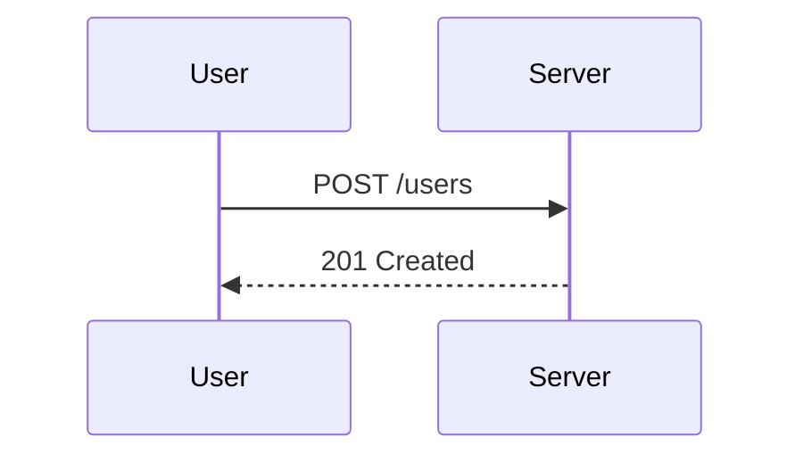

## Mass Assignment Attack

### Introduction

Mass assignment, also known as overposting, is a common vulnerability in web applications where an attacker can manipulate the input data to set values for properties that should not be user-modifiable. This typically occurs in frameworks that automatically map incoming request parameters to object properties without proper validation or sanitization. The result can be unauthorized access, privilege escalation, or other malicious actions.

### Understanding Mass Assignment

#### What is Mass Assignment?

Mass assignment occurs when a framework automatically maps all incoming request parameters to the properties of an object. This can lead to unintended consequences if the application does not properly validate which properties should be modifiable by the user.

For example, consider a user registration form where the user can set their username and password. If the application allows the user to set additional properties like `isAdmin`, an attacker could potentially set this property to `true` and gain administrative privileges.

#### Why Does Mass Assignment Matter?

Mass assignment vulnerabilities can have severe security implications:

- **Privilege Escalation**: An attacker can elevate their privileges by setting sensitive properties such as `isAdmin`.
- **Data Manipulation**: An attacker can modify other fields that should not be user-modifiable, leading to data corruption or unauthorized actions.
- **Unauthorized Access**: By manipulating certain properties, an attacker might gain access to restricted areas of the application.

### Real-World Examples

#### Recent CVEs and Breaches

One notable example of a mass assignment vulnerability is CVE-2015-3210, which affected the Ruby on Rails framework. In this case, an attacker could exploit the vulnerability to gain administrative privileges by setting the `admin` attribute to `true`.

Another example is the breach at Equifax in 2017, where attackers exploited a vulnerability in Apache Struts to gain unauthorized access to sensitive data. While not explicitly a mass assignment issue, the underlying principle of unvalidated input led to the breach.

### How Mass Assignment Works

#### Example Scenario

Consider a simple user registration form in a web application. The form allows users to set their username and password. However, due to a mass assignment vulnerability, an attacker can also set the `isAdmin` property to `true`.



#### Code Example

Here is a simplified example using Python and Flask:

```python
from flask import Flask, request
from flask_sqlalchemy import SQLAlchemy

app = Flask(__name__)
app.config['SQLALCHEMY_DATABASE_URI'] = 'sqlite:///users.db'
db = SQLAlchemy(app)

class User(db.Model):
    id = db.Column(db.Integer, primary_key=True)
    username = db.Column(db.String(80), unique=True, nullable=False)
    password = db.Column(db.String(120), nullable=False)
    isAdmin = db.Column(db.Boolean, default=False)

@app.route('/users', methods=['POST'])
def create_user():
    data = request.get_json()
    new_user = User(**data)
    db.session.add(new_user)
    db.session.commit()
    return {'message': 'User created'}, 201

if __name__ == '__main__':
    app.run(debug=True)
```

In this example, the `create_user` function takes all the data from the request and maps it directly to the `User` model. An attacker can exploit this by sending a request like:

```json
{
    "username": "attacker",
    "password": "password",
    "isAdmin": true
}
```

### Pitfalls and Common Mistakes

#### Unvalidated Input

The most common mistake is failing to validate which properties should be modifiable by the user. Frameworks that automatically map all incoming parameters to object properties without proper validation are particularly vulnerable.

#### Lack of Authorization Checks

Even if the input is validated, lack of proper authorization checks can lead to mass assignment vulnerabilities. For example, an attacker might be able to set properties that should only be modifiable by administrators.

### How to Prevent / Defend

#### Secure Coding Practices

To prevent mass assignment vulnerabilities, follow these secure coding practices:

1. **Whitelist Properties**: Only allow specific properties to be modifiable by the user. Explicitly define which properties can be set.
2. **Authorization Checks**: Ensure that only authorized users can set certain properties. For example, only administrators should be able to set the `isAdmin` property.
3. **Input Validation**: Validate all incoming data to ensure it meets the expected format and constraints.

#### Example Secure Code

Here is an example of how to securely handle user creation in Flask:

```python
from flask import Flask, request
from flask_sqlalchemy import SQLAlchemy

app = Flask(__name__)
app.config['SQLALCHEMY_DATABASE_URI'] = 'sqlite:///users.db'
db = SQLAlchemy(app)

class User(db.Model):
    id = db.Column(db.Integer, primary_key=True)
    username = db.Column(db.String(80), unique=True, nullable=False)
    password = db.Column(db.String(120), nullable=False)
    isAdmin = db.Column(db.Boolean, default=False)

@app.route('/users', methods=['POST'])
def create_user():
    data = request.get_json()
    new_user = User(
        username=data.get('username'),
        password=data.get('password')
    )
    db.session.add(new_user)
    db.session.commit()
    return {'message': 'User created'}, 201

if __name__ == '__main__':
    app.run(debug=True)
```

In this example, only the `username` and `password` properties are set from the incoming data. The `isAdmin` property is not modifiable by the user.

#### Detection and Prevention Tools

Use tools and libraries that help prevent mass assignment vulnerabilities:

- **Flask-WTF**: A library for handling forms in Flask that includes CSRF protection and form validation.
- **OWASP ZAP**: A free tool for finding security vulnerabilities in web applications, including mass assignment issues.
- **SonarQube**: A static code analysis tool that can detect potential mass assignment vulnerabilities.

### Practice Labs

To practice and understand mass assignment attacks, consider the following labs:

- **PortSwigger Web Security Academy**: Offers interactive labs on various web security topics, including mass assignment.
- **OWASP Juice Shop**: A deliberately insecure web application for practicing web security skills.
- **DVWA (Damn Vulnerable Web Application)**: A PHP/MySQL web application that demonstrates common web application vulnerabilities.

### Conclusion

Mass assignment vulnerabilities can have serious security implications, including privilege escalation and unauthorized access. By understanding how these vulnerabilities work and implementing secure coding practices, developers can prevent such issues. Always validate and whitelist properties, perform authorization checks, and use tools to detect and prevent mass assignment vulnerabilities.

---
<!-- nav -->
[[01-Introduction to Mass Assignment Attacks|Introduction to Mass Assignment Attacks]] | [[API Security/10-Mass Assignment Attack/03-Mass Assignment Demonstration/00-Overview|Overview]] | [[API Security/10-Mass Assignment Attack/03-Mass Assignment Demonstration/03-Practice Questions & Answers|Practice Questions & Answers]]
