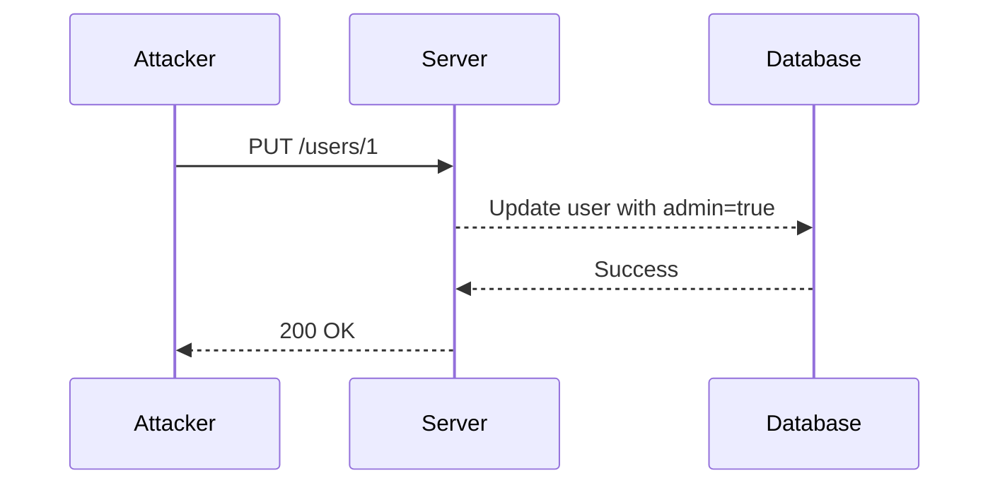
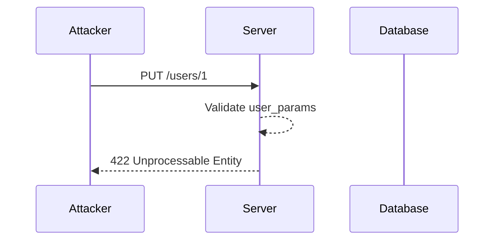

## Introduction to Mass Assignment Attack

Mass assignment is a common vulnerability found in web applications, particularly those built using modern frameworks such as Ruby on Rails, Laravel, and Django. This vulnerability arises when an application allows untrusted input to update attributes of an object without proper validation or sanitization. In essence, mass assignment enables attackers to manipulate sensitive data, leading to unauthorized access, privilege escalation, and other severe security issues.

### What is Mass Assignment?

Mass assignment occurs when a web application accepts a collection of key-value pairs (often in the form of a JSON object) and uses these pairs to update the attributes of an object. This mechanism is often used to simplify the development process, allowing developers to quickly update multiple fields of an object with minimal code. However, if not properly secured, this can lead to significant security risks.

#### Example Scenario

Consider a web application that allows users to update their profile information. The application might accept a JSON object containing various fields such as `username`, `email`, `password`, and `admin`. If the application blindly updates all these fields without proper validation, an attacker could exploit this to set themselves as an admin user.

```json
{
  "username": "attacker",
  "email": "attacker@example.com",
  "password": "securepassword",
  "admin": true
}
```

In this example, the attacker can set the `admin` field to `true`, thereby gaining administrative privileges.

### Why Does Mass Assignment Matter?

Mass assignment is a critical concern because it can lead to several types of attacks:

1. **Privilege Escalation**: An attacker can elevate their privileges by setting certain fields to specific values.
2. **Data Manipulation**: An attacker can modify sensitive data, such as financial records or personal information.
3. **Unauthorized Access**: An attacker can gain access to restricted areas of the application by manipulating authentication-related fields.

### How Does Mass Assignment Work Under the Hood?

Modern web frameworks often provide mechanisms to automatically map incoming data to model objects. For instance, in Ruby on Rails, the `update_attributes` method can be used to update multiple attributes of a model at once. Similarly, in Laravel, the `fill` method can be used to fill a model with an array of attributes.

#### Example in Ruby on Rails

Consider the following Ruby on Rails code snippet:

```ruby
class User < ApplicationRecord
  attr_accessor :admin
end

def update_user
  @user = User.find(params[:id])
  @user.update_attributes(user_params)
  redirect_to @user
end

private

def user_params
  params.require(:user).permit(:username, :email, :password, :admin)
end
```

In this example, the `update_attributes` method is used to update the user's attributes based on the `params` passed in the request. If the `admin` attribute is included in the permitted list, an attacker can set it to `true`.

### Real-World Examples and Recent Breaches

Several high-profile breaches have been attributed to mass assignment vulnerabilities. One notable example is the breach of the popular social networking site LinkedIn in 2012. Although the primary cause was weak password hashing, the breach also exposed the importance of securing user data against unauthorized modifications.

Another example is the breach of the online retailer Target in 2013. While the primary attack vector was through a third-party HVAC vendor, the breach highlighted the importance of securing all aspects of an application, including user data.

### How to Detect Mass Assignment Vulnerabilities

Detecting mass assignment vulnerabilities requires a combination of static analysis and dynamic testing. Static analysis tools can help identify areas where mass assignment is being used without proper validation. Dynamic testing involves sending crafted payloads to the application to see if they are accepted and processed.

#### Static Analysis Tools

- **Brakeman**: A static analysis tool for Ruby on Rails applications that can detect mass assignment vulnerabilities.
- **SonarQube**: A code quality management tool that supports multiple languages and can detect various security vulnerabilities, including mass assignment.

#### Dynamic Testing Tools

- **OWASP ZAP**: A free and open-source web application security scanner that can be used to test for mass assignment vulnerabilities.
- **Burp Suite**: A comprehensive toolkit for web application security testing that includes features for detecting and exploiting mass assignment vulnerabilities.

### How to Prevent / Defend Against Mass Assignment Attacks

Preventing mass assignment attacks requires a combination of proper coding practices, validation, and hardening of the application.

#### Secure Coding Practices

1. **Whitelist Attributes**: Only permit the attributes that should be updated. Avoid using blanket methods that allow all attributes to be updated.
2. **Strong Parameters**: Use strong parameters to explicitly define which attributes can be updated. This is particularly important in frameworks like Ruby on Rails and Laravel.

#### Example in Ruby on Rails

```ruby
class User < ApplicationRecord
  attr_accessor :admin
end

def update_user
  @user = User.find(params[:id])
  @user.update(user_params)
  redirect_to @user
end

private

def user_params
  params.require(:user).permit(:username, :email, :password)
end
```

In this example, the `admin` attribute is not included in the permitted list, thus preventing an attacker from setting it to `true`.

#### Example in Laravel

```php
public function update(Request $request, $id)
{
    $user = User::findOrFail($id);
    $user->update($request->validate([
        'username' => 'required|string|max:255',
        'email' => 'required|string|email|max:255|unique:users,email,' . $id,
        'password' => 'nullable|string|min:8',
    ]));
    return redirect()->route('users.show', $user);
}
```

In this example, the `admin` attribute is not included in the validation rules, thus preventing an attacker from setting it to `true`.

#### Hardening the Application

1. **Input Validation**: Always validate user input to ensure it meets the expected format and constraints.
2. **Role-Based Access Control (RBAC)**: Implement RBAC to restrict access to sensitive operations based on user roles.
3. **Logging and Monitoring**: Log and monitor suspicious activities to detect potential mass assignment attacks.

### Complete Example: Mass Assignment Exploitation and Prevention

#### Vulnerable Code

Consider the following vulnerable code in a Ruby on Rails application:

```ruby
class User < ApplicationRecord
  attr_accessor :admin
end

def update_user
  @user = User.find(params[:id])
  @user.update_attributes(user_params)
  redirect_to @user
end

private

def user_params
  params.require(:user).permit(:username, :email, :password, :admin)
end
```

#### Exploit Request

An attacker can send the following PUT request to exploit the mass assignment vulnerability:

```http
PUT /users/1 HTTP/1.1
Host: example.com
Content-Type: application/json

{
  "username": "attacker",
  "email": "attacker@example.com",
  "password": "securepassword",
  "admin": true
}
```

#### Exploit Response

The server would respond with a successful update:

```http
HTTP/1.1 200 OK
Content-Type: application/json

{
  "id": 1,
  "username": "attacker",
  "email": "attacker@example.com",
  "admin": true
}
```

#### Secure Code

To prevent the mass assignment vulnerability, the code should be modified as follows:

```ruby
class User < ApplicationRecord
  attr_accessor :admin
end

def update_user
  @user = User.find(params[:id])
  @user.update(user_params)
  redirect_to @user
end

private

def user_params
  params.require(:user).permit(:username, :email, :password)
end
```

#### Secure Request

The attacker's request would now be rejected:

```http
PUT /users/1 HTTP/1.1
Host: example.com
Content-Type: application/json

{
  "username": "attacker",
  "email": "attacker@example.com",
  "password": "securepassword",
  "admin": true
}
```

#### Secure Response

The server would respond with an error:

```http
HTTP/1.1 422 Unprocessable Entity
Content-Type: application/json

{
  "errors": {
    "admin": ["is not allowed"]
  }
}
```

### Mermaid Diagrams

#### Mass Assignment Attack Chain



#### Secure Mass Assignment Flow



### Practice Labs

For hands-on practice with mass assignment attacks, consider the following labs:

- **PortSwigger Web Security Academy**: Offers a module on mass assignment vulnerabilities.
- **OWASP Juice Shop**: Contains several challenges related to mass assignment and other security vulnerabilities.
- **DVWA (Damn Vulnerable Web Application)**: Provides a variety of web application vulnerabilities, including mass assignment.

By thoroughly understanding and implementing the preventive measures discussed, developers can significantly reduce the risk of mass assignment attacks and ensure the security of their applications.

---
<!-- nav -->
[[API Security/10-Mass Assignment Attack/04-Mass Assignment Preparation/00-Overview|Overview]] | [[API Security/10-Mass Assignment Attack/04-Mass Assignment Preparation/02-Introduction to Mass Assignment Vulnerability|Introduction to Mass Assignment Vulnerability]]
