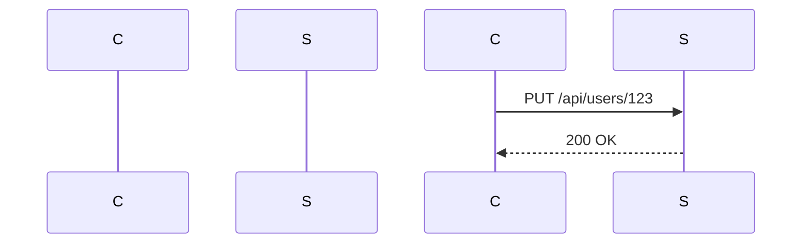

## Mass Assignment Attack

### Introduction

Mass assignment vulnerabilities occur when an application allows an attacker to set arbitrary object properties through a form or API endpoint. This can lead to unauthorized data manipulation, privilege escalation, and other serious security issues. In this section, we will delve deep into the mechanics of mass assignment attacks, their potential impacts, and how to defend against them.

### Understanding Mass Assignment

#### What is Mass Assignment?

Mass assignment is a feature in many web frameworks that allows developers to update multiple attributes of an object at once. For instance, consider a user profile update form where a user can change their name, email, and role. The framework might automatically map the form fields to the corresponding object properties, updating all of them in one go.

#### Why Does It Matter?

While convenient for developers, mass assignment can introduce significant security risks if not properly controlled. An attacker can exploit this feature to set arbitrary properties, including sensitive ones like `isAdmin`, which could grant them elevated privileges.

#### How Does It Work Under the Hood?

Let's take a look at a simplified example using a hypothetical web framework:

```python
class User:
    def __init__(self, name, email, role):
        self.name = name
        self.email = email
        self.role = role

def update_user(user_id, data):
    user = get_user_by_id(user_id)
    for key, value in data.items():
        setattr(user, key, value)
    save_user(user)
```

In this example, the `update_user` function takes a `user_id` and a dictionary `data` containing the new attribute values. It then iterates over the dictionary and sets each attribute on the user object. This is a classic case of mass assignment.

### Real-World Examples

#### Recent CVEs and Breaches

One notable example of a mass assignment vulnerability is CVE-2018-14574, which affected the popular Ruby on Rails framework. In this case, an attacker could manipulate the `admin` attribute of a user object, effectively granting themselves administrative privileges.

Another example is the breach of the popular social networking site MySpace in 2006. Although not directly related to mass assignment, the incident highlights the importance of proper input validation and access control mechanisms.

### Crafting Malicious Calls

To understand how an attacker might exploit a mass assignment vulnerability, let's consider a scenario where a user can update their profile information via an API endpoint.

#### Example Scenario: Profile Update

Suppose we have an API endpoint `/api/users/:id` that allows users to update their profile information. The endpoint accepts a JSON payload containing the updated attributes.

```json
{
  "name": "John Doe",
  "email": "john.doe@example.com",
  "role": "user"
}
```

An attacker could craft a malicious payload to exploit the mass assignment vulnerability:

```json
{
  "name": "John Doe",
  "email": "john.doe@example.com",
  "role": "admin",
  "password": "hacked"
}
```

By including the `role` and `password` attributes in the payload, the attacker attempts to elevate their privileges and change their password.

### HTTP Request and Response

Let's examine the full HTTP request and response for this scenario.

#### HTTP Request

```http
PUT /api/users/123 HTTP/1.1
Host: example.com
Content-Type: application/json
Authorization: Bearer <access_token>

{
  "name": "John Doe",
  "email": "john.doe@example.com",
  "role": "admin",
  "password": "hacked"
}
```

#### HTTP Response

```http
HTTP/1.1 200 OK
Content-Type: application/json

{
  "message": "User updated successfully"
}
```

### Mermaid Diagrams

#### Sequence Diagram

A sequence diagram can help visualize the interaction between the client and the server during a mass assignment attack.



### Pitfalls and Common Mistakes

#### Unrestricted Attribute Updates

One of the most common mistakes is allowing unrestricted updates to sensitive attributes. Developers should carefully restrict which attributes can be updated via mass assignment.

#### Lack of Input Validation

Failing to validate input can also lead to mass assignment vulnerabilities. Input validation should be performed on both the client and server sides to ensure that only valid data is accepted.

### How to Prevent / Defend

#### Detection

To detect mass assignment vulnerabilities, you can perform static code analysis and dynamic testing. Static analysis tools can identify instances where mass assignment is used without proper restrictions. Dynamic testing involves simulating attacks to see if the application is vulnerable.

#### Prevention

To prevent mass assignment vulnerabilities, follow these best practices:

1. **Whitelist Attributes**: Explicitly define which attributes can be updated via mass assignment.
2. **Input Validation**: Validate all input data to ensure it meets expected criteria.
3. **Role-Based Access Control**: Implement role-based access control to restrict access to sensitive operations.

#### Secure Coding Fixes

Here’s an example of how to securely handle mass assignment in Python:

```python
class User:
    def __init__(self, name, email, role):
        self.name = name
        self.email = email
        self.role = role

def update_user(user_id, data):
    user = get_user_by_id(user_id)
    allowed_attributes = ['name', 'email']
    for key, value in data.items():
        if key in allowed_attributes:
            setattr(user, key, value)
    save_user(user)
```

In this example, only the `name` and `email` attributes are allowed to be updated, preventing an attacker from setting the `role` attribute.

#### Configuration Hardening

Ensure that your application framework is configured to prevent mass assignment vulnerabilities. For example, in Ruby on Rails, you can use the `attr_accessible` method to whitelist attributes:

```ruby
class User < ApplicationRecord
  attr_accessible :name, :email
end
```

### Complete Example

Let's put everything together with a complete example using a hypothetical web application.

#### Vulnerable Code

```python
class User:
    def __init__(self, name, email, role):
        self.name = name
        self.email = email
        self.role = role

def update_user(user_id, data):
    user = get_user_by_id(user_id)
    for key, value in data.items():
        setattr(user, key, value)
    save_user(user)
```

#### Secure Code

```python
class User:
    def __init__(self, name, email, role):
        self.name = name
        self.email = email
        self.role = role

def update_user(user_id, data):
    user = get_user_by_id(user_id)
    allowed_attributes = ['name', 'email']
    for key, value in data.items():
        if key in allowed_attributes:
            setattr(user, key, value)
    save_user(user)
```

### Conclusion

Mass assignment vulnerabilities can have severe consequences if not properly managed. By understanding the mechanics of these vulnerabilities, crafting malicious calls, and implementing robust defenses, you can significantly reduce the risk of exploitation.

### Hands-On Labs

For practical experience with mass assignment attacks, consider the following labs:

- **PortSwigger Web Security Academy**: Offers interactive labs on various web security topics, including mass assignment vulnerabilities.
- **OWASP Juice Shop**: A deliberately insecure web application for practicing web security skills.
- **DVWA (Damn Vulnerable Web Application)**: A PHP/MySQL web application that is riddled with vulnerabilities for educational purposes.

These labs provide a safe environment to practice identifying and defending against mass assignment vulnerabilities.

---
<!-- nav -->
[[API Security/10-Mass Assignment Attack/04-Mass Assignment Preparation/02-Introduction to Mass Assignment Vulnerability|Introduction to Mass Assignment Vulnerability]] | [[API Security/10-Mass Assignment Attack/04-Mass Assignment Preparation/00-Overview|Overview]] | [[04-Understanding Mass Assignment Vulnerability|Understanding Mass Assignment Vulnerability]]
