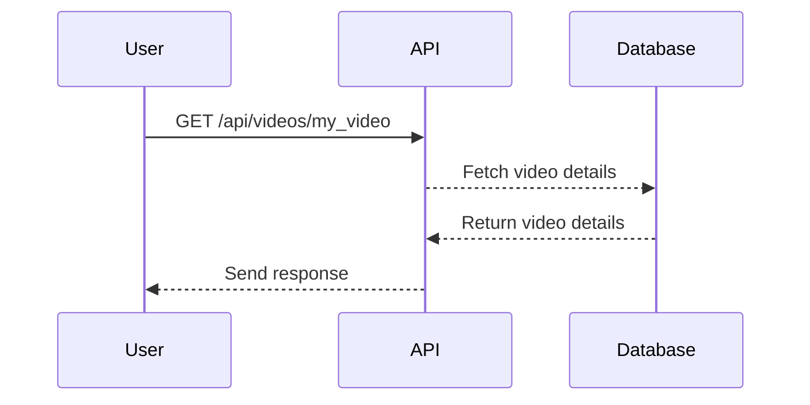

## Understanding Mass Assignment Vulnerability

### Background Theory

Mass assignment, also known as overposting, is a security vulnerability that occurs when an application allows unfiltered user input to overwrite internal object properties. This can lead to unauthorized data modification, privilege escalation, and other severe security issues. The vulnerability arises when an application uses a single method to map incoming data to an object, allowing attackers to set arbitrary properties of that object.

### How Mass Assignment Works

In the context of web applications, mass assignment typically involves an HTTP POST request where the request body contains key-value pairs that correspond to the properties of an object. The application then maps these key-value pairs to the object properties without proper validation or filtering.

#### Example Scenario

Consider an API endpoint that handles video uploads and conversions. The request body might contain parameters such as `name` and `format`. For instance:

```json
{
  "name": "my_video",
  "format": "mp4"
}
```

The application might use this data to create or update a video object. However, if the application does not properly validate or filter the input, an attacker could potentially send additional parameters that would overwrite internal properties of the video object.

### Crafting a Request to Exploit Mass Assignment

To understand how to exploit mass assignment, let's consider a scenario where we want to retrieve all properties of a video object at a specific endpoint.

#### Step-by-Step Process

1. **Identify the Endpoint**: Determine the API endpoint that returns video information. For example, `/api/videos/my_video`.

2. **Craft the Request**: Construct an HTTP GET request to fetch the video details.

```http
GET /api/videos/my_video HTTP/1.1
Host: example.com
Accept: application/json
```

3. **Analyze the Response**: Examine the response to identify all the properties of the video object.

```http
HTTP/1.1 200 OK
Content-Type: application/json

{
  "video_id": "V-ID",
  "file_name": "my_video.mp4",
  "format": "mp4",
  "upload_date": "2023-10-01T12:00:00Z",
  "duration": "00:05:00",
  "status": "converted"
}
```

### Real-World Examples

#### Recent CVEs and Breaches

One notable example of mass assignment vulnerability is CVE-2018-1268. This vulnerability affected several Ruby on Rails applications, where unfiltered user input was used to update model attributes, leading to unauthorized data modification.

Another example is the breach of a popular social media platform in 2021, where an attacker exploited a mass assignment vulnerability to gain unauthorized access to user profiles and modify sensitive information.

### Pitfalls and Common Mistakes

#### Unfiltered User Input

The primary pitfall is failing to validate and filter user input before mapping it to object properties. This allows attackers to inject arbitrary data and overwrite internal properties.

#### Lack of Authorization Checks

Another common mistake is not implementing proper authorization checks. Even if input is validated, an attacker might still exploit the vulnerability if the application does not verify whether the user has the necessary permissions to modify certain properties.

### How to Prevent / Defend Against Mass Assignment

#### Detection

To detect mass assignment vulnerabilities, you can perform static code analysis and dynamic testing. Static analysis tools like SonarQube and Fortify can help identify unfiltered user input. Dynamic testing tools like Burp Suite and OWASP ZAP can simulate attacks to check for vulnerabilities.

#### Prevention

1. **Input Validation**: Always validate and sanitize user input before using it to update object properties. Ensure that only expected fields are updated.

2. **Whitelist Attributes**: Use whitelisting to specify which attributes can be updated. This prevents attackers from setting arbitrary properties.

3. **Authorization Checks**: Implement robust authorization mechanisms to ensure that users can only modify properties they are authorized to change.

#### Secure Coding Fixes

Here’s an example of how to securely handle mass assignment in a Ruby on Rails application:

**Vulnerable Code:**

```ruby
class Video < ApplicationRecord
  def update_attributes(params)
    self.attributes = params
  end
end
```

**Secure Code:**

```ruby
class Video < ApplicationRecord
  attr_accessible :name, :format, :upload_date, :duration, :status

  def update_attributes(params)
    self.update(params.permit(:name, :format, :upload_date, :duration, :status))
  end
end
```

### Complete Example

#### Full HTTP Request and Response

**Request:**

```http
GET /api/videos/my_video HTTP/1.1
Host: example.com
Accept: application/json
```

**Response:**

```http
HTTP/1.1 200 OK
Content-Type: application/json

{
  "video_id": "V-ID",
  "file_name": "my_video.mp4",
  "format": "mp4",
  "upload_date": "2_2023-10-01T12:00:00Z",
  "duration": "00:05:00",
  "status": "converted"
}
```

### Mermaid Diagrams

#### Sequence Diagram



### Hands-On Labs

For practical experience with mass assignment vulnerabilities, consider the following labs:

- **PortSwigger Web Security Academy**: Offers interactive labs to practice identifying and exploiting mass assignment vulnerabilities.
- **OWASP Juice Shop**: A deliberately insecure web application that includes various security vulnerabilities, including mass assignment.
- **DVWA (Damn Vulnerable Web Application)**: Another intentionally vulnerable web application that can be used to practice detecting and exploiting mass assignment vulnerabilities.

By thoroughly understanding the concepts, real-world examples, and secure coding practices, you can effectively prevent and defend against mass assignment vulnerabilities in your applications.

---
<!-- nav -->
[[API Security/10-Mass Assignment Attack/04-Mass Assignment Preparation/03-Mass Assignment Attack|Mass Assignment Attack]] | [[API Security/10-Mass Assignment Attack/04-Mass Assignment Preparation/00-Overview|Overview]] | [[API Security/10-Mass Assignment Attack/04-Mass Assignment Preparation/05-Practice Questions & Answers|Practice Questions & Answers]]
