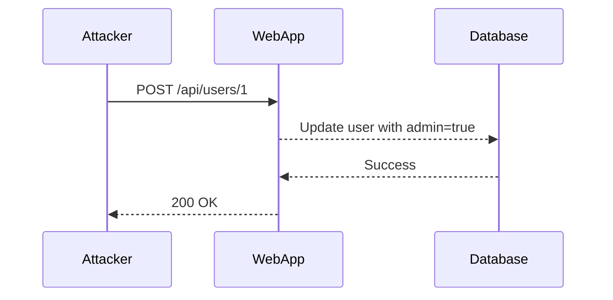
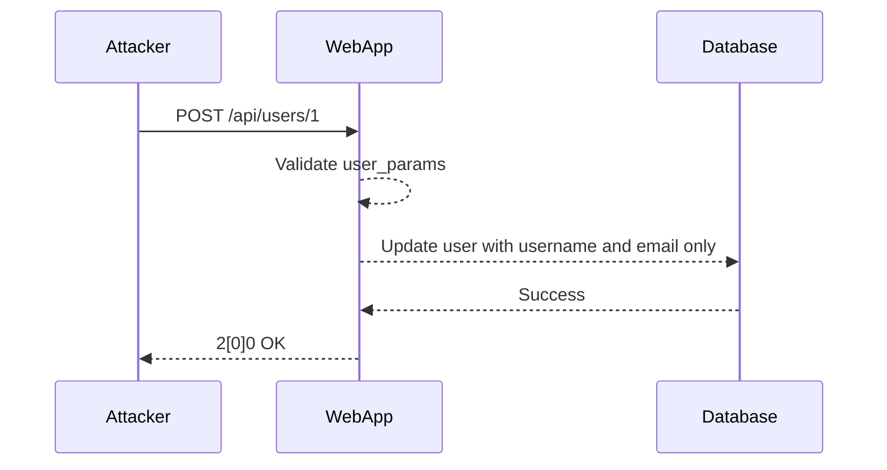

## Introduction to Mass Assignment Vulnerability

Mass assignment, also known as overposting or parameter pollution, is a critical security vulnerability that arises when an application allows an attacker to manipulate or set internal object properties that were not intended to be modified by external input. This vulnerability can lead to unauthorized data modification, privilege escalation, and other severe security breaches. Understanding the mechanics of mass assignment and how to defend against it is crucial for securing modern web applications.

### What is Mass Assignment?

Mass assignment occurs when a user is able to initialize or override server-side variables that are not intended to be modified by the application. In many frameworks, such as Ruby on Rails, Django, or Laravel, developers often use mass assignment to simplify the process of updating multiple attributes of an object at once. However, if not properly controlled, this feature can be exploited by attackers to modify sensitive fields.

#### Example Scenario

Consider a simple user model in a web application:

```python
class User:
    def __init__(self, username, email, admin=False):
        self.username = username
        self.email = email
        self.admin = admin
```

In a typical scenario, an attacker might send a request to update a user's profile information:

```http
PUT /users/1 HTTP/1.1
Host: example.com
Content-Type: application/json

{
    "username": "attacker",
    "email": "attacker@example.com",
    "admin": true
}
```

If the application does not validate or restrict the parameters being assigned, the `admin` field could be set to `true`, granting the attacker administrative privileges.

### How Mass Assignment Works Under the Hood

To understand the vulnerability, let's delve into how mass assignment typically works in web frameworks. Many frameworks provide convenience methods to automatically map incoming request parameters to object properties. For instance, in Ruby on Rails, the `update_attributes` method allows updating multiple attributes in one go:

```ruby
# Vulnerable code
def update
  @user = User.find(params[:id])
  if @user.update_attributes(user_params)
    redirect_to @user, notice: 'User was successfully updated.'
  else
    render :edit
  end
end

private

def user_params
  params.require(:user).permit(:username, :email, :admin)
end
```

In this example, the `user_params` method permits all three attributes (`username`, `email`, and `admin`). An attacker can exploit this by sending a request with the `admin` parameter set to `true`.

### Why Mass Assignment Matters

Mass assignment vulnerabilities can have severe consequences:

- **Data Integrity**: Unauthorized modification of data can corrupt the integrity of the database.
- **Privilege Escalation**: Attackers can gain elevated privileges, leading to unauthorized access to sensitive information.
- **Denial of Service**: Malicious modifications can cause the application to malfunction or crash.

### Recent Real-World Examples

Several high-profile breaches have been attributed to mass assignment vulnerabilities:

- **CVE-2018-1267**: A mass assignment vulnerability in the WordPress REST API allowed attackers to modify user roles, potentially gaining administrative access.
- **CVE-2019-11510**: A similar issue in the Drupal framework allowed unauthorized users to escalate their privileges by manipulating certain fields.

### How to Craft a Request for Mass Assignment

An attacker typically crafts a request to include additional parameters that are not intended to be modified. Here’s an example using a hypothetical web application:

```http
POST /api/users/1 HTTP/1.1
Host: example.com
Content-Type: application/json

{
    "username": "attacker",
    "email": "attacker@example.com",
    "admin": true,
    "role": "superuser"
}
```

The attacker includes the `admin` and `role` fields, which are not supposed to be modifiable through this endpoint.

### Detection and Prevention

Detecting and preventing mass assignment vulnerabilities requires a combination of code review, proper validation, and secure coding practices.

#### Detection

- **Static Code Analysis**: Tools like SonarQube, Brakeman (for Ruby on Rails), and Bandit (for Python) can help identify potential mass assignment vulnerabilities.
- **Dynamic Analysis**: Penetration testing and fuzzing tools can simulate attacks to detect vulnerabilities in real-time.

#### Prevention

1. **Whitelist Attributes**: Explicitly whitelist the attributes that can be updated. Avoid using convenience methods that permit all attributes by default.

2. **Parameter Validation**: Validate each parameter individually to ensure it meets the expected criteria.

3. **Role-Based Access Control (RBAC)**: Implement RBAC to restrict which users can modify specific attributes.

4. **Input Sanitization**: Sanitize all inputs to prevent injection attacks.

### Secure Coding Fixes

Let’s compare the vulnerable and secure versions of the code:

#### Vulnerable Code

```ruby
def update
  @user = User.find(params[:id])
  if @user.update_attributes(user_params)
    redirect_to @user, notice: 'User was successfully updated.'
  else
    render :edit
  end
end

private

def user_params
  params.require(:user).permit(:username, :email, :admin)
end
```

#### Secure Code

```ruby
def update
  @user = User.find(params[:id])
  if @user.update(user_params)
    redirect_to @user, notice: 'User was successfully updated.'
  else
    render :edit
  end
end

private

def user_params
  params.require(:user).permit(:username, :email)
end
```

In the secure version, the `admin` attribute is removed from the permitted list, preventing unauthorized modification.

### Configuration Hardening

Hardening configurations can further mitigate the risk of mass assignment vulnerabilities:

- **Framework Settings**: Configure your framework to disable mass assignment by default.
- **Environment Variables**: Use environment variables to control which attributes can be updated.

### Mermaid Diagrams

#### Attack Chain Diagram



#### Secure Flow Diagram



### Hands-On Labs

For practical experience with mass assignment vulnerabilities, consider the following labs:

- **PortSwigger Web Security Academy**: Offers a module on mass assignment vulnerabilities.
- **OWASP Juice Shop**: Contains several challenges related to mass assignment and overposting.
- **DVWA (Damn Vulnerable Web Application)**: Provides a variety of insecure coding scenarios, including mass assignment.

By thoroughly understanding and implementing the preventive measures discussed, developers can significantly reduce the risk of mass assignment vulnerabilities in their applications.

---
<!-- nav -->
[[API Security/10-Mass Assignment Attack/05-Mass Assignment is a Real Thing/01-Introduction to Mass Assignment Attack|Introduction to Mass Assignment Attack]] | [[API Security/10-Mass Assignment Attack/05-Mass Assignment is a Real Thing/00-Overview|Overview]] | [[API Security/10-Mass Assignment Attack/05-Mass Assignment is a Real Thing/03-Mass Assignment Attack|Mass Assignment Attack]]
