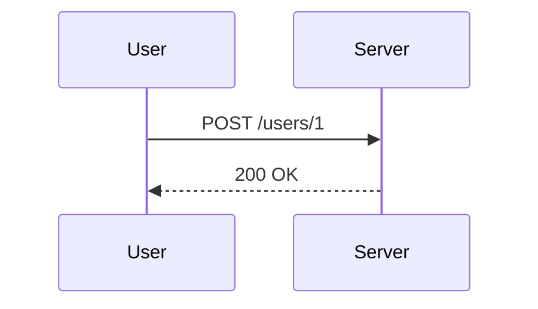
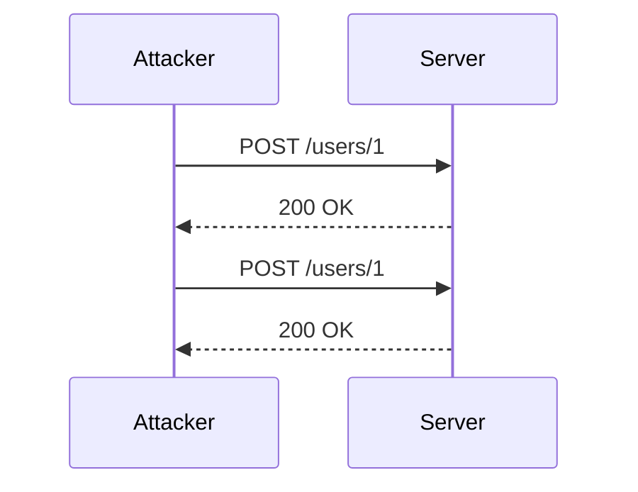

## Understanding Mass Assignment Vulnerabilities

### What is Mass Assignment?

Mass assignment, also known as overposting, is a security vulnerability that occurs when an application allows an attacker to set arbitrary object properties through user input. This typically happens in frameworks that automatically map incoming data to model objects without proper validation or sanitization. In the context of web applications, this often involves sending a JSON payload to an endpoint that updates a user's profile or other sensitive information.

### Why Does Mass Assignment Matter?

Mass assignment vulnerabilities can lead to serious security issues such as unauthorized access, privilege escalation, and data manipulation. An attacker can exploit these vulnerabilities to modify fields that should not be writable by the user, such as administrative flags or password hashes.

### How Does Mass Assignment Work?

Consider a typical scenario where a user can update their profile information via an API endpoint. The endpoint might accept a JSON payload containing various fields:

```json
{
  "email": "user@example.com",
  "name": "John Doe",
  "admin": false
}
```

In a vulnerable implementation, the server might blindly assign these values to the corresponding fields in the user object without checking whether the `admin` field should be writable by the user. This could allow an attacker to set the `admin` flag to `true`, thereby gaining elevated privileges.

### Example Scenario

Let's take a closer look at the example provided in the lecture:

```json
{
  "email": "user@example.com",
  "second_email": "second@date.gmail.com"
}
```

Here, the attacker sends a JSON payload with two email fields. If the server does not properly validate which fields can be updated, the `second_email` field might be assigned to the user object, potentially leading to unintended behavior or data corruption.

### Real-World Examples

#### CVE-2018-1268

One notable real-world example is the CVE-2018-1268 vulnerability in the Ruby on Rails framework. This vulnerability allowed attackers to manipulate attributes of Active Record models, including sensitive ones like `admin`. By sending a specially crafted JSON payload, an attacker could escalate their privileges.

#### Recent Breaches

Another example is the breach of a popular social media platform where an attacker exploited a mass assignment vulnerability to gain admin privileges. The attacker was able to send a JSON payload that included an `admin` field, which the server blindly accepted and assigned to the user object.

### How to Detect Mass Assignment Vulnerabilities

Detecting mass assignment vulnerabilities requires a thorough review of the application's codebase, particularly the parts that handle user input and update model objects. Automated tools can help identify potential issues, but manual code review is essential.

#### Static Analysis Tools

Tools like Brakeman for Ruby on Rails, SonarQube, and Fortify can scan the codebase for patterns indicative of mass assignment vulnerabilities. These tools look for instances where user input is directly mapped to model objects without proper validation.

#### Dynamic Analysis Tools

Dynamic analysis tools like Burp Suite, ZAP, and OWASP ZAP can simulate attacks and monitor the application's behavior. By sending crafted payloads and observing the server's response, you can identify potential vulnerabilities.

### How to Prevent Mass Assignment Vulnerabilities

Preventing mass assignment vulnerabilities involves several best practices and secure coding techniques.

#### Explicit Whitelisting

One effective method is to explicitly whitelist the fields that can be updated by the user. This ensures that only the intended fields are modified, preventing unauthorized changes.

##### Example Code

Here’s an example using Ruby on Rails:

```ruby
class User < ApplicationRecord
  attr_accessible :email, :name
end
```

In this example, only the `email` and `name` fields are accessible for mass assignment. Any other fields sent in the JSON payload will be ignored.

#### Strong Parameters

Ruby on Rails introduced strong parameters to mitigate mass assignment vulnerabilities. Strong parameters require developers to explicitly permit the fields that can be updated.

##### Example Code

```ruby
class UsersController < ApplicationController
  def update
    @user = User.find(params[:id])
    if @user.update(user_params)
      redirect_to @user
    else
      render 'edit'
    end
  end

  private

  def user_params
    params.require(:user).permit(:email, :name)
  end
end
```

In this example, only the `email` and `name` fields are permitted for update. Any other fields sent in the JSON payload will be ignored.

#### Secure Coding Practices

General secure coding practices include:

- **Input Validation**: Always validate user input to ensure it meets expected criteria.
- **Least Privilege Principle**: Ensure that users have the minimum permissions necessary to perform their tasks.
- **Logging and Monitoring**: Implement logging and monitoring to detect and respond to suspicious activities.

### Mermaid Diagrams

#### Request/Response Flow



#### Attack Chain



### Complete Example

#### Vulnerable Code

```ruby
class UserController < ApplicationController
  def update
    @user = User.find(params[:id])
    if @user.update(params[:user])
      redirect_to @user
    else
      render 'edit'
    end
  end
end
```

#### Secure Code

```ruby
class UserController < ApplicationController
  def update
    @user = User.find(params[:id])
    if @user.update(user_params)
      redirect_to @user
    else
      render 'edit'
    end
  end

  private

  def user_params
    params.require(:user).permit(:email, :name)
  end
end
```

### Hands-On Labs

For hands-on practice with mass assignment vulnerabilities, consider the following labs:

- **PortSwigger Web Security Academy**: Offers a module on mass assignment vulnerabilities.
- **OWASP Juice Shop**: A deliberately insecure web application for practicing web security skills.
- **DVWA (Damn Vulnerable Web Application)**: A PHP/MySQL web application that demonstrates web application vulnerabilities.

By thoroughly understanding and implementing these best practices, you can significantly reduce the risk of mass assignment vulnerabilities in your applications.

---
<!-- nav -->
[[API Security/10-Mass Assignment Attack/05-Mass Assignment is a Real Thing/03-Mass Assignment Attack|Mass Assignment Attack]] | [[API Security/10-Mass Assignment Attack/05-Mass Assignment is a Real Thing/00-Overview|Overview]] | [[API Security/10-Mass Assignment Attack/05-Mass Assignment is a Real Thing/05-Practice Questions & Answers|Practice Questions & Answers]]
