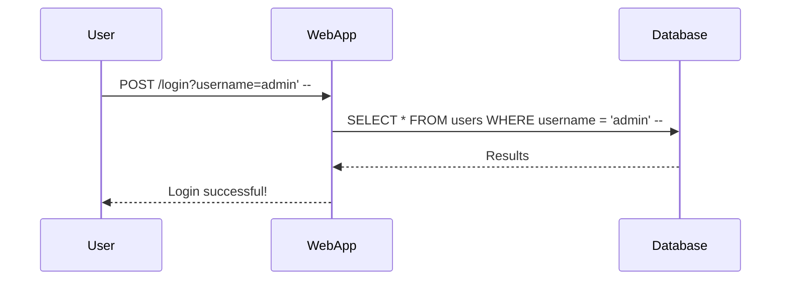
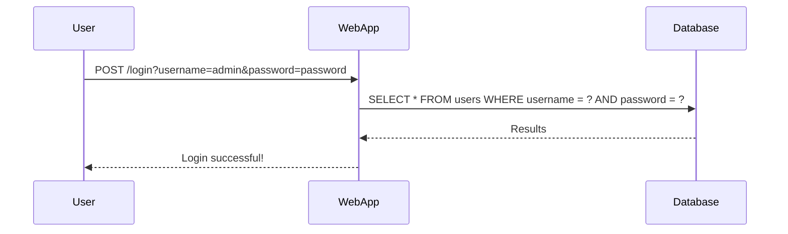

## Introduction to SQL Injection

SQL Injection (SQLi) is a type of cyber attack used to exploit vulnerabilities in web applications that use SQL databases. This attack involves inserting malicious SQL statements into an input field for execution. SQL Injection attacks can lead to unauthorized access to sensitive data, data manipulation, and even complete control of the database server.

### What is SQL Injection?

SQL Injection occurs when an attacker manipulates the SQL queries executed by a web application. By injecting malicious SQL code into input fields, attackers can bypass authentication mechanisms, read or modify sensitive data, and sometimes even execute commands on the underlying operating system.

#### Why Does SQL Injection Matter?

SQL Injection is a critical security issue because it can lead to severe consequences such as:

- **Data Theft**: Attackers can extract sensitive information like usernames, passwords, credit card details, etc.
- **Data Manipulation**: Attackers can alter or delete data within the database.
- **Unauthorized Access**: Attackers can gain administrative privileges and take control of the entire database server.
- **Denial of Service (DoS)**: Attackers can cause the database to crash, leading to service disruptions.

### How Does SQL Injection Work?

To understand SQL Injection, let's consider a simple example. Suppose a web application has a login form where users enter their username and password. The application might construct an SQL query like this:

```sql
SELECT * FROM users WHERE username = 'username' AND password = 'password';
```

If the application does not properly sanitize the input, an attacker could inject malicious SQL code. For instance, if the attacker enters `admin' --` as the username, the resulting SQL query would look like this:

```sql
SELECT * FROM users WHERE username = 'admin' --' AND password = 'password';
```

The double dash (`--`) is a comment marker in SQL, which causes the rest of the query to be ignored. As a result, the query becomes:

```sql
SELECT * FROM users WHERE username = 'admin';
```

This effectively bypasses the password check, allowing the attacker to log in as the admin user.

### Real-World Examples of SQL Injection

SQL Injection attacks have been responsible for several high-profile breaches. Here are some recent examples:

- **CVE-2021-22205**: A SQL Injection vulnerability was found in the WordPress plugin "WP Event Manager." An attacker could exploit this vulnerability to execute arbitrary SQL commands, potentially gaining unauthorized access to the database.
- **CVE-2020-14882**: A SQL Injection vulnerability was discovered in the Joomla CMS. This allowed attackers to execute arbitrary SQL commands, leading to potential data theft and manipulation.

### Background Theory

To fully understand SQL Injection, it's essential to delve into the underlying principles of SQL and how web applications interact with databases.

#### SQL Basics

Structured Query Language (SQL) is a standard language for managing relational databases. It allows users to perform various operations such as creating tables, inserting data, querying data, updating records, and deleting records.

Here are some basic SQL commands:

- **SELECT**: Retrieves data from a database.
- **INSERT INTO**: Adds new records to a database.
- **UPDATE**: Updates existing records in a database.
- **DELETE**: Deletes records from a database.
- **CREATE TABLE**: Creates a new table in a database.
- **DROP TABLE**: Deletes a table from a database.

#### Web Application Architecture

A typical web application architecture consists of three main components:

- **Client**: The end-user's browser.
- **Web Server**: The server that processes HTTP requests and serves web pages.
- **Database Server**: The server that stores and manages data.

When a user interacts with a web application, the following steps typically occur:

1. The client sends an HTTP request to the web server.
2. The web server processes the request and generates an SQL query based on the input provided by the user.
3. The SQL query is sent to the database server.
4. The database server executes the query and returns the results.
5. The web server processes the results and sends an HTTP response back to the client.

### SQL Injection Techniques

There are several techniques used to exploit SQL Injection vulnerabilities. Let's explore some of the most common ones.

#### Error-Based SQL Injection

Error-based SQL Injection occurs when the application displays error messages generated by the database server. These error messages can provide valuable information to the attacker, such as the structure of the database and the types of queries being executed.

For example, consider the following SQL query:

```sql
SELECT * FROM users WHERE username = 'admin' AND password = 'password';
```

If the attacker enters `admin' OR '1'='1` as the username, the resulting query would be:

```sql
SELECT * FROM users WHERE username = 'admin' OR '1'='1' AND password = 'password';
```

Since `'1'='1` is always true, the query will return all rows from the `users` table, effectively bypassing the password check.

#### Blind SQL Injection

Blind SQL Injection occurs when the application does not display error messages or any other feedback that reveals the structure of the database. In this case, the attacker must infer the structure of the database through trial and error.

For example, consider the following SQL query:

```sql
SELECT * FROM users WHERE username = 'admin' AND password = 'password';
```

If the attacker enters `admin' AND 1=1 --` as the username, the resulting query would be:

```sql
SELECT * FROM users WHERE username = 'admin' AND 1=1 --' AND password = 'password';
```

The double dash (`--`) comments out the rest of the query, making it equivalent to:

```sql
SELECT * FROM users WHERE username = 'admin' AND 1=1;
```

Since `1=1` is always true, the query will return all rows from the `users` table, effectively bypassing the password check.

### Recent Real-World Example: CVE-2021-22205

In 2021, a SQL Injection vulnerability was discovered in the WordPress plugin "WP Event Manager." This vulnerability allowed attackers to execute arbitrary SQL commands, potentially gaining unauthorized access to the database.

#### Vulnerable Code

The vulnerable code in the plugin looked something like this:

```php
$username = $_POST['username'];
$password = $_POST['password'];

$query = "SELECT * FROM users WHERE username = '$username' AND password = '$password'";
$result = mysqli_query($conn, $query);
```

#### Exploitation

An attacker could exploit this vulnerability by entering `admin' --` as the username. The resulting SQL query would be:

```sql
SELECT * FROM users WHERE username = 'admin' --' AND password = 'password';
```

The double dash (`--`) comments out the rest of the query, making it equivalent to:

```sql
SELECT * FROM users WHERE username = 'admin';
```

This effectively bypasses the password check, allowing the attacker to log in as the admin user.

### How to Prevent / Defend Against SQL Injection

Preventing SQL Injection requires a combination of proper coding practices, input validation, and the use of secure coding techniques.

#### Secure Coding Practices

1. **Use Prepared Statements**: Prepared statements separate the SQL logic from the input data, preventing attackers from injecting malicious SQL code.
   
   ```php
   $stmt = $conn->prepare("SELECT * FROM users WHERE username = ? AND password = ?");
   $stmt->bind_param("ss", $username, $password);
   $stmt->execute();
   ```

2. **Input Validation**: Validate all user inputs to ensure they meet the expected format and constraints. Use regular expressions or built-in validation functions to enforce these rules.

   ```php
   function validate_input($input) {
       return preg_match("/^[a-zA-Z0-9_]{1,20}$/", $input);
   }

   if (!validate_input($_POST['username'])) {
       die("Invalid username");
   }
   ```

3. **Parameterized Queries**: Use parameterized queries to separate the SQL logic from the input data. This prevents attackers from injecting malicious SQL code.

   ```php
   $stmt = $conn->prepare("SELECT * FROM users WHERE username = :username AND password = :password");
   $stmt->bindParam(':username', $username);
   $stmt->bindParam(':password', $password);
   $stmt->execute();
   ```

#### Detection and Prevention

1. **Static Code Analysis**: Use static code analysis tools to identify potential SQL Injection vulnerabilities in your codebase. Tools like SonarQube, Fortify, and Veracode can help detect and mitigate these vulnerabilities.

2. **Dynamic Application Security Testing (DAST)**: Use DAST tools to simulate SQL Injection attacks against your application. Tools like Burp Suite, OWASP ZAP, and Acunetix can help identify and exploit SQL Injection vulnerabilities.

3. **Web Application Firewalls (WAFs)**: Deploy WAFs to protect your application from SQL Injection attacks. WAFs can detect and block malicious SQL queries before they reach your application.

#### Secure Configuration

1. **Least Privilege Principle**: Ensure that the database user account used by your application has the minimum necessary privileges. Avoid using accounts with administrative privileges.

2. **Database Hardening**: Harden your database server by disabling unnecessary features, enabling logging, and configuring security settings. Follow best practices for securing your database server.

3. **Regular Audits**: Regularly audit your application and database to identify and mitigate SQL Injection vulnerabilities. Conduct penetration testing and vulnerability assessments to ensure your application is secure.

### Complete Example: SQL Injection in a Login Form

Let's consider a complete example of a login form vulnerable to SQL Injection and how to fix it.

#### Vulnerable Code

```php
<?php
// Connect to the database
$conn = mysqli_connect('localhost', 'root', 'password', 'mydatabase');

// Get user input
$username = $_POST['username'];
$password = $_POST['password'];

// Construct the SQL query
$query = "SELECT * FROM users WHERE username = '$username' AND password = '$password'";
$result = mysqli_query($conn, $query);

// Check if the query returned any results
if (mysqli_num_rows($result) > 0) {
    echo "Login successful!";
} else {
    echo "Invalid username or password.";
}
?>
```

#### Exploitation

An attacker could exploit this vulnerability by entering `admin' --` as the username. The resulting SQL query would be:

```sql
SELECT * FROM users WHERE username = 'admin' --' AND password = 'password';
```

The double dash (`--`) comments out the rest of the query, making it equivalent to:

```sql
SELECT * FROM users WHERE username = 'admin';
```

This effectively bypasses the password check, allowing the attacker to log in as the admin user.

#### Fixed Code

To fix this vulnerability, we should use prepared statements and parameterized queries.

```php
<?php
// Connect to the database
$conn = mysqli_connect('localhost', 'root', 'password', 'mydatabase');

// Get user input
$username = $_POST['username'];
$password = $_POST['password'];

// Prepare the SQL query
$stmt = $conn->prepare("SELECT * FROM users WHERE username = ? AND password = ?");
$stmt->bind_param("ss", $username, $password);
$stmt->execute();

// Get the result
$result = $stmt->get_result();

// Check if the query returned any results
if ($result->num_rows > 0) {
    echo "Login successful!";
} else {
    echo "Invalid username or password.";
}
?>
```

### Mermaid Diagrams

#### SQL Injection Attack Chain



#### Secure Login Flow



### Practice Labs

To practice and learn more about SQL Injection, you can use the following well-known labs:

- **PortSwigger Web Security Academy**: Offers interactive labs to learn about SQL Injection and other web security topics.
- **OWASP Juice Shop**: A deliberately insecure web application for practicing web security skills.
- **DVWA (Damn Vulnerable Web Application)**: A PHP/MySQL web application that demonstrates web application vulnerabilities.

By following these guidelines and practicing with real-world examples, you can significantly improve your ability to detect and prevent SQL Injection attacks.

### Conclusion

SQL Injection is a serious security threat that can have severe consequences for web applications. By understanding the underlying principles, recognizing common techniques, and implementing secure coding practices, you can effectively defend against SQL Injection attacks. Always stay vigilant and keep your applications and databases secure.

---
<!-- nav -->
[[API Security/11-SQL Injection/01-Admin Token Bypassing SQL Injection/00-Overview|Overview]] | [[API Security/11-SQL Injection/01-Admin Token Bypassing SQL Injection/02-SQL Injection Overview|SQL Injection Overview]]
