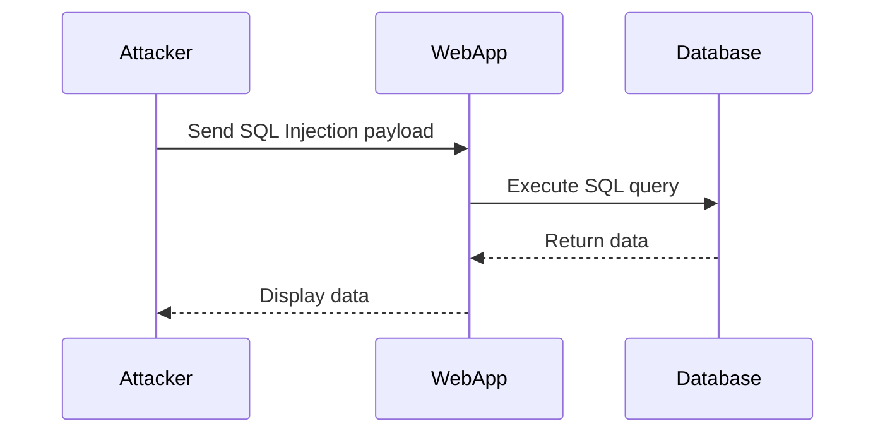
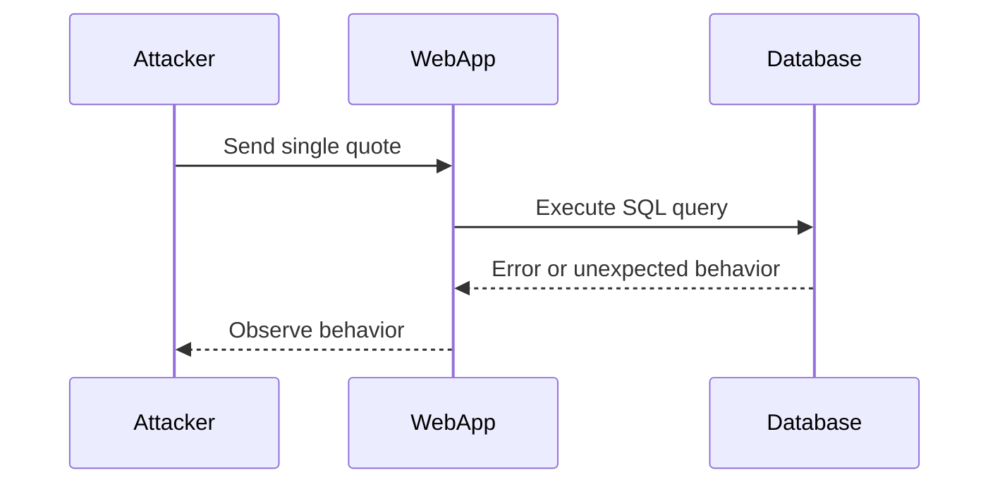

## Introduction to SQL Injection

SQL Injection (SQLi) is one of the most prevalent and dangerous types of attacks in web application security. It occurs when an attacker manipulates input data to execute arbitrary SQL commands against a database. This can lead to unauthorized access to sensitive data, data manipulation, and even complete system compromise. In this chapter, we will focus on a specific type of SQL Injection called **Blind SQL Injection**.

### What is SQL Injection?

SQL Injection is a code injection technique used to exploit vulnerabilities in web applications that use SQL databases. Attackers inject malicious SQL statements into input fields, which are then executed by the database. This can result in unauthorized access to data, data corruption, or even complete control over the database.

#### Why Does SQL Injection Matter?

SQL Injection is significant because it can lead to severe consequences such as:

- **Data Theft**: Attackers can extract sensitive information like usernames, passwords, credit card details, etc.
- **Data Manipulation**: Attackers can modify or delete data in the database.
- **Privilege Escalation**: In some cases, attackers can gain administrative privileges and take control of the entire server.

### How Does SQL Injection Work?

To understand SQL Injection, let's consider a simple example. Suppose a web application has a login form where users enter their username and password. The application might construct an SQL query like this:

```sql
SELECT * FROM users WHERE username = 'username' AND password = 'password';
```

If the application does not properly sanitize user inputs, an attacker could inject malicious SQL code. For instance, if the attacker enters `username` as `' OR '1'='1` and `password` as `' OR '1'='1`, the resulting SQL query would be:

```sql
SELECT * FROM users WHERE username = '' OR '1'='1' AND password = '' OR '1'='1';
```

This query will return all rows from the `users` table because the condition `'1'='1'` is always true.

### Types of SQL Injection

There are several types of SQL Injection, including:

- **Error-Based SQL Injection**: The attacker uses error messages to gather information about the database structure.
- **Union-Based SQL Injection**: The attacker combines the results of two or more SELECT statements.
- **Blind SQL Injection**: The attacker infers the database structure and data by observing the behavior of the application.

In this chapter, we will focus on **Blind SQL Injection**.

### Blind SQL Injection

Blind SQL Injection is a type of SQL Injection where the attacker cannot see the actual output of the injected SQL query. Instead, the attacker must infer the database structure and data by observing the behavior of the application.

#### How to Identify Blind SQL Injection Vulnerabilities

One way to identify Blind SQL Injection vulnerabilities is by injecting a single quote (`'`) into input fields. This can cause the SQL query to fail, leading to an error or unexpected behavior in the application.

For example, consider the following SQL query:

```sql
SELECT * FROM users WHERE id = 1;
```

If an attacker injects a single quote into the `id` parameter, the query becomes:

```sql
SELECT * FROM users WHERE id = '1';
```

This will likely cause a SQL syntax error, indicating a potential SQL Injection vulnerability.

### Real-World Example: CVE-2021-21972

CVE-2021-21972 is a Blind SQL Injection vulnerability in the WordPress REST API. An attacker could exploit this vulnerability to retrieve sensitive information from the database by manipulating the input parameters.

#### Exploitation Steps

1. **Identify the Vulnerable Parameter**: The attacker identifies a parameter that is used in a SQL query.
2. **Inject a Single Quote**: The attacker injects a single quote into the parameter to cause a SQL syntax error.
3. **Observe the Behavior**: The attacker observes the behavior of the application to determine if the injection was successful.

### Detailed Example

Let's consider a detailed example of how an attacker might exploit a Blind SQL Injection vulnerability.

#### Step 1: Identify the Vulnerable Parameter

Suppose a web application has an endpoint `/api/users` that accepts a `search` parameter. The application constructs an SQL query based on this parameter:

```sql
SELECT * FROM users WHERE name LIKE '%search%';
```

#### Step 2: Inject a Single Quote

The attacker injects a single quote into the `search` parameter:

```
/search?q='
```

This causes the SQL query to become:

```sql
SELECT * FROM users WHERE name LIKE '%' OR '1'='1';
```

#### Step 3: Observe the Behavior

The attacker observes the behavior of the application. If the application returns unexpected results or behaves differently, it indicates a potential SQL Injection vulnerability.

### How to Prevent / Defend Against SQL Injection

#### Detection

To detect SQL Injection vulnerabilities, you can use automated tools such as:

- **SQLMap**: A powerful tool for detecting and exploiting SQL Injection vulnerabilities.
- **Burp Suite**: A comprehensive toolkit for web application security testing.

#### Prevention

To prevent SQL Injection, follow these best practices:

1. **Use Prepared Statements**: Prepared statements ensure that user inputs are treated as data rather than executable code.
2. **Input Validation**: Validate and sanitize all user inputs to ensure they meet expected formats.
3. **Least Privilege Principle**: Ensure that the application database user has the minimum necessary permissions.

#### Secure Coding Fixes

Here is an example of how to securely handle user inputs using prepared statements in Python:

```python
import sqlite3

# Connect to the database
conn = sqlite3.connect('example.db')
cursor = conn.cursor()

# User input
user_input = "' OR '1'='1"

# Prepare the statement
query = "SELECT * FROM users WHERE name LIKE ?"
params = ('%' + user_input + '%',)

# Execute the query
cursor.execute(query, params)
results = cursor.fetchall()

# Close the connection
conn.close()
```

#### Hardening Configuration

Ensure that your database configurations are hardened to prevent SQL Injection attacks:

- **Disable unnecessary features**: Disable features that are not required for your application.
- **Use strong authentication mechanisms**: Use strong authentication mechanisms to protect database access.

### Mermaid Diagrams

#### SQL Injection Attack Chain



#### Blind SQL Injection Flow



### Practice Labs

To practice identifying and exploiting SQL Injection vulnerabilities, you can use the following labs:

- **PortSwigger Web Security Academy**: Offers interactive labs to learn and practice SQL Injection.
- **OWASP Juice Shop**: A deliberately insecure web application for practicing various web security techniques.
- **DVWA (Damn Vulnerable Web Application)**: A PHP/MySQL web application that is riddled with vulnerabilities for educational purposes.

### Conclusion

SQL Injection is a serious threat to web application security. By understanding how it works and implementing proper defenses, you can protect your applications from these attacks. Always validate and sanitize user inputs, use prepared statements, and follow the least privilege principle to minimize the risk of SQL Injection vulnerabilities.

---
<!-- nav -->
[[API Security/11-SQL Injection/02-Blind SQL Injection Part 1/01-Introduction to Blind SQL Injection|Introduction to Blind SQL Injection]] | [[API Security/11-SQL Injection/02-Blind SQL Injection Part 1/00-Overview|Overview]] | [[API Security/11-SQL Injection/02-Blind SQL Injection Part 1/03-Practice Questions & Answers|Practice Questions & Answers]]
