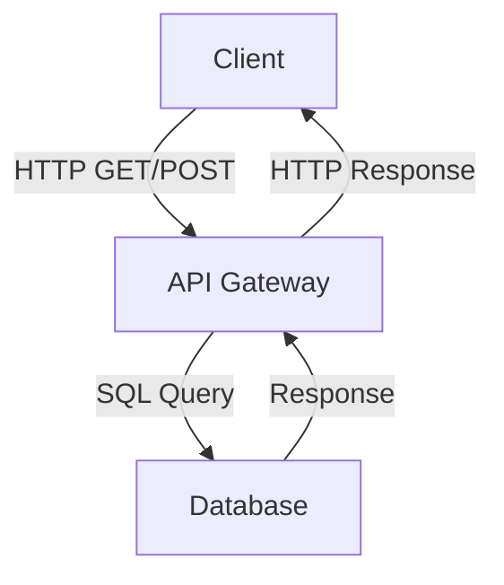
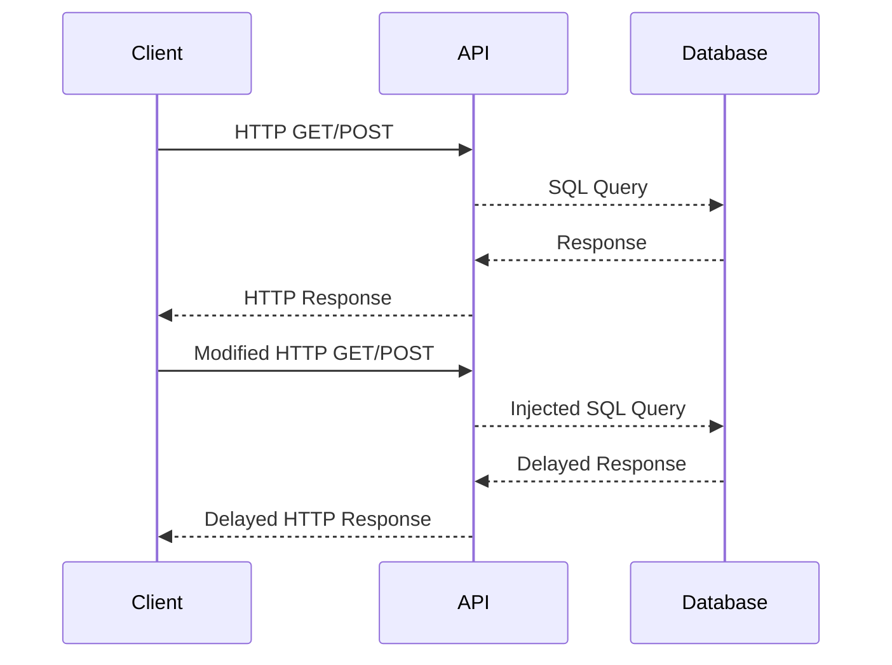

## Introduction to Blind SQL Injection

Blind SQL Injection is a type of SQL Injection attack where the attacker does not receive direct feedback from the database regarding the success or failure of their injected SQL commands. Instead, the attacker infers the structure and contents of the database through subtle changes in the application's behavior, such as error messages, time delays, or differences in the returned data. This makes blind SQL Injection more challenging to detect and mitigate compared to error-based SQL Injection.

### Background Theory

SQL Injection occurs when an attacker manipulates input fields to inject malicious SQL code into a query executed by the backend database. In the case of blind SQL Injection, the attacker aims to extract sensitive information from the database without receiving explicit error messages or direct feedback. This is typically achieved by making the database perform certain actions that can be observed indirectly.

#### How Blind SQL Injection Works

1. **Input Manipulation**: The attacker modifies the input fields to inject SQL code.
2. **Conditional Queries**: The injected SQL code often includes conditional statements that cause the database to behave differently based on the truth value of the condition.
3. **Observation**: The attacker observes the application's behavior to infer the result of the injected SQL code.

### Example Scenario: Product Gate API

Let's consider an API endpoint that retrieves product information. The API does not accept parameters but instead returns all product details in the response body. The attacker wants to determine if this endpoint is vulnerable to blind SQL Injection.

#### Capturing the Request

To start, the attacker captures the HTTP request sent to the API using a tool like Burp Suite. Here is an example of the captured request:

```http
GET /product/gate HTTP/1.1
Host: example.com
User-Agent: Mozilla/5.0
Accept: */*
```

The response from the server might look like this:

```http
HTTP/1.1 200 OK
Date: Mon, 20 Nov 2023 12:00:00 GMT
Content-Type: application/json
Content-Length: 123

{
  "products": [
    {
      "id": 1,
      "name": "Product A"
    },
    {
      "id": 2,
      "name": "Product B"
    }
  ]
}
```

### Testing for Blind SQL Injection

#### Using Burp Suite Repeater

The attacker uses Burp Suite's Repeater tool to test the endpoint for blind SQL Injection. They modify the request to include single quotes (`'`) to see if the server responds differently.

```http
GET /product/gate' HTTP/1.1
Host: example.com
User-Agent: Mozilla/5.0
Accept: */*
```

If the server returns an error or behaves differently, it could indicate a potential vulnerability. However, in this case, the server does not return any information, suggesting that the single quotes are being escaped or ignored.

#### Escaping Characters

To further test, the attacker tries escaping characters using backslashes (`\`). This can help bypass simple input sanitization mechanisms.

```http
GET /product/gate\' HTTP/1.1
Host: example.com
User-Agent: Mozilla/5.0
Accept: */*
```

If the server still does not respond with any information, it suggests that the input is being properly sanitized or that the endpoint is not vulnerable to this type of injection.

### Analyzing the POST Request

Next, the attacker looks at the POST request to the `/product/post` endpoint. This request includes a JSON body with `id` and `name` fields.

#### Capturing the POST Request

Here is an example of the captured POST request:

```http
POST /product/post HTTP/1.1
Host: example.com
User-Agent: Mozilla/5.0
Content-Type: application/json
Content-Length: 30

{
  "id": 1,
  "name": "Product A"
}
```

The response from the server might look like this:

```http
HTTP/1.1 200 OK
Date: Mon, 20 Nov 2023 12:00:00 GMT
Content-Type: application/json
Content-Length: 30

{
  "id": 1,
  "name": "Product A"
}
```

### Testing for Blind SQL Injection in POST Requests

The attacker modifies the POST request to include SQL injection payloads. For example, they might try to inject a payload that causes the database to wait for a certain amount of time before responding.

#### Time-Based Blind SQL Injection

One common technique is to use a time delay to infer the success of the injected SQL code. For instance, the attacker might inject a payload that causes the database to sleep for a specific duration.

```json
{
  "id": "1' OR SLEEP(5)--",
  "name": "Product A"
}
```

The modified request would look like this:

```http
POST /product/post HTTP/1.1
Host: example.com
User-Agent: Mozilla/5.0
Content-Type: application/json
Content-Length: 38

{
  "id": "1' OR SLEEP(5)--",
  "name": "Product A"
}
```

If the server takes significantly longer to respond, it indicates that the injected SQL code was executed successfully.

### Real-World Examples

#### Recent CVEs and Breaches

Blind SQL Injection vulnerabilities have been found in various applications and systems. For example, CVE-2021-31166 describes a blind SQL Injection vulnerability in the WordPress plugin "WP User Frontend." This vulnerability allowed attackers to extract sensitive information from the database by manipulating input fields.

Another example is the breach of the popular online marketplace, which was caused by a blind SQL Injection vulnerability in the search functionality. Attackers were able to extract user data and manipulate search results.

### How to Prevent / Defend Against Blind SQL Injection

#### Detection

1. **Logging and Monitoring**: Implement logging and monitoring to detect unusual patterns in database queries.
2. **Intrusion Detection Systems (IDS)**: Use IDS to identify and alert on suspicious activities that could indicate a SQL Injection attack.

#### Prevention

1. **Input Validation**: Validate and sanitize all user inputs to ensure they conform to expected formats.
2. **Parameterized Queries**: Use parameterized queries or prepared statements to separate SQL code from user inputs.
3. **Least Privilege Principle**: Ensure that database users have the minimum privileges necessary to perform their tasks.

#### Secure Coding Fixes

##### Vulnerable Code

```sql
SELECT * FROM products WHERE id = '$id';
```

##### Secure Code

```sql
PreparedStatement stmt = conn.prepareStatement("SELECT * FROM products WHERE id = ?");
stmt.setInt(1, id);
ResultSet rs = stmt.executeQuery();
```

### Mermaid Diagrams

#### Network Topology



#### Attack Chain



### Practice Labs

For hands-on practice with blind SQL Injection, consider the following labs:

- **PortSwigger Web Security Academy**: Offers detailed modules on SQL Injection, including blind SQL Injection.
- **OWASP Juice Shop**: Provides a vulnerable web application for practicing various types of attacks, including SQL Injection.
- **DVWA (Damn Vulnerable Web Application)**: A deliberately insecure web application for practicing penetration testing and vulnerability assessments.

By thoroughly understanding the concepts, techniques, and defenses against blind SQL Injection, you can better protect your applications and systems from these types of attacks.

---
<!-- nav -->
[[API Security/11-SQL Injection/03-Blind SQL Injection Part 2/00-Overview|Overview]] | [[API Security/11-SQL Injection/03-Blind SQL Injection Part 2/02-Introduction to SQL Injection|Introduction to SQL Injection]]
