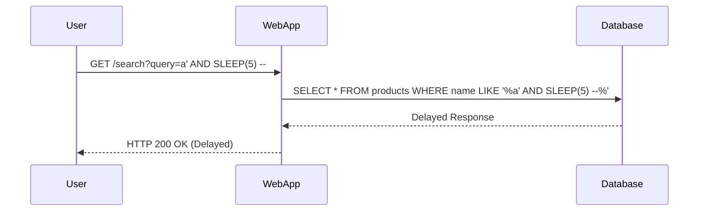

## Blind SQL Injection

Blind SQL Injection is a type of SQL Injection where the attacker does not receive direct feedback from the database. Instead, the attacker infers the success of their SQL injection attempts by observing changes in the application's behavior.

### Understanding Blind SQL Injection

In Blind SQL Injection, the attacker sends payloads that cause the database to perform certain actions, such as waiting for a specific amount of time or returning different results based on the injected SQL code. By analyzing these changes, the attacker can determine whether the injection was successful.

#### Example Scenario

Consider a web application that allows users to search for products using a query parameter. The application constructs an SQL query like this:

```sql
SELECT * FROM products WHERE name LIKE '%input_query%';
```

An attacker could inject a payload that causes the database to wait for a specific amount of time, such as:

```http
GET /search?query=a' AND SLEEP(5) -- 
```

This would cause the database to wait for 5 seconds before responding, indicating that the injection was successful.

### Steps to Perform Blind SQL Injection

1. **Identify Vulnerable Parameters**: Determine which parameters are vulnerable to SQL Injection.
2. **Craft Injection Payloads**: Create payloads that cause the database to perform specific actions.
3. **Observe Application Behavior**: Analyze the application's response to infer the success of the injection.

#### Example Code

Let's walk through an example of how an attacker might perform a Blind SQL Injection attack.

```http
GET /search?query=a' AND SLEEP(5) -- 
```

The full HTTP request and response might look like this:

```http
GET /search?query=a' AND SLEEP(5) -- HTTP/1.1
Host: example.com
User-Agent: Mozilla/5.0
Accept: */*

HTTP/1.1 200 OK
Date: Mon, 23 Jan 2023 12:00:00 GMT
Server: Apache/2.4.41 (Ubuntu)
Content-Type: text/html; charset=UTF-8
Content-Length: 1234

<!DOCTYPE html>
<html>
<head>
    <title>Search Results</title>
</head>
<body>
    <!-- Search results -->
</body>
</html>
```

By observing the delay in the response, the attacker can infer that the injection was successful.

### Mermaid Diagrams

A mermaid diagram can help visualize the process of a Blind SQL Injection attack:



### Common Pitfalls

When performing Blind SQL Injection, attackers often encounter several challenges:

- **Network Latency**: Network latency can make it difficult to distinguish between a delayed response due to the injection and a normal delay.
- **Error Handling**: Applications that handle errors gracefully may not provide useful feedback to the attacker.
- **Rate Limiting**: Applications that implement rate limiting can prevent attackers from sending too many requests in a short period.

### How to Prevent / Defend Against SQL Injection

#### Secure Coding Practices

1. **Use Prepared Statements**: Prepared statements ensure that user input is treated as data rather than executable code.
2. **Parameterized Queries**: Parameterized queries separate the SQL logic from the user input, preventing SQL Injection.

#### Example of Secure Coding

Here is an example of how to securely handle user input using prepared statements in Python:

```python
import sqlite3

def search_products(query):
    conn = sqlite3.connect('database.db')
    cursor = conn.cursor()
    
    # Use a parameterized query
    cursor.execute("SELECT * FROM products WHERE name LIKE ?", ('%' + query + '%',))
    
    results = cursor.fetchall()
    conn.close()
    
    return results
```

#### Detection and Prevention

1. **Input Validation**: Validate all user input to ensure it meets expected formats and lengths.
2. **Web Application Firewalls (WAF)**: Use WAFs to detect and block suspicious SQL Injection attempts.
3. **Security Scanning Tools**: Regularly scan your application using tools like Burp Suite, OWASP ZAP, or Acunetix to identify potential SQL Injection vulnerabilities.

#### Secure Configuration

1. **Least Privilege Principle**: Ensure that database accounts used by the application have the minimum necessary permissions.
2. **Regular Audits**: Conduct regular security audits to identify and mitigate SQL Injection vulnerabilities.

### Real-World Breaches

One recent example of a SQL Injection breach is the 2021 breach of the popular forum platform phpBB. Attackers exploited a SQL Injection vulnerability to gain access to user data. This highlights the importance of regularly updating and securing web applications against SQL Injection attacks.

### Practice Labs

For hands-on practice with SQL Injection, consider the following labs:

- **PortSwigger Web Security Academy**: Offers comprehensive modules on SQL Injection, including both classic and blind SQL Injection.
- **OWASP Juice Shop**: A deliberately insecure web application for practicing various web security techniques, including SQL Injection.
- **DVWA (Damn Vulnerable Web Application)**: A PHP/MySQL web application that is intentionally vulnerable for educational purposes.

These labs provide a safe environment to practice and understand SQL Injection attacks and defenses.

---
<!-- nav -->
[[API Security/11-SQL Injection/03-Blind SQL Injection Part 2/02-Introduction to SQL Injection|Introduction to SQL Injection]] | [[API Security/11-SQL Injection/03-Blind SQL Injection Part 2/00-Overview|Overview]] | [[04-Understanding Blind SQL Injection|Understanding Blind SQL Injection]]
