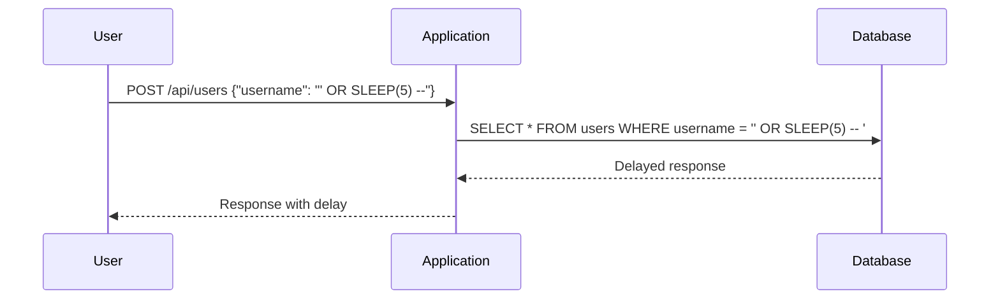

## Understanding Blind SQL Injection

Blind SQL injection is a type of SQL injection attack where the attacker does not receive direct feedback from the database. Instead, the attacker infers information based on the application's behavior. This makes blind SQL injection more challenging to detect and mitigate but equally dangerous as traditional SQL injection attacks.

### What is SQL Injection?

SQL injection is a code injection technique used to exploit vulnerabilities in an application's database layer. An attacker injects malicious SQL statements into input fields, which are then executed by the database. This can lead to unauthorized access to sensitive data, data manipulation, or even complete control over the database.

### Why Does Blind SQL Injection Matter?

Blind SQL injection is particularly insidious because it doesn't provide immediate feedback to the attacker. Instead, the attacker must infer the success of their injected SQL commands through subtle changes in the application's behavior. This makes blind SQL injection harder to detect and defend against, as the attacker can slowly extract information without triggering obvious alerts.

### How Does Blind SQL Injection Work?

In blind SQL injection, the attacker crafts SQL queries that cause the database to behave in a specific way, which can be observed by the application's response. For example, the attacker might inject a query that causes the database to wait for a certain amount of time before responding. By observing the delay in the application's response, the attacker can determine whether the injected query was successful.

#### Example Scenario

Consider a web application that allows users to search for products by name. The application constructs a SQL query like this:

```sql
SELECT * FROM products WHERE name = 'search_term';
```

If the application does not properly sanitize user input, an attacker could inject a malicious SQL statement. For instance, the attacker might enter the following search term:

```
' OR SLEEP(5) -- 
```

This would result in the following SQL query being executed:

```sql
SELECT * FROM products WHERE name = '' OR SLEEP(5) -- ';
```

The `SLEEP(5)` function causes the database to pause for five seconds before returning a result. If the application takes significantly longer to respond, the attacker knows the injection was successful.

### Real-World Examples

#### Recent CVEs and Breaches

One notable example of a blind SQL injection attack is the breach of the Equifax credit reporting agency in 2017. The attackers exploited a vulnerability in the Apache Struts framework, which allowed them to execute arbitrary SQL commands. Although the details of the attack were complex, it demonstrates the severe consequences of failing to protect against SQL injection.

Another example is the breach of the Capital One financial services company in 2019. The attacker exploited a misconfigured server that allowed them to access sensitive customer data. While this breach did not involve blind SQL injection specifically, it highlights the importance of securing all aspects of an application, including the database layer.

### Complete Example of Blind SQL Injection

Let's walk through a complete example of a blind SQL injection attack. Consider a web application that allows users to retrieve account information by entering a username. The application constructs a SQL query like this:

```sql
SELECT * FROM users WHERE username = 'input_username';
```

If the application does not properly sanitize user input, an attacker could inject a malicious SQL statement. For instance, the attacker might enter the following username:

```
' OR SLEEP(5) -- 
```

This would result in the following SQL query being executed:

```sql
SELECT * FROM users WHERE username = '' OR SLEEP(5) -- ';
```

The `SLEEP(5)` function causes the database to pause for five seconds before returning a result. If the application takes significantly longer to respond, the attacker knows the injection was successful.

Here is the full HTTP request and response for this scenario:

```http
POST /api/users HTTP/1.1
Host: example.com
Content-Type: application/json

{
  "username": "' OR SLEEP(5) --"
}
```

```http
HTTP/1.1 200 OK
Date: Mon, 20 Mar 2023 12:00:00 GMT
Content-Type: application/json
Content-Length: 123

{
  "message": "User found",
  "data": {
    "username": "",
    "email": ""
  }
}
```

### Mermaid Diagrams

To better understand the flow of a blind SQL injection attack, consider the following sequence diagram:



### Common Pitfalls

One common pitfall in defending against blind SQL injection is relying solely on input validation. While input validation is important, it is not sufficient on its own. Attackers can often bypass simple validation rules by using encoded or obfuscated inputs.

Another pitfall is assuming that the application will always return an error message when an injection attempt fails. In blind SQL injection, the attacker may not receive any direct feedback, making it difficult to detect the attack.

### How to Prevent / Defend Against Blind SQL Injection

#### Detection

To detect blind SQL injection attempts, you should monitor your application's performance and response times. Unusual delays or patterns in the application's behavior can indicate a potential attack. Additionally, you can use tools like intrusion detection systems (IDS) to identify suspicious activity.

#### Prevention

To prevent blind SQL injection, you should follow these best practices:

1. **Use Prepared Statements**: Prepared statements ensure that user input is treated as data rather than executable code. This prevents attackers from injecting malicious SQL commands.

2. **Input Validation**: Validate all user input to ensure it meets expected formats and constraints. However, remember that input validation alone is not sufficient.

3. **Least Privilege Principle**: Ensure that the database user account used by the application has the minimum necessary privileges. This limits the damage an attacker can cause if they successfully inject SQL commands.

4. **Error Handling**: Configure your application to handle errors gracefully and avoid revealing sensitive information in error messages.

#### Secure Coding Fixes

Here is an example of a vulnerable code snippet and its secure counterpart:

**Vulnerable Code:**

```python
import sqlite3

def get_user(username):
    conn = sqlite3.connect('database.db')
    cursor = conn.cursor()
    query = f"SELECT * FROM users WHERE username = '{username}'"
    cursor.execute(query)
    user = cursor.fetchone()
    conn.close()
    return user
```

**Secure Code:**

```python
import sqlite3

def get_user(username):
    conn = sqlite3.connect('database.db')
    cursor = conn.cursor()
    query = "SELECT * FROM users WHERE username = ?"
    cursor.execute(query, (username,))
    user = cursor.fetchone()
    conn.close()
    return user
```

### Configuration Hardening

Ensure that your database and application configurations are hardened against SQL injection attacks. This includes:

- Disabling unnecessary database features and permissions.
- Using parameterized queries or prepared statements.
- Configuring your application to handle errors securely.

### Practice Labs

For hands-on practice with blind SQL injection, consider the following labs:

- **PortSwigger Web Security Academy**: Offers interactive labs that cover various types of SQL injection, including blind SQL injection.
- **OWASP Juice Shop**: A deliberately insecure web application that includes several SQL injection vulnerabilities, including blind SQL injection.
- **DVWA (Damn Vulnerable Web Application)**: A PHP/MySQL web application that intentionally contains numerous security vulnerabilities, including SQL injection.

By thoroughly understanding the mechanics of blind SQL injection and implementing robust defenses, you can significantly reduce the risk of such attacks compromising your applications.

---
<!-- nav -->
[[API Security/11-SQL Injection/03-Blind SQL Injection Part 2/03-Blind SQL Injection|Blind SQL Injection]] | [[API Security/11-SQL Injection/03-Blind SQL Injection Part 2/00-Overview|Overview]] | [[05-Understanding SQL Injection in APIs|Understanding SQL Injection in APIs]]
