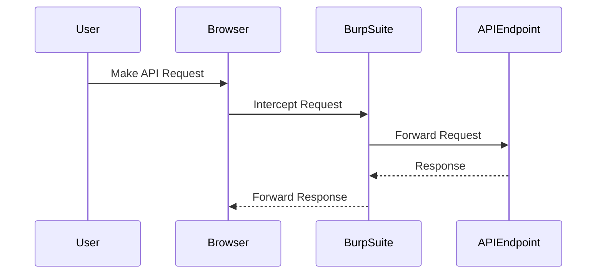

## Understanding SQL Injection in APIs

### Background Theory

SQL Injection is a type of attack where an attacker manipulates a SQL query by inserting malicious SQL code into input fields. This can lead to unauthorized access to sensitive data, modification of data, or even complete control over the database. In the context of APIs, SQL injection vulnerabilities often arise due to improper validation and sanitization of user inputs.

### Types of SQL Injection

There are two main types of SQL injection attacks:

1. **Error-Based SQL Injection**: This type of attack relies on error messages generated by the database to infer details about the underlying schema and data.
2. **Blind SQL Injection**: This type of attack does not rely on error messages. Instead, it infers information based on the behavior of the application, such as timing differences or the presence/absence of certain data.

### Real-World Example: CVE-2021-21972

CVE-2021-21972 is a blind SQL injection vulnerability found in the WordPress REST API. Attackers could exploit this vulnerability to inject malicious SQL code and potentially gain unauthorized access to sensitive data. This example highlights the importance of proper input validation and sanitization in API endpoints.

### Capturing and Analyzing Requests

To understand and exploit SQL injection vulnerabilities, it is essential to capture and analyze HTTP requests. Tools like Burp Suite are commonly used for this purpose.

#### Capturing Requests with Burp Suite

1. **Proxy Interception**: Enable proxy interception in Burp Suite to capture HTTP traffic.
2. **Request Capture**: Capture the request to the API endpoint that you suspect might be vulnerable to SQL injection.



### Analyzing the Request

Once the request is captured, it can be analyzed in tools like Burp Suite's Repeater to test for vulnerabilities.

#### Example Request

Consider the following HTTP request to an API endpoint:

```http
PUT /api/products/175437 HTTP/1.1
Host: example.com
Content-Type: application/json

{
    "name": "Product Name",
    "description": "Product Description",
    "price": 19.99,
    "photo": "product_photo.jpg"
}
```

### Testing for SQL Injection

To test for SQL injection, we can modify the request parameters to see if the application behaves unexpectedly.

#### Modifying the Request

1. **Remove the Product ID**: Remove the `175437` from the URL to see if the application handles the request differently.
2. **Modify Parameters**: Change the values of the parameters to include SQL injection payloads.

```http
PUT /api/products/ HTTP/1.1
Host: example.com
Content-Type: application/json

{
    "name": "Product Name",
    "description": "Product Description",
    "price": 19.99,
    "photo": "product_photo.jpg"
}
```

#### Injecting Malicious Payloads

Inject SQL injection payloads into the parameters to see if the application responds differently.

```http
PUT /api/products/ HTTP/1.1
Host: example.com
Content-Type: application/json

{
    "name": "Product Name",
    "description": "Product Description",
    "price": 19.99,
    "photo": "product_photo.jpg' OR '1'='1"
}
```

### Analyzing the Response

Analyze the response to determine if the application is vulnerable to SQL injection.

#### Example Response

If the application is vulnerable, the response might indicate that the injected SQL code was executed.

```http
HTTP/1.1 200 OK
Content-Type: application/json

{
    "message": "Product updated successfully."
}
```

### How to Prevent / Defend Against SQL Injection

#### Secure Coding Practices

1. **Input Validation**: Validate and sanitize all user inputs to ensure they meet expected formats.
2. **Parameterized Queries**: Use parameterized queries or prepared statements to prevent SQL injection.

##### Vulnerable Code Example

```python
import sqlite3

def update_product(product_id, name, description, price, photo):
    conn = sqlite3.connect('database.db')
    cursor = conn.cursor()
    query = f"UPDATE products SET name='{name}', description='{description}', price={price}, photo='{photo}' WHERE id={product_id}"
    cursor.execute(query)
    conn.commit()
    conn.close()
```

##### Secure Code Example

```python
import sqlite3

def update_product(product_id, name, description, price, photo):
    conn = sqlite3.connect('database.db')
    cursor = conn.cursor()
    query = "UPDATE products SET name=?, description=?, price=?, photo=? WHERE id=?"
    cursor.execute(query, (name, description, price, photo, product_id))
    conn.commit()
    conn.close()
```

#### Configuration Hardening

1. **Least Privilege Principle**: Ensure that database users have the least privileges necessary to perform their tasks.
2. **Database Security Settings**: Configure database security settings to restrict unauthorized access.

#### Detection

Use tools like SQLMap to detect SQL injection vulnerabilities in your applications.

```bash
sqlmap -u "http://example.com/api/products/175437" --data="name=Product Name&description=Product Description&price=19.99&photo=product_photo.jpg"
```

### Hands-On Practice

For hands-on practice with SQL injection in APIs, consider using the following labs:

- **PortSwigger Web Security Academy**: Offers interactive labs to practice various types of SQL injection attacks.
- **OWASP Juice Shop**: A deliberately insecure web application for practicing web security techniques, including SQL injection.

By thoroughly understanding and practicing the concepts covered in this chapter, you will be better equipped to identify and mitigate SQL injection vulnerabilities in API endpoints.

---
<!-- nav -->
[[04-Understanding Blind SQL Injection|Understanding Blind SQL Injection]] | [[API Security/11-SQL Injection/03-Blind SQL Injection Part 2/00-Overview|Overview]] | [[06-Understanding SQL Injection|Understanding SQL Injection]]
