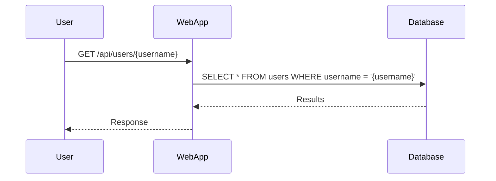
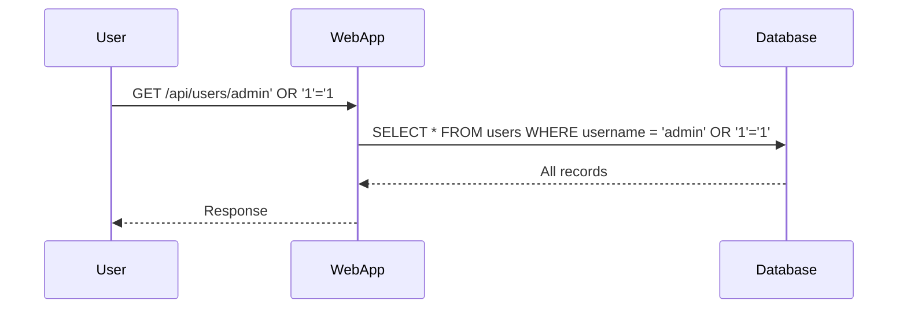

## Introduction to SQL Injection

SQL Injection (SQLi) is a type of cyber attack used to exploit vulnerabilities in web applications that use SQL databases. This attack allows an attacker to insert malicious SQL statements into input fields, which can then be executed by the database. The consequences of a successful SQL injection attack can range from unauthorized access to sensitive data to complete compromise of the database server.

### Background Concept of SQL Injection

To understand SQL Injection, it is essential to first grasp the basics of SQL and how it interacts with web applications. SQL (Structured Query Language) is a programming language used to manage and manipulate relational databases. Web applications often use SQL queries to retrieve, insert, update, or delete data from these databases.

When a web application accepts user input and uses it directly in SQL queries without proper validation or sanitization, it becomes vulnerable to SQL Injection attacks. An attacker can inject malicious SQL code into the input fields, which the application then executes as part of the SQL query.

### Example Scenario: API Endpoints

Let's consider an example scenario involving API endpoints. Suppose we have an API that provides various functionalities such as getting user information, adding new users, and retrieving all users. These endpoints are typically implemented using HTTP methods like GET, POST, PUT, and DELETE.

For instance, the following API endpoint retrieves all user information:

```http
GET /api/users
```

The corresponding SQL query might look something like this:

```sql
SELECT * FROM users;
```

Now, let's consider another endpoint that adds a new user:

```http
POST /api/users
Content-Type: application/json

{
    "username": "newuser",
    "password": "securepassword"
}
```

The corresponding SQL query might look like this:

```sql
INSERT INTO users (username, password) VALUES ('newuser', 'securepassword');
```

### Vulnerability in API Endpoints

If the application does not properly validate or sanitize the input received from the user, an attacker can inject malicious SQL code. For example, consider the following input:

```json
{
    "username": "attacker'; DROP TABLE users; --",
    "password": "securepassword"
}
```

If the application directly inserts this input into the SQL query without proper validation, the resulting SQL query would be:

```sql
INSERT INTO users (username, password) VALUES ('attacker'; DROP TABLE users; --', 'securepassword');
```

This would result in the `users` table being dropped from the database, leading to a severe data loss.

### Real-World Examples

SQL Injection attacks have been responsible for numerous high-profile breaches. One notable example is the breach of the Equifax credit reporting agency in 2017, which exposed sensitive personal information of over 143 million individuals. The attackers exploited a vulnerability in the Apache Struts framework, which allowed them to execute arbitrary SQL commands.

Another example is the breach of the US retailer Target in 2013, where hackers stole payment card data from up to 40 million customers. The attack was carried out through a SQL Injection vulnerability in the company's HVAC system, which was connected to the same network as the payment systems.

### How SQL Injection Works

To better understand how SQL Injection works, let's break down the process step-by-step:

1. **Input Validation**: The web application accepts user input and uses it directly in SQL queries without proper validation or sanitization.
2. **Malicious Input**: An attacker injects malicious SQL code into the input fields.
3. **Execution of Malicious Code**: The application executes the SQL query containing the malicious code, leading to unintended actions such as data theft, data manipulation, or even complete compromise of the database.

### Example Attack Scenario

Let's consider a more detailed example of an SQL Injection attack on an API endpoint. Suppose we have an endpoint that retrieves user information based on a provided username:

```http
GET /api/users/{username}
```

The corresponding SQL query might look like this:

```sql
SELECT * FROM users WHERE username = '{username}';
```

If the application does not properly validate the input, an attacker can inject malicious SQL code. For example, consider the following input:

```http
GET /api/users/admin' OR '1'='1
```

The resulting SQL query would be:

```sql
SELECT * FROM users WHERE username = 'admin' OR '1'='1';
```

Since `'1'='1'` is always true, this query would return all records from the `users` table, effectively bypassing the intended authentication mechanism.

### Detection and Prevention

#### Detection

Detecting SQL Injection vulnerabilities requires a combination of static and dynamic analysis techniques. Static analysis tools can scan the source code for potential vulnerabilities, while dynamic analysis tools can test the application for runtime vulnerabilities.

One popular tool for detecting SQL Injection vulnerabilities is Burp Suite, which includes features such as SQL Injection scanner and Intruder. Another tool is SQLMap, which automates the process of detecting and exploiting SQL Injection vulnerabilities.

#### Prevention

Preventing SQL Injection attacks involves several best practices:

1. **Input Validation**: Always validate and sanitize user input to ensure it meets the expected format and constraints.
2. **Parameterized Queries**: Use parameterized queries or prepared statements to separate the SQL code from the user input.
3. **Least Privilege Principle**: Ensure that the database user account used by the application has the minimum necessary privileges.
4. **Error Handling**: Avoid exposing detailed error messages to the user, as they can provide valuable information to an attacker.

### Secure Coding Practices

Here is an example of how to securely implement the previous API endpoint using parameterized queries:

#### Vulnerable Code

```python
import sqlite3

def get_user(username):
    conn = sqlite3.connect('database.db')
    cursor = conn.cursor()
    query = f"SELECT * FROM users WHERE username = '{username}'"
    cursor.execute(query)
    user = cursor.fetchone()
    conn.close()
    return user
```

#### Secure Code

```python
import sqlite3

def get_user(username):
    conn = sqlite3.connect('database.db')
    cursor = conn.cursor()
    query = "SELECT * FROM users WHERE username = ?"
    cursor.execute(query, (username,))
    user = cursor.fetchone()
    conn.close()
    return user
```

In the secure code, the user input is passed as a parameter to the `execute` method, ensuring that it is treated as a value rather than part of the SQL code.

### Configuration Hardening

Hardening the database configuration can also help prevent SQL Injection attacks. Some best practices include:

1. **Disable Unnecessary Features**: Disable unnecessary features and extensions in the database to reduce the attack surface.
2. **Use Strong Passwords**: Ensure that all database accounts use strong passwords and enable multi-factor authentication where possible.
3. **Regular Audits**: Regularly audit the database configuration and access logs to identify and address potential vulnerabilities.

### Conclusion

SQL Injection is a serious threat to web applications that use SQL databases. By understanding the underlying concepts, recognizing real-world examples, and implementing best practices for detection and prevention, developers can significantly reduce the risk of SQL Injection attacks.

### Practice Labs

To gain hands-on experience with SQL Injection, consider the following practice labs:

- **PortSwigger Web Security Academy**: Offers interactive labs on SQL Injection and other web security topics.
- **OWASP Juice Shop**: A deliberately insecure web application for practicing web security skills.
- **DVWA (Damn Vulnerable Web Application)**: A PHP/MySQL web application that demonstrates common web application vulnerabilities.

By engaging in these practice labs, you can deepen your understanding of SQL Injection and improve your ability to defend against such attacks.



This sequence diagram illustrates the normal flow of a GET request to retrieve user information. However, if the input is not properly validated, an attacker can inject malicious SQL code, leading to unintended actions.



This sequence diagram illustrates the flow of a GET request with a malicious input, demonstrating how an attacker can bypass the intended authentication mechanism.

By thoroughly understanding the concepts, recognizing real-world examples, and implementing best practices, you can effectively prevent SQL Injection attacks and protect your web applications.

---
<!-- nav -->
[[API Security/11-SQL Injection/04-SQL Injection/00-Overview|Overview]] | [[API Security/11-SQL Injection/04-SQL Injection/02-SQL Injection Overview|SQL Injection Overview]]
