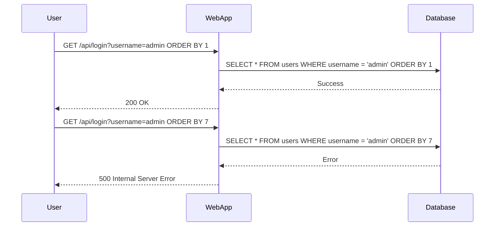

## SQL Injection Overview

SQL injection is a type of security vulnerability that allows an attacker to manipulate database queries by injecting malicious SQL code through input fields. This can lead to unauthorized access to sensitive data, data corruption, or even complete system compromise. Understanding SQL injection is crucial for securing applications that interact with databases.

### What is SQL Injection?

SQL injection occurs when an attacker is able to insert or "inject" SQL commands into a query that is executed by the application. This can happen when user input is not properly sanitized or validated before being used in a database query. The injected SQL code can alter the intended behavior of the query, potentially exposing sensitive information or allowing the attacker to perform unauthorized actions.

#### Why Does SQL Injection Matter?

SQL injection is one of the most common and dangerous types of vulnerabilities found in web applications. According to the Open Web Application Security Project (OWASP), SQL injection ranks high on their list of top web application security risks. Real-world examples of SQL injection attacks include:

- **CVE-2021-22205**: A SQL injection vulnerability in the WordPress plugin WP Event Manager allowed attackers to execute arbitrary SQL commands.
- **CVE-2020-14882**: A SQL injection vulnerability in the Joomla! CMS allowed attackers to retrieve sensitive information from the database.

These examples highlight the importance of understanding and preventing SQL injection attacks.

### How SQL Injection Works

To understand how SQL injection works, let's consider a simple example. Suppose we have a login form that takes a username and password and checks them against a database. The SQL query might look like this:

```sql
SELECT * FROM users WHERE username = 'input_username' AND password = 'input_password';
```

If the input fields are not properly sanitized, an attacker could inject malicious SQL code. For instance, if the attacker inputs `admin' --` as the username, the query would become:

```sql
SELECT * FROM users WHERE username = 'admin' --' AND password = 'input_password';
```

The `--` is a comment marker in SQL, which causes the rest of the query to be ignored. As a result, the query becomes:

```sql
SELECT * FROM users WHERE username = 'admin';
```

This would allow the attacker to log in as the admin user without knowing the password.

### Example Scenario

Let's walk through the scenario described in the lecture transcript. The goal is to determine the number of columns in a table using SQL injection.

#### Step-by-Step Mechanics

1. **Initial Request**:
    - The initial request is made to a server, likely through a web interface.
    - The request does not contain a request body but includes a username parameter.

    ```http
    GET /api/login?username=admin HTTP/1.1
    Host: example.com
    User-Agent: Mozilla/5.0
    Accept: */*
    ```

2. **Order By Injection**:
    - The attacker tries to inject an `ORDER BY` clause to determine the number of columns.
    - The `ORDER BY` clause is used to sort the results based on a specified column index.

    ```http
    GET /api/login?username=admin ORDER BY 1 HTTP/1.1
    Host: example.com
    User-Agent: Mozilla/5.0
    Accept: */*
    ```

3. **Response Analysis**:
    - The server responds with a success message, indicating that the query was valid.
    - The attacker increases the column index until an error is returned.

    ```http
    HTTP/1.1 200 OK
    Content-Type: application/json
    Content-Length: 1024

    {
        "status": "success",
        "data": [
            {"id": 1, "name": "John Doe"},
            {"id": 2, "name": "Jane Smith"}
        ]
    }
    ```

4. **Error Response**:
    - When the column index exceeds the actual number of columns, the server returns an error.

    ```http
    HTTP/1.1 500 Internal Server Error
    Content-Type: application/json
    Content-Length: 1024

    {
        "status": "error",
        "message": "Unknown column '7' in 'order clause'"
    }
    ```

5. **Determine Number of Columns**:
    - The attacker repeats the process until the correct number of columns is determined.

    ```http
    GET /api/login?username=admin ORDER BY 6 HTTP/1.1
    Host: example.com
    User-Agent: Mozilla/5.0
    Accept: */*
    ```

    ```http
    HTTP/1.1 200 OK
    Content-Type: application/json
    Content-Length: 1024

    {
        "status": "success",
        "data": [
            {"id": 1, "name": "John Doe"},
            {"id": 2, "name": "Jane Smith"}
        ]
    }
    ```

### Mermaid Diagrams

#### SQL Injection Attack Flow



### Common Pitfalls

1. **Improper Input Validation**:
    - Not validating or sanitizing user input can lead to SQL injection vulnerabilities.
    - Always validate and sanitize user input before using it in a database query.

2. **Using Dynamic SQL**:
    - Constructing SQL queries dynamically using string concatenation is risky.
    - Use parameterized queries or prepared statements to avoid SQL injection.

3. **Insufficient Error Handling**:
    - Improper error handling can reveal sensitive information to attackers.
    - Ensure that error messages do not expose internal details of the application.

### How to Prevent / Defend

#### Secure Coding Practices

1. **Use Parameterized Queries**:
    - Parameterized queries ensure that user input is treated as data rather than executable code.

    ```python
    import sqlite3

    conn = sqlite3.connect('example.db')
    cursor = conn.cursor()

    username = 'admin'
    password = 'password'

    cursor.execute("SELECT * FROM users WHERE username = ? AND password = ?", (username, password))
    rows = cursor.fetchall()
    ```

2. **Input Validation**:
    - Validate user input to ensure it meets expected criteria.
    - Use regular expressions or validation libraries to check input format.

    ```python
    import re

    def validate_input(input_str):
        return bool(re.match(r'^[a-zA-Z0-9]+$', input_str))

    username = 'admin'
    if validate_input(username):
        print("Valid input")
    else:
        print("Invalid input")
    ```

3. **Least Privilege Principle**:
    - Run the application with the least privileges necessary.
    - Limit database permissions to only what is required for the application to function.

#### Detection and Prevention Tools

1. **Web Application Firewalls (WAF)**:
    - WAFs can help detect and block SQL injection attempts.
    - Popular WAFs include ModSecurity, Cloudflare, and AWS WAF.

2. **Static Code Analysis Tools**:
    - Tools like SonarQube, Fortify, and Veracode can identify potential SQL injection vulnerabilities in code.

3. **Dynamic Analysis Tools**:
    - Tools like Burp Suite, OWASP ZAP, and sqlmap can be used to test for SQL injection vulnerabilities.

#### Secure Configuration Examples

1. **Database Configuration**:
    - Ensure that the database is configured securely.
    - Disable unnecessary features and limit user permissions.

    ```sql
    GRANT SELECT, INSERT, UPDATE ON users TO app_user;
    ```

2. **Application Configuration**:
    - Configure the application to use secure coding practices.
    - Enable logging and monitoring to detect suspicious activity.

    ```yaml
    logging:
      level: INFO
      file: /var/log/app.log
    ```

### Practice Labs

For hands-on practice with SQL injection, consider the following labs:

- **PortSwigger Web Security Academy**: Offers interactive labs to learn and practice SQL injection techniques.
- **OWASP Juice Shop**: A deliberately insecure web application for learning web security concepts.
- **DVWA (Damn Vulnerable Web Application)**: A PHP/MySQL web application that demonstrates various web application vulnerabilities, including SQL injection.

By thoroughly understanding SQL injection and implementing robust security measures, developers can significantly reduce the risk of such vulnerabilities in their applications.

---
<!-- nav -->
[[API Security/11-SQL Injection/04-SQL Injection/01-Introduction to SQL Injection|Introduction to SQL Injection]] | [[API Security/11-SQL Injection/04-SQL Injection/00-Overview|Overview]] | [[API Security/11-SQL Injection/04-SQL Injection/03-How to Prevent  Defend Against SQL Injection|How to Prevent  Defend Against SQL Injection]]
