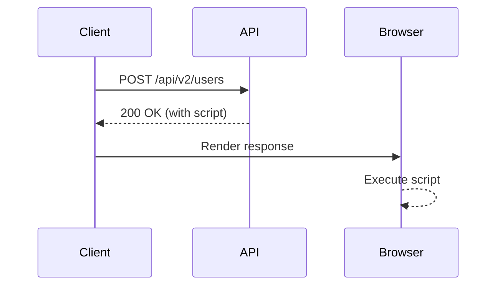
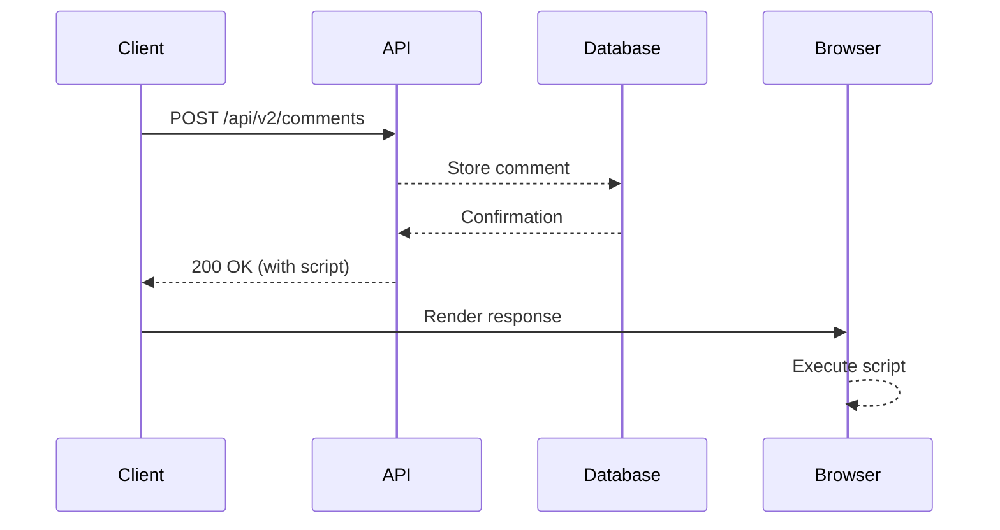

## Introduction to Cross-Site Scripting (XSS) in API Context

Cross-Site Scripting (XSS) is a type of security vulnerability that allows an attacker to inject malicious scripts into web pages viewed by other users. In the context of APIs, XSS vulnerabilities can occur when an API endpoint improperly handles user input and outputs it in a way that can be interpreted as executable script by a client browser.

### Background Theory

To understand XSS in the context of APIs, it's essential to grasp the basics of how web applications and APIs interact with clients. An API (Application Programming Interface) is a set of rules and protocols for building and integrating application software. APIs allow different software components to communicate with each other. In a typical web application, an API might handle requests from a client (such as a web browser) and return data in a structured format like JSON.

When an API endpoint receives user input, it should validate and sanitize the input to prevent malicious scripts from being executed. If the input is not properly handled, it can lead to XSS vulnerabilities. There are three main types of XSS:

1. **Reflected XSS**: The injected script comes from the current HTTP request and is echoed back immediately.
2. **Stored XSS**: The injected script is permanently stored on the server and is served to users over time.
3. **DOM-based XSS**: The vulnerability exists in the client-side JavaScript code rather than the server-side code.

In the context of APIs, both Reflected and Stored XSS can occur, depending on how the API handles and returns user input.

### Example Scenario: User Authentication API

Let's consider an example where an API endpoint `/api/v2/users` is used to validate user credentials. The endpoint expects a JSON payload with `username` and `password`.

#### Vulnerable Code Example

```python
@app.route('/api/v2/users', methods=['POST'])
def validate_user():
    data = request.get_json()
    username = data['username']
    password = data['password']

    # Check if user exists
    if user_exists(username, password):
        response = {
            "message": f"User {username} exists."
        }
    else:
        response = {
            "message": "User does not exist."
        }

    return jsonify(response)
```

#### Potential Vulnerability

If the `username` field contains a malicious script, such as `<script>alert('XSS')</script>`, and the API returns this script in the response, it can be executed by the client browser. This is a classic example of Reflected XSS.

### Real-World Examples

Recent real-world examples of XSS vulnerabilities in APIs include:

- **CVE-2021-3278**: A stored XSS vulnerability in the WordPress REST API allowed attackers to inject malicious scripts into comments.
- **CVE-2020-14882**: A reflected XSS vulnerability in the Atlassian Jira REST API allowed attackers to inject scripts into issue descriptions.

### Detailed Explanation of the Vulnerability

Let's break down the potential vulnerability in the given scenario:

1. **User Input Handling**:
   - The API endpoint `/api/v2/users` accepts a JSON payload with `username` and `password`.
   - The `username` field is not sanitized or validated before being included in the response.

2. **Response Content-Type**:
   - The API returns a JSON response with a `Content-Type` header set to `application/json`.
   - However, if the `Content-Type` is changed to `text/html` or `text/plain`, the browser may interpret the response as HTML and execute any embedded scripts.

3. **Example Attack**:
   - An attacker sends a POST request to `/api/v2/users` with a payload containing a malicious script in the `username` field.
   - The API returns a response with the script included in the `message` field.
   - If the `Content-Type` is `text/html`, the browser will execute the script.

### Full HTTP Request and Response Example

#### Vulnerable Request

```http
POST /api/v2/users HTTP/1.1
Host: example.com
Content-Type: application/json

{
    "username": "<script>alert('XSS')</script>",
    "password": "password123"
}
```

#### Vulnerable Response

```http
HTTP/1.1 200 OK
Content-Type: text/html

{
    "message": "User <script>alert('XSS')</script> exists."
}
```

### Diagram: Attack Flow



### How to Prevent / Defend Against XSS in API Context

#### Detection

- **Static Analysis Tools**: Use tools like SonarQube, ESLint, or Bandit to scan your code for potential XSS vulnerabilities.
- **Dynamic Analysis Tools**: Use tools like Burp Suite or OWASP ZAP to test your API endpoints for XSS vulnerabilities.

#### Prevention

1. **Input Validation and Sanitization**:
   - Validate and sanitize all user inputs before using them in responses.
   - Use libraries like `OWASP Java Encoder` or `DOMPurify` to escape potentially dangerous characters.

2. **Content Security Policy (CSP)**:
   - Implement a strict CSP to limit the sources from which scripts can be loaded.
   - Example CSP header: `Content-Security-Policy: default-src 'self'; script-src 'none'`

3. **Secure Coding Practices**:
   - Avoid including user input directly in responses without proper sanitization.
   - Use template engines that automatically escape user input.

#### Secure Code Example

```python
from flask import Flask, request, jsonify
from markupsafe import escape

app = Flask(__name__)

@app.route('/api/v2/users', methods=['POST'])
def validate_user():
    data = request.get_json()
    username = escape(data['username'])
    password = data['password']

    if user_exists(username, password):
        response = {
            "message": f"User {username} exists."
        }
    else:
        response = {
            "message": "User does not exist."
        }

    return jsonify(response)

if __name__ == '__main__':
    app.run(debug=True)
```

### Additional Scenarios: Comment System

Consider another scenario where an API endpoint `/api/v2/comments` is used to store and retrieve comments.

#### Vulnerable Code Example

```python
@app.route('/api/v2/comments', methods=['POST'])
def create_comment():
    data = request.get_json()
    comment = data['comment']

    # Store comment in database
    store_comment(comment)

    response = {
        "message": f"Comment {comment} saved successfully."
    }

    return jsonify(response)
```

#### Potential Vulnerability

If the `comment` field contains a malicious script, such as `<script>alert('XSS')</script>`, and the API returns this script in the response, it can be executed by the client browser. This is a classic example of Stored XSS.

### Full HTTP Request and Response Example

#### Vulnerable Request

```http
POST /api/v2/comments HTTP/1.1
Host: example.com
Content-Type: application/json

{
    "comment": "<script>alert('XSS')</script>"
}
```

#### Vulnerable Response

```http
HTTP/1.1 200 OK
Content-Type: text/html

{
    "message": "Comment <script>alert('XSS')</script> saved successfully."
}
```

### Diagram: Attack Flow



### How to Prevent / Defend Against XSS in Comment System

#### Detection

- **Static Analysis Tools**: Use tools like SonarQube, ESLint, or Bandit to scan your code for potential XSS vulnerabilities.
- **Dynamic Analysis Tools**: Use tools like Burp Suite or OWASP ZAP to test your API endpoints for XSS vulnerabilities.

#### Prevention

1. **Input Validation and Sanitization**:
   - Validate and sanitize all user inputs before storing them in the database.
   - Use libraries like `OWASP Java Encoder` or `DOMPurify` to escape potentially dangerous characters.

2. **Content Security Policy (CSP)**:
   - Implement a strict CSP to limit the sources from which scripts can be loaded.
   - Example CSP header: `Content-Security-Policy: default-src 'self'; script-src 'none'`

3. **Secure Coding Practices**:
   - Avoid including user input directly in responses without proper sanitization.
   - Use template engines that automatically escape user input.

#### Secure Code Example

```python
from flask import Flask, request, jsonify
from markupsafe import escape

app = Flask(__name__)

@app.route('/api/v2/comments', methods=['POST'])
def create_comment():
    data = request.get_json()
    comment = escape(data['comment'])

    # Store comment in database
    store_comment(comment)

    response = {
        "message": f"Comment {comment} saved successfully."
    }

    return jsonify(response)

if __name__ == '__main__':
    app.run(debug=True)
```

### Conclusion

Cross-Site Scripting (XSS) is a serious security vulnerability that can occur in API contexts. By understanding the potential attack vectors and implementing robust security measures, developers can protect their applications from XSS attacks. Always validate and sanitize user inputs, implement a strict Content Security Policy, and use secure coding practices to mitigate the risk of XSS vulnerabilities.

### Practice Labs

For hands-on practice with XSS in API contexts, consider the following labs:

- **PortSwigger Web Security Academy**: Offers interactive labs on various web security topics, including XSS.
- **OWASP Juice Shop**: A deliberately insecure web application for practicing web security skills.
- **DVWA (Damn Vulnerable Web Application)**: A PHP/MySQL web application that is riddled with vulnerabilities for educational purposes.
- **WebGoat**: An interactive, gamified training application for learning about web application security.

These labs provide practical experience in identifying and mitigating XSS vulnerabilities in real-world scenarios.

---
<!-- nav -->
[[API Security/12-Cross Site Scripting/03-Cross Site Scripting in API Context/00-Overview|Overview]] | [[API Security/12-Cross Site Scripting/03-Cross Site Scripting in API Context/02-Introduction to Cross-Site Scripting (XSS)|Introduction to Cross-Site Scripting (XSS)]]
