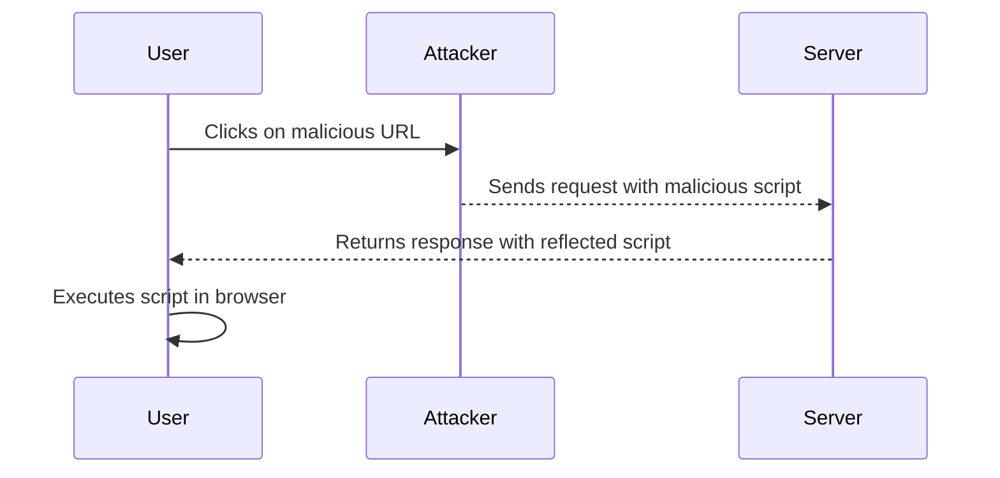
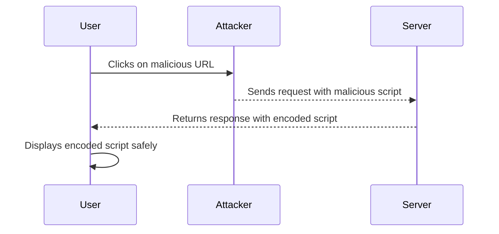

## Introduction to Cross-Site Scripting (XSS)

Cross-Site Scripting (XSS) is a type of security vulnerability typically found in web applications where an attacker can inject malicious scripts into web pages viewed by other users. This can lead to various harmful outcomes such as stealing sensitive data, session hijacking, and defacement of websites. XSS vulnerabilities can be categorized into three main types: Stored XSS, DOM-based XSS, and Reflected XSS. In this chapter, we will focus specifically on Reflected XSS in API endpoints.

### What is Reflected XSS?

Reflected XSS occurs when an attacker injects malicious scripts into a web page via a query parameter or form input. The server reflects the input back to the user without proper sanitization or validation. When the user visits the reflected URL, the injected script executes within the context of the user's browser, potentially compromising their session or stealing sensitive information.

### Why Does Reflected XSS Matter?

Reflected XSS is particularly dangerous because it can be used to trick users into visiting a malicious URL. Once the user clicks on the link, the injected script runs in their browser, often leading to unauthorized actions or data theft. This type of attack is commonly seen in phishing attempts and can be used to bypass certain security mechanisms like Same-Origin Policy.

### How Does Reflected XSS Work?

To understand how Reflected XSS works, consider the following scenario:

1. **User Input**: A user submits a form or navigates to a URL containing a query parameter.
2. **Server Reflection**: The server reflects the user input back in the response without proper sanitization.
3. **Script Execution**: When the user receives the response, the injected script executes in their browser.

Let's break down the process with a concrete example.

### Example Scenario

Consider an API endpoint `/search` that accepts a `query` parameter and returns search results. An attacker might craft a URL like:

```
https://example.com/search?query=<script>alert('XSS')</script>
```

When a user visits this URL, the server reflects the `query` parameter back in the response. If the server does not properly sanitize the input, the `<script>` tag will be included in the response, causing the `alert('XSS')` script to execute in the user's browser.

### Detailed Explanation of the Example

#### Step-by-Step Mechanics

1. **Attacker Crafted URL**:
    - The attacker crafts a URL with a malicious script embedded in the `query` parameter.
    - The URL might look like: `https://example.com/search?query=<script>alert('XSS')</script>`

2. **User Visits URL**:
    - The user clicks on the malicious URL, which sends a request to the server.
    - The request might look like:
      ```http
      GET /search?query=%3Cscript%3Ealert%28%27XSS%27%29%3C%2Fscript%3E HTTP/1.1
      Host: example.com
      ```

3. **Server Response**:
    - The server processes the request and reflects the `query` parameter back in the response.
    - The response might look like:
      ```http
      HTTP/1.1 200 OK
      Content-Type: text/html; charset=UTF-8
      
      <html>
        <body>
          <h1>Search Results</h1>
          <div>
            <script>alert('XSS')</script>
          </div>
        </body>
      </html>
      ```

4. **Script Execution**:
    - The user's browser receives the response and renders the HTML.
    - The `<script>` tag is executed, displaying an alert box with the message "XSS".

### Real-World Examples

Reflected XSS vulnerabilities have been identified in numerous real-world scenarios. Here are a couple of recent examples:

1. **CVE-2021-33766**: This vulnerability was found in the WordPress REST API. An attacker could inject malicious JavaScript into the `wp-json` endpoint, leading to a Reflected XSS attack.

2. **CVE-2022-22965**: This vulnerability affected the Atlassian Jira Software. An attacker could inject malicious scripts into the `browse` endpoint, leading to a Reflected XSS attack.

### Common Pitfalls

Developers often fall into several common traps that can lead to Reflected XSS vulnerabilities:

1. **Insufficient Input Validation**: Failing to validate user inputs can allow attackers to inject malicious scripts.
2. **Improper Output Encoding**: Not properly encoding output can result in scripts being executed in the user's browser.
3. **Lack of Content Security Policies (CSP)**: Without proper CSPs, browsers may execute scripts even if they are not from trusted sources.

### How to Prevent / Defend Against Reflected XSS

To prevent Reflected XSS attacks, developers should implement several defensive measures:

1. **Input Validation**: Validate all user inputs to ensure they conform to expected formats.
2. **Output Encoding**: Encode all outputs to prevent scripts from being executed.
3. **Content Security Policies (CSP)**: Implement CSPs to restrict the sources from which scripts can be loaded.
4. **HTTP Headers**: Use HTTP headers like `X-XSS-Protection` to enable browser-based protections.

#### Secure Coding Practices

Here is an example of how to securely handle user inputs in an API endpoint using Python and Flask:

```python
from flask import Flask, request, escape

app = Flask(__name__)

@app.route('/search')
def search():
    query = request.args.get('query', '')
    # Escape the query to prevent XSS
    safe_query = escape(query)
    # Return the search results with the escaped query
    return f'<html><body><h1>Search Results</h1><div>{safe_query}</div></body></html>'

if __name__ == '__main__':
    app.run(debug=True)
```

In this example, the `escape` function ensures that any potentially malicious scripts are encoded, preventing them from being executed in the user's browser.

### Detection and Prevention Tools

Several tools can help detect and prevent Reflected XSS vulnerabilities:

1. **Static Application Security Testing (SAST)**: Tools like SonarQube and Fortify can identify insecure coding practices.
2. **Dynamic Application Security Testing (DAST)**: Tools like Burp Suite and OWASP ZAP can simulate attacks and detect vulnerabilities.
3. **Web Application Firewalls (WAF)**: WAFs like ModSecurity can filter out malicious requests before they reach the application.

### Complete Example with Request, Response, and Result

Let's walk through a complete example of a Reflected XSS attack and how to defend against it.

#### Vulnerable Code

```python
from flask import Flask, request

app = Flask(__name__)

@app.route('/search')
def search():
    query = request.args.get('query', '')
    # Vulnerable code: no input validation or output encoding
    return f'<html><body><h1>Search Results</h1><div>{query}</div></body></html>'

if __name__ == '__main__':
    app.run(debug=True)
```

#### Malicious Request

```http
GET /search?query=%3Cscript%3Ealert%28%27XSS%27%29%3C%2Fscript%3E HTTP/1.1
Host: example.com
```

#### Vulnerable Response

```http
HTTP/1.1 200 OK
Content-Type: text/html; charset=UTF-8

<html>
  <body>
    <h1>Search Results</h1>
    <div>
      <script>alert('XSS')</script>
    </div>
  </body>
</html>
```

#### Secure Code

```python
from flask import Flask, request, escape

app = Flask(__name__)

@app.route('/search')
def search():
    query = request.args.get('query', '')
    # Secure code: input validation and output encoding
    safe_query = escape(query)
    return f'<html><body><h1>Search Results</h1><div>{safe_query}</div></body></html>'

if __name__ == '__main__':
    app.run(debug=True)
```

#### Secure Response

```http
HTTP/1.1 200 OK
Content-Type: text/html; charset=UTF-8

<html>
  <body>
    <h1>Search Results</h1>
    <div>
      &lt;script&gt;alert(&#39;XSS&#39;)&lt;/script&gt;
    </div>
  </body>
</html>
```

### Mermaid Diagrams

#### Attack Chain Diagram



#### Secure Flow Diagram



### Hands-On Labs

For hands-on practice with Reflected XSS in API endpoints, consider the following labs:

- **PortSwigger Web Security Academy**: Offers a comprehensive set of labs covering various types of XSS attacks, including Reflected XSS.
- **OWASP Juice Shop**: Provides a vulnerable web application for practicing different types of security vulnerabilities, including XSS.
- **DVWA (Damn Vulnerable Web Application)**: Another popular web application for learning and testing web security vulnerabilities.

By thoroughly understanding and implementing the defensive measures outlined in this chapter, developers can significantly reduce the risk of Reflected XSS vulnerabilities in their applications.

---
<!-- nav -->
[[API Security/12-Cross Site Scripting/04-Reflected XSS in API Endpoints/00-Overview|Overview]] | [[02-Introduction to Reflected Cross-Site Scripting (XSS) in API Endpoints|Introduction to Reflected Cross-Site Scripting (XSS) in API Endpoints]]
