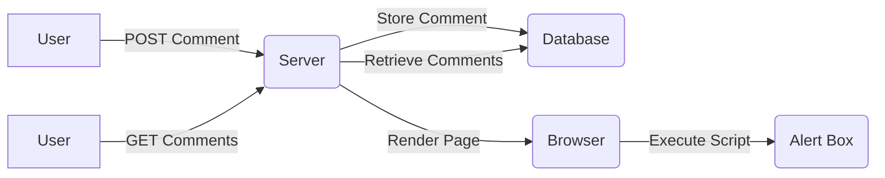

## Introduction to Cross-Site Scripting (XSS)

Cross-Site Scripting (XSS) is a type of security vulnerability typically found in web applications. XSS allows an attacker to inject malicious scripts into web pages viewed by other users. This can lead to various harmful outcomes such as stealing sensitive data, performing actions on behalf of the user, or even taking control of the user's browser session.

### Types of XSS

There are three main types of XSS vulnerabilities:

1. **Reflected XSS**: The injected script is reflected off a web server, often in response to a search query or similar request.
2. **Stored XSS**: The injected script is permanently stored on the target servers, such as in a database, and served to users in the future.
3. **DOM-based XSS**: The vulnerability exists in the client-side JavaScript code rather than the server-side code.

In this chapter, we will focus on Stored XSS, which is particularly dangerous because the malicious script is stored on the server and can affect multiple users over time.

### Background Theory

To understand Stored XSS, we need to delve into how web applications handle user input and display it back to users. In a typical scenario, a web application allows users to submit comments, posts, or other forms of content. These submissions are stored in a database and later retrieved and displayed to other users.

If the application fails to properly sanitize or encode the user-submitted content, an attacker can inject malicious scripts that will be executed by the browser of anyone viewing the page.

### Example Scenario

Let's consider a web application that allows users to post comments on articles. An attacker could inject a malicious script into a comment, which would be stored in the database. When another user views the article, their browser executes the script, potentially leading to unauthorized actions or data theft.

#### Code Example

Here’s a simplified example of how a Stored XSS vulnerability might occur:

```python
# Vulnerable code
def store_comment(user_id, comment):
    # Store the comment in the database
    db.execute("INSERT INTO comments (user_id, comment) VALUES (?, ?)", (user_id, comment))

def get_comments(article_id):
    # Retrieve comments from the database
    comments = db.execute("SELECT * FROM comments WHERE article_id=?", (article_id,))
    return comments
```

In this example, the `store_comment` function takes user input directly and stores it in the database without any sanitization or encoding. The `get_comments` function retrieves these comments and displays them to users.

### Real-World Examples

Recent real-world examples of Stored XSS vulnerabilities include:

- **CVE-2021-30148**: A Stored XSS vulnerability was discovered in the WordPress plugin "WP GDPR Compliance." Attackers could inject malicious scripts into user comments, which would be executed by other users.
- **CVE-2020-1938**: Another Stored XSS vulnerability was found in the Joomla! CMS. Attackers could inject scripts into user profiles, affecting other users who viewed those profiles.

These examples highlight the importance of proper input validation and output encoding to prevent such vulnerabilities.

### Detailed Explanation of the Transcript Chunk

The transcript chunk describes a specific scenario involving a Stored XSS vulnerability. Let's break it down step-by-step.

#### Step 1: Sending a Comment

The attacker sends a comment containing a malicious script. For example:

```json
{
  "comment": "<script>alert('XSS');</script>"
}
```

This comment is stored in the database associated with a specific comment ID.

#### Step 2: Retrieving the Comment

When another user views the article, the web application retrieves the comments from the database and displays them. The malicious script is included in the HTML response.

#### Step 3: Executing the Script

The user's browser interprets the HTML and executes the `<script>` tag, triggering the alert box. This demonstrates the successful exploitation of the Stored XSS vulnerability.

### Full HTTP Request and Response

Let's look at the full HTTP request and response involved in this process.

#### HTTP Request to Post a Comment

```http
POST /api/comments HTTP/1.1
Host: example.com
Content-Type: application/json

{
  "comment": "<script>alert('XSS');</script>"
}
```

#### HTTP Response from Posting a Comment

```http
HTTP/1.1 201 Created
Content-Type: application/json

{
  "id": 1013,
  "comment": "<script>alert('XSS');</script>"
}
```

#### HTTP Request to Get Comments

```http
GET /api/comments/1013 HTTP/1.1
Host: example.com
```

#### HTTP Response from Getting Comments

```http
HTTP/1.1 200 OK
Content-Type: application/json

{
  "id": 1013,
  "comment": "<script>alert('XSS');</script>"
}
```

### How to Prevent / Defend Against Stored XSS

Preventing Stored XSS requires a combination of input validation, output encoding, and proper security practices.

#### Input Validation

Input validation ensures that user-submitted data conforms to expected formats. For example, comments should not contain HTML tags unless explicitly allowed.

```python
import re

def validate_comment(comment):
    # Simple regex to check for HTML tags
    if re.search(r'<[^>]+>', comment):
        raise ValueError("Invalid comment: contains HTML tags")
    return comment
```

#### Output Encoding

Output encoding ensures that any user-submitted data is properly encoded before being displayed in the browser. This prevents the browser from interpreting the data as executable code.

```python
from html import escape

def display_comment(comment):
    # Escape HTML entities
    safe_comment = escape(comment)
    return safe_comment
```

#### Secure Coding Practices

Secure coding practices include using frameworks and libraries that automatically handle input validation and output encoding. For example, Django and Flask provide built-in mechanisms to prevent XSS.

```python
# Using Django's auto-escaping feature
from django.utils.safestring import mark_safe

def display_comment(comment):
    # Automatically escapes HTML entities
    return mark_safe(escape(comment))
```

### Complete Example with Vulnerable and Secure Code

#### Vulnerable Code

```python
def store_comment(user_id, comment):
    # Store the comment in the database
    db.execute("INSERT INTO comments (user_id, comment) VALUES (?, ?)", (user_id, comment))

def get_comments(article_id):
    # Retrieve comments from the database
    comments = db.execute("SELECT * FROM comments WHERE article_id=?", (article_id,))
    return comments
```

#### Secure Code

```python
import re
from html import escape

def validate_comment(comment):
    # Simple regex to check for HTML tags
    if re.search(r'<[^>]+>', comment):
        raise ValueError("Invalid comment: contains HTML tags")
    return comment

def store_comment(user_id, comment):
    # Validate the comment
    safe_comment = validate_comment(comment)
    # Store the comment in the database
    db.execute("INSERT INTO comments (user_id, comment) VALUES (?, ?)", (user_id, safe_comment))

def display_comment(comment):
    # Escape HTML entities
    safe_comment = escape(comment)
    return safe_comment

def get_comments(article_id):
    # Retrieve comments from the database
    comments = db.execute("SELECT * FROM comments WHERE article_id=?", (article_id,))
    # Display comments safely
    safe_comments = [display_comment(comment['comment']) for comment in comments]
    return safe_comments
```

### Mermaid Diagrams

#### Sequence Diagram for Stored XSS Exploitation

```mermaid
sequenceDiagram
    participant User as U
    participant Server as S
    participant Browser as B
    U->>S: POST /api/comments
    S-->>U: 201 Created
    U->>S: GET /api/comments/1013
    S-->>U: 200 OK
    U->>B: Load Page
    B-->>B: Execute <script>alert('XSS');</script>
```

#### Architecture Diagram for Web Application



### Hands-On Labs

For hands-on practice with Stored XSS, consider the following labs:

- **PortSwigger Web Security Academy**: Offers a comprehensive set of labs covering various types of XSS vulnerabilities, including Stored XSS.
- **OWASP Juice Shop**: A deliberately insecure web application designed for security training. It includes several Stored XSS challenges.
- **DVWA (Damn Vulnerable Web Application)**: Another popular web application for security testing that includes Stored XSS vulnerabilities.

### Conclusion

Stored XSS is a serious security vulnerability that can have significant consequences. By understanding the underlying mechanisms and implementing proper input validation and output encoding, developers can effectively prevent such attacks. Regular security audits and penetration testing are also crucial to identify and mitigate potential vulnerabilities.

---
<!-- nav -->
[[API Security/12-Cross Site Scripting/05-Stored Cross Site Scripting hide01ir/00-Overview|Overview]] | [[02-Introduction to Stored Cross-Site Scripting (XSS)|Introduction to Stored Cross-Site Scripting (XSS)]]
