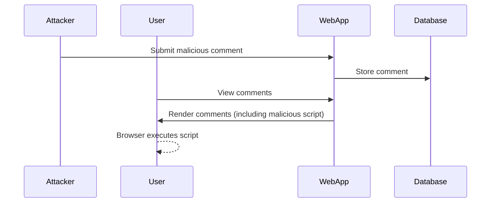

## Introduction to Stored Cross-Site Scripting (XSS)

Cross-Site Scripting (XSS) is a type of security vulnerability typically found in web applications. XSS allows attackers to inject malicious scripts into web pages viewed by other users. There are three main types of XSS vulnerabilities: reflected, stored, and DOM-based. In this chapter, we will focus on **Stored Cross-Site Scripting**.

### What is Stored XSS?

Stored XSS occurs when an attacker injects malicious JavaScript code into a database or persistent storage mechanism. This code is then served to other users as part of the normal page content. Unlike reflected XSS, which relies on the victim clicking a malicious link, stored XSS affects all users who view the affected page.

#### Example Scenario

Consider a web application that allows users to submit comments on a blog post. If the application does not properly sanitize input, an attacker could inject a malicious script into the comment field. When other users view the blog post, their browsers execute the injected script, potentially compromising their session or stealing sensitive data.

### Background Theory

To understand Stored XSS, we need to delve into the basics of how web applications handle user input and serve content.

#### How Web Applications Handle User Input

Web applications often allow users to submit data through forms, such as comments, posts, or profile information. This data is typically stored in a database and later retrieved and displayed to other users.

#### How Stored XSS Works

1. **Injection**: An attacker submits a comment containing malicious JavaScript code.
2. **Storage**: The web application stores the comment in a database without proper sanitization.
3. **Retrieval**: When another user views the blog post, the web application retrieves the comment from the database and includes it in the HTML response.
4. **Execution**: The user’s browser executes the malicious script, leading to potential security issues.

### Real-World Examples

#### Recent Breaches and CVEs

- **CVE-2021-33766**: A stored XSS vulnerability was discovered in the WordPress plugin "WP GDPR Compliance." Attackers could inject malicious scripts into user comments, affecting all users viewing those comments.
- **CVE-2020-28490**: A stored XSS vulnerability was found in the Joomla! component "JEvents." Attackers could inject scripts into event descriptions, affecting users viewing the events.

### Complete Code Example

Let's walk through a detailed example of how a stored XSS vulnerability might occur and how to mitigate it.

#### Vulnerable Code

Consider a simple web application that allows users to submit comments:

```python
# Vulnerable Comment Submission Endpoint
@app.route('/submit_comment', methods=['POST'])
def submit_comment():
    comment = request.form['comment']
    user_id = request.form['user_id']
    
    # Store the comment in the database
    db.execute("INSERT INTO comments (user_id, comment) VALUES (?, ?)", (user_id, comment))
    db.commit()
    
    return "Comment submitted successfully!"

# Vulnerable Comment Retrieval Endpoint
@app.route('/get_comments', methods=['GET'])
def get_comments():
    comments = db.execute("SELECT * FROM comments").fetchall()
    
    # Generate HTML response with comments
    html_response = "<html><body>"
    for comment in comments:
        html_response += f"<div>{comment['comment']}</div>"
    html_response += "</body></html>"
    
    return html_response
```

#### Exploitation

An attacker could submit a comment like:

```html
<script>alert('XSS');</script>
```

When another user views the comments, their browser would execute the `alert` function, demonstrating the vulnerability.

### Detection and Prevention

#### How to Detect Stored XSS

1. **Automated Scanning Tools**: Use tools like Burp Suite, OWASP ZAP, or commercial scanners to automatically detect XSS vulnerabilities.
2. **Manual Testing**: Manually test input fields by submitting payloads like `<script>alert('XSS')</script>` and checking if the script is executed.

#### How to Prevent Stored XSS

1. **Input Sanitization**: Ensure all user inputs are sanitized before storing them in the database. Libraries like `OWASP Java HTML Sanitizer` or `DOMPurify` can help.
2. **Output Encoding**: Encode all user-generated content before rendering it in the HTML response. Use libraries like `html.escape` in Python or `htmlspecialchars` in PHP.

#### Secure Code Fix

Here’s how the code should be modified to prevent XSS:

```python
from html import escape

# Secure Comment Submission Endpoint
@app.route('/submit_comment', methods=['POST'])
def submit_comment():
    comment = escape(request.form['comment'])
    user_id = request.form['user_id']
    
    # Store the sanitized comment in the database
    db.execute("INSERT INTO comments (user_id, comment) VALUES (?, ?)", (user_id, comment))
    db.commit()
    
    return "Comment submitted successfully!"

# Secure Comment Retrieval Endpoint
@app.route('/get_comments', methods=['GET'])
def get_comments():
    comments = db.execute("SELECT * FROM comments").fetchall()
    
    # Generate HTML response with comments
    html_response = "<html><body>"
    for comment in comments:
        html_response += f"<div>{escape(comment['comment'])}</div>"
    html_response += "</body></html>"
    
    return html_response
```

### Mermaid Diagrams

#### Attack Chain Diagram



### Common Pitfalls

1. **Assuming Input is Safe**: Always assume user input is malicious until proven otherwise.
2. **Incomplete Sanitization**: Only sanitizing some parts of the input can leave vulnerabilities open.
3. **Ignoring Output Encoding**: Failing to encode output can lead to XSS even if input is sanitized.

### Hands-On Labs

For practical experience with Stored XSS, consider the following labs:

- **PortSwigger Web Security Academy**: Offers interactive labs specifically designed to teach and test XSS vulnerabilities.
- **OWASP Juice Shop**: A deliberately insecure web application for practicing web security skills, including XSS.
- **DVWA (Damn Vulnerable Web Application)**: Another intentionally vulnerable web app for learning and testing security concepts.

By thoroughly understanding and implementing the principles discussed in this chapter, you can significantly reduce the risk of stored XSS vulnerabilities in your web applications.

---
<!-- nav -->
[[API Security/12-Cross Site Scripting/05-Stored Cross Site Scripting hide01ir/01-Introduction to Cross-Site Scripting (XSS)|Introduction to Cross-Site Scripting (XSS)]] | [[API Security/12-Cross Site Scripting/05-Stored Cross Site Scripting hide01ir/00-Overview|Overview]] | [[API Security/12-Cross Site Scripting/05-Stored Cross Site Scripting hide01ir/03-Practice Questions & Answers|Practice Questions & Answers]]
