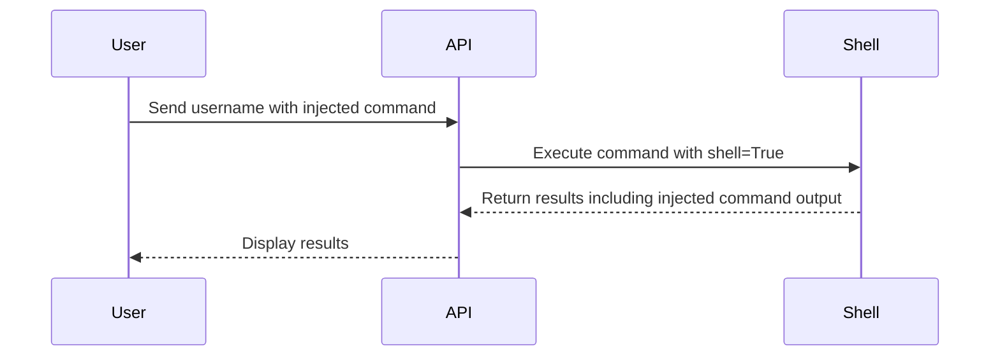

## Command Injection Overview

Command injection is a type of vulnerability that occurs when an attacker is able to inject malicious commands into a program or script that executes system commands. This can lead to unauthorized access, data theft, or other malicious activities. Understanding how command injection works and how to prevent it is crucial for securing APIs and web applications.

### What is Command Injection?

Command injection happens when an application takes untrusted input and passes it to a system shell for execution. The attacker can manipulate the input to execute arbitrary commands on the server. This can occur in various contexts, such as web forms, URL parameters, or API endpoints.

#### Why Does Command Injection Matter?

Command injection vulnerabilities can have severe consequences:

- **Unauthorized Access**: Attackers can gain access to sensitive files or directories.
- **Data Theft**: They can steal confidential information stored on the server.
- **System Compromise**: Attackers can take control of the server and perform actions like installing malware or launching further attacks.

### How Does Command Injection Work?

To understand command injection, let's consider a simple example where an application uses user input to execute a system command.

#### Example Scenario

Imagine an API endpoint that accepts a `username` parameter and uses it to display the user's home directory contents:

```python
import subprocess

def list_home_directory(username):
    command = f"ls -l /home/{username}"
    result = subprocess.run(command, shell=True, capture_output=True, text=True)
    return result.stdout
```

In this example, the `subprocess.run` function is used to execute the `ls` command with the provided `username`. However, if the `username` parameter is not properly sanitized, an attacker can inject additional commands.

#### Exploiting the Vulnerability

An attacker could provide a `username` value like `victim; ls -l /etc/passwd`. This would cause the following command to be executed:

```bash
ls -l /home/victim; ls -l /etc/passwd
```

The first part lists the contents of `/home/victim`, and the second part lists the contents of `/etc/passwd`, which contains sensitive information about system users.

### Real-World Examples

Recent real-world examples of command injection vulnerabilities include:

- **CVE-2021-21972**: A command injection vulnerability in the Jenkins plugin for GitLab integration allowed attackers to execute arbitrary commands on the Jenkins server.
- **CVE-2020-14182**: A command injection vulnerability in the Apache Struts framework allowed attackers to execute arbitrary commands on the server.

### Detection and Prevention

#### Detection

Detecting command injection vulnerabilities requires a combination of static analysis and dynamic testing:

- **Static Analysis**: Tools like SonarQube, Fortify, and Veracode can identify potential command injection vulnerabilities in the codebase.
- **Dynamic Testing**: Penetration testing and fuzzing tools like Burp Suite, OWASP ZAP, and AFL can help identify runtime vulnerabilities.

#### Prevention

Preventing command injection involves several best practices:

1. **Input Validation**: Validate and sanitize all user inputs to ensure they do not contain malicious characters.
2. **Use Safe Libraries**: Use libraries that handle command execution safely, such as `subprocess.run` without `shell=True`.
3. **Least Privilege Principle**: Run the application with the least privileges necessary to minimize the damage if a vulnerability is exploited.
4. **Code Reviews**: Regularly review code for security vulnerabilities, especially in areas where external input is processed.

### Secure Coding Practices

Let's compare the insecure and secure versions of the previous example:

#### Insecure Code

```python
import subprocess

def list_home_directory(username):
    command = f"ls -l /home/{username}"
    result = subprocess.run(command, shell=True, capture_output=True, text=True)
    return result.stdout
```

#### Secure Code

```python
import subprocess

def list_home_directory(username):
    # Sanitize the username input
    sanitized_username = username.replace(";", "").replace("&", "").replace("|", "")
    
    # Use a list to pass arguments safely
    command = ["ls", "-l", f"/home/{sanitized_username}"]
    result = subprocess.run(command, capture_output=True, text=True)
    return result.stdout
```

### Mermaid Diagrams

#### Command Execution Flow



### Hands-On Labs

For hands-on practice with command injection, consider the following labs:

- **PortSwigger Web Security Academy**: Offers interactive labs on command injection.
- **OWASP Juice Shop**: Contains several vulnerabilities, including command injection, for learning purposes.
- **DVWA (Damn Vulnerable Web Application)**: Provides a variety of web application vulnerabilities, including command injection.

By thoroughly understanding command injection and implementing robust security measures, developers can significantly reduce the risk of such vulnerabilities in their applications.

---
<!-- nav -->
[[API Security/13-Command Injection/01-Approach Towards Command Injection/00-Overview|Overview]] | [[02-Introduction to Command Injection|Introduction to Command Injection]]
