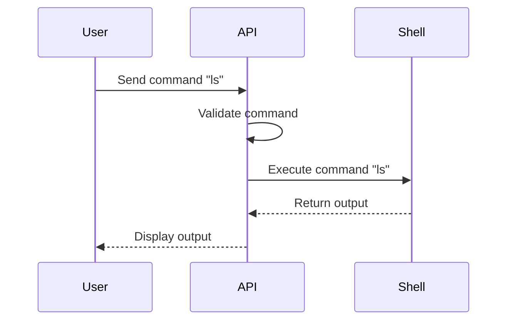

## Command Injection in APIs

Command injection is a type of security vulnerability that occurs when an attacker can inject malicious commands into an application through user input. This can lead to unauthorized access, data theft, or even complete system compromise. In the context of APIs, command injection vulnerabilities often arise due to improper validation and sanitization of user inputs.

### Understanding Command Injection

#### What is Command Injection?

Command injection occurs when an application constructs a command string using untrusted input and then executes that command. If the input is not properly sanitized, an attacker can inject additional commands or modify existing ones, leading to unintended behavior.

#### Why Does Command Injection Matter?

Command injection can have severe consequences, including:

- **Unauthorized Access**: An attacker might gain access to sensitive files or execute commands with elevated privileges.
- **Data Theft**: Attackers can exfiltrate sensitive data by executing commands that read files or dump database contents.
- **System Compromise**: In worst-case scenarios, attackers can take control of the entire system, leading to complete compromise.

#### How Does Command Injection Work?

Consider an API endpoint that takes a parameter `cmd` and executes it as a shell command. If the input is not validated or sanitized, an attacker can inject additional commands.

For example, consider the following Python code snippet:

```python
import subprocess

def execute_command(cmd):
    result = subprocess.run(cmd, shell=True, stdout=subprocess.PIPE)
    return result.stdout.decode('utf-8')

# Example usage
cmd = "ls"
output = execute_command(cmd)
print(output)
```

If an attacker provides the input `cmd="ls; rm -rf /"`, the `subprocess.run` function will execute both `ls` and `rm -rf /`, potentially causing significant damage.

### Real-World Examples

#### Recent CVEs and Breaches

One notable example of command injection is the CVE-2021-2109, which affected the Jenkins CI server. The vulnerability allowed attackers to inject arbitrary commands into the Jenkins environment, leading to potential system compromise.

Another example is the CVE-2020-14882, which affected the Apache Struts framework. This vulnerability allowed attackers to inject commands into the application, leading to remote code execution.

### Detection and Prevention

#### How to Detect Command Injection Vulnerabilities

To detect command injection vulnerabilities, you can perform the following steps:

1. **Static Analysis**: Use static analysis tools to scan your codebase for potential command injection vulnerabilities.
2. **Dynamic Analysis**: Use dynamic analysis tools to test your application for command injection vulnerabilities by injecting malicious inputs.
3. **Penetration Testing**: Conduct penetration testing to simulate real-world attacks and identify vulnerabilities.

#### How to Prevent Command Injection

To prevent command injection vulnerabilities, follow these best practices:

1. **Input Validation**: Validate and sanitize all user inputs to ensure they do not contain malicious commands.
2. **Use Safe Libraries**: Use libraries and functions that are designed to safely handle command execution.
3. **Least Privilege Principle**: Ensure that the application runs with the least privilege necessary to perform its tasks.
4. **Logging and Monitoring**: Implement logging and monitoring to detect and respond to suspicious activities.

### Secure Coding Practices

#### Vulnerable Code Example

Consider the following vulnerable code snippet:

```python
import subprocess

def execute_command(cmd):
    result = subprocess.run(cmd, shell=True, stdout=subprocess.PIPE)
    return result.stdout.decode('utf-8')

# Example usage
cmd = "ls; rm -rf /"
output = execute_command(cmd)
print(output)
```

In this example, the `cmd` parameter is directly passed to the `subprocess.run` function without any validation or sanitization. This allows an attacker to inject malicious commands.

#### Secure Code Example

To secure the code, you should validate and sanitize the input before executing it. Here’s an example of how to do this:

```python
import subprocess

def execute_command(cmd):
    if not isinstance(cmd, str) or ";" in cmd or "|" in cmd:
        raise ValueError("Invalid command")
    result = subprocess.run(cmd, shell=False, stdout=subprocess.PIPE)
    return result.stdout.decode('utf-8')

# Example usage
cmd = "ls"
output = execute_command(cmd)
print(output)
```

In this secure example, the `execute_command` function checks if the input contains any characters that could be used to inject additional commands. If such characters are found, the function raises a `ValueError`.

### Configuration Hardening

#### Secure Configuration Example

To further harden the configuration, you can set up your environment to run with minimal privileges. For example, in a Docker container, you can use the `--read-only` flag to mount the root filesystem as read-only:

```yaml
version: '3'
services:
  app:
    image: myapp
    volumes:
      - type: bind
        source: /path/to/app
        target: /app
        read_only: true
```

This ensures that even if an attacker gains access to the container, they cannot modify the filesystem.

### Hands-On Labs

To practice detecting and preventing command injection vulnerabilities, you can use the following labs:

- **PortSwigger Web Security Academy**: Offers interactive labs to practice detecting and preventing command injection vulnerabilities.
- **OWASP Juice Shop**: A deliberately insecure web application that includes command injection vulnerabilities.
- **DVWA (Damn Vulnerable Web Application)**: Another deliberately insecure web application that includes various security vulnerabilities, including command injection.

### Conclusion

Command injection is a serious security vulnerability that can have severe consequences. By understanding how command injection works, detecting and preventing it, and following secure coding practices, you can significantly reduce the risk of such vulnerabilities in your applications.

### Diagrams

#### Command Execution Flow

```mermaid
sequenceDiagram
    participant User
    participant API
    participant Shell
    User->>API: Send command "ls; rm -rf /"
    API->>Shell: Execute command "ls; rm -rf /"
    Shell-->>API: Return output
    API-->>User: Display output
```

#### Secure Command Execution Flow



By following these best practices and using the provided resources, you can effectively protect your applications from command injection vulnerabilities.

---
<!-- nav -->
[[02-Introduction to Command Injection|Introduction to Command Injection]] | [[API Security/13-Command Injection/01-Approach Towards Command Injection/00-Overview|Overview]] | [[API Security/13-Command Injection/01-Approach Towards Command Injection/04-Practice Questions & Answers|Practice Questions & Answers]]
