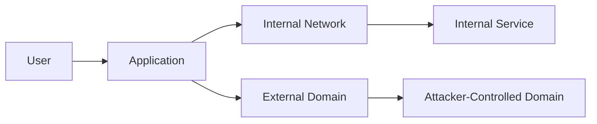

## Server-Side Request Forgery (SSRF)

### Introduction to SSRF

Server-Side Request Forgery (SSRF) is a type of web application vulnerability that allows an attacker to induce the server-side application to make HTTP requests to an arbitrary domain of the attacker's choosing. This can lead to unauthorized access to internal networks, sensitive data exposure, and even remote code execution. SSRF vulnerabilities arise due to improper input validation and lack of proper access controls on the server-side.

### Background Concepts

#### What is SSRF?

SSRF occurs when an application takes user input and uses it to make HTTP requests to an internal or external resource without proper validation or sanitization. The attacker can manipulate the input to point to internal resources such as the local network, internal services, or even loopback addresses (`localhost`).

#### Why Does SSRF Matter?

SSRF can be exploited to bypass network segmentation, access internal services, and perform reconnaissance on internal networks. In some cases, SSRF can be used to exploit other vulnerabilities within the internal network, such as Remote Code Execution (RCE) or information disclosure.

#### How Does SSRF Work Under the Hood?

When an application accepts user input and uses it to make HTTP requests, it typically follows these steps:

1. **Input Reception**: The application receives user input, which could be a URL or a hostname.
2. **Request Construction**: The application constructs an HTTP request using the provided input.
3. **Request Execution**: The application sends the constructed HTTP request to the specified destination.
4. **Response Handling**: The application processes the response received from the destination.

If the input is not properly validated, an attacker can inject malicious input to point the request to unintended destinations.

### Real-World Examples

#### Recent CVEs and Breaches

One notable example of SSRF exploitation is the **CVE-2020-5902** vulnerability in Jenkins. This vulnerability allowed attackers to exploit SSRF to access internal network resources and potentially execute arbitrary commands on the server.

Another example is the **CVE-2021-21972** vulnerability in Apache Struts. This vulnerability allowed attackers to exploit SSRF to access internal network resources and potentially execute arbitrary commands on the server.

### Detailed Explanation of SSRF Exploitation

#### Out-of-Band Resource Load

Out-of-band resource load refers to the scenario where an attacker induces the server to make HTTP requests to an external domain controlled by the attacker. This can be used to exfiltrate data or perform further attacks.

##### Example Scenario

Consider an application that allows users to provide a URL to fetch content from. An attacker can provide a URL pointing to an external domain controlled by the attacker.

```python
# Vulnerable code snippet
def fetch_content(url):
    response = requests.get(url)
    return response.text

# Attacker's input
url = "http://attacker-controlled-domain.com"
content = fetch_content(url)
```

In this example, the `fetch_content` function takes user input and makes an HTTP GET request to the provided URL. If the URL points to an attacker-controlled domain, the server will send a request to that domain, potentially allowing the attacker to exfiltrate data or perform further attacks.

### External Interactions

External interactions refer to the scenario where an application interacts with external services or APIs. If these interactions are not properly validated, an attacker can exploit them to perform SSRF.

##### Example Scenario

Consider an application that interacts with an external payment gateway. An attacker can manipulate the input to point to an internal service or loopback address.

```python
# Vulnerable code snippet
def process_payment(payment_url):
    response = requests.post(payment_url, data={"amount": 100})
    return response.status_code

# Attacker's input
payment_url = "http://localhost:8080/payment"
status_code = process_payment(payment_url)
```

In this example, the `process_payment` function takes a URL and makes an HTTP POST request to that URL. If the URL points to an internal service or loopback address, the server will send a request to that address, potentially allowing the attacker to access internal resources.

### Spoofable Client IP Address

Spoofable client IP address refers to the scenario where an attacker can manipulate the client IP address to perform SSRF. This can be used to bypass IP-based access controls.

##### Example Scenario

Consider an application that restricts access based on the client IP address. An attacker can manipulate the client IP address to bypass these restrictions.

```python
# Vulnerable code snippet
def check_access(ip_address):
    if ip_address == "192.168.1.1":
        return True
    else:
        return False

# Attacker's input
ip_address = "192.168.1.1"
access_granted = check_access(ip_address)
```

In this example, the `check_access` function checks the client IP address to determine if access should be granted. If the attacker can manipulate the client IP address, they can bypass these restrictions and gain unauthorized access.

### Detection and Prevention

#### How to Detect SSRF

To detect SSRF vulnerabilities, you can use various tools and techniques:

1. **Static Analysis Tools**: Tools like SonarQube, Fortify, and Veracode can help identify potential SSRF vulnerabilities in your codebase.
2. **Dynamic Analysis Tools**: Tools like Burp Suite, ZAP, and OWASP Dependency-Check can help identify SSRF vulnerabilities during runtime.
3. **Penetration Testing**: Conduct regular penetration testing to identify and mitigate SSRF vulnerabilities.

#### How to Prevent SSRF

To prevent SSRF vulnerabilities, you can implement the following measures:

1. **Input Validation**: Validate all user inputs to ensure they do not contain malicious content.
2. **Whitelist Filtering**: Use whitelisting to allow only trusted domains and IP addresses.
3. **Network Segmentation**: Implement network segmentation to isolate internal services from external access.
4. **Access Controls**: Implement strict access controls to restrict access to internal resources.
5. **Secure Coding Practices**: Follow secure coding practices to avoid common vulnerabilities.

### Secure Coding Fixes

#### Vulnerable Code

```python
# Vulnerable code snippet
def fetch_content(url):
    response = requests.get(url)
    return response.text

# Attacker's input
url = "http://attacker-controlled-domain.com"
content = fetch_content(url)
```

#### Fixed Code

```python
# Fixed code snippet
import requests

def fetch_content(url):
    allowed_domains = ["example.com"]
    if any(domain in url for domain in allowed_domains):
        response = requests.get(url)
        return response.text
    else:
        raise ValueError("Invalid domain")

# Attacker's input
url = "http://attacker-controlled-domain.com"
try:
    content = fetch_content(url)
except ValueError as e:
    print(e)
```

In the fixed code, we validate the input URL against a whitelist of allowed domains. If the input URL does not match any of the allowed domains, we raise an error.

### Network Topology Diagram



### Conclusion

Server-Side Request Forgery (SSRF) is a critical vulnerability that can be exploited to access internal network resources and perform further attacks. By understanding the concepts, real-world examples, and implementing proper detection and prevention measures, you can mitigate the risks associated with SSRF.

### Practice Labs

For hands-on practice with SSRF, consider the following labs:

- **PortSwigger Web Security Academy**: Offers interactive labs on SSRF and other web application vulnerabilities.
- **OWASP Juice Shop**: Provides a vulnerable web application for practicing various security exploits, including SSRF.
- **DVWA (Damn Vulnerable Web Application)**: A deliberately insecure web application for practicing web application security.

By engaging with these labs, you can gain practical experience in identifying and mitigating SSRF vulnerabilities.

---
<!-- nav -->
[[API Security/14-Server Side Request Forgery/01-Background Concept Minimal Refer Hunter 20 Section/01-Introduction to Server-Side Request Forgery (SSRF)|Introduction to Server-Side Request Forgery (SSRF)]] | [[API Security/14-Server Side Request Forgery/01-Background Concept Minimal Refer Hunter 20 Section/00-Overview|Overview]] | [[API Security/14-Server Side Request Forgery/01-Background Concept Minimal Refer Hunter 20 Section/03-Practice Questions & Answers|Practice Questions & Answers]]
