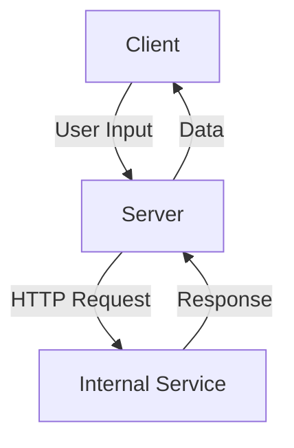

## Introduction to Server-Side Request Forgery (SSRF)

Server-Side Request Forgery (SSRF) is a type of web application vulnerability that allows an attacker to induce the server-side application to make HTTP requests to an arbitrary domain. This can lead to unauthorized access to internal networks, sensitive data, and even remote code execution. SSRF attacks exploit the trust relationship between the server and the client, enabling attackers to bypass security measures such as firewalls and network segmentation.

### Background Theory

To understand SSRF, it's essential to grasp the basic architecture of web applications and how they interact with external resources. A typical web application consists of a client (usually a browser) and a server. The server communicates with various external services, databases, and APIs to fulfill client requests. SSRF vulnerabilities arise when the server makes requests to external resources based on user input without proper validation or sanitization.

### Identifying Injection Points

The first step in exploiting SSRF is identifying injection points within the application. These are places where user input is used to construct HTTP requests. Common injection points include:

- URL parameters
- Form fields
- Headers
- Body content

#### Example: Injection Point in a URL Parameter

Consider a web application that fetches data from an external API based on a user-provided URL parameter:

```python
import requests

def fetch_data(url):
    response = requests.get(url)
    return response.text

# Example usage
user_input_url = "http://example.com/data"
data = fetch_data(user_input_url)
```

In this example, `user_input_url` is an injection point. An attacker can manipulate this parameter to inject malicious URLs.

### Exploiting SSRF to Access Internal Applications

Once an injection point is identified, an attacker can attempt to access internal applications running on the local network or intranet. This is achieved by injecting URLs that point to internal IP addresses or loopback addresses.

#### Example: Injecting Loopback Address

Let's consider the previous example and inject a loopback address (`127.0.0.1`) to access an internal service:

```python
# Malicious user input
malicious_url = "http://127.0.0.1:8080/data"

# Fetching data using the malicious URL
data = fetch_data(malicious_url)
```

If the server is configured to allow outbound requests to internal IP addresses, the above code will fetch data from the internal service running on `127.0.0.1:8080`.

### Real-World Examples and Recent Breaches

Several high-profile breaches have been attributed to SSRF vulnerabilities. One notable example is the Capital One breach in 2019, where an attacker exploited an SSRF vulnerability to gain unauthorized access to sensitive customer data.

#### CVE-2019-11510: Docker API SSRF

Another significant example is CVE-2019-11510, which affected Docker API versions 1.24 through 1.40. The vulnerability allowed attackers to perform SSRF attacks against the Docker daemon, leading to potential container escape and unauthorized access to the host system.

### Detailed Exploit Walkthrough

Let's walk through a detailed example of exploiting SSRF to access an internal application running on the local network.

#### Step 1: Identify Injection Point

Assume we have a web application with a form that accepts a URL parameter to fetch data:

```html
<form action="/fetch-data" method="POST">
    <input type="text" name="url" placeholder="Enter URL">
    <button type="submit">Fetch Data</button>
</form>
```

#### Step 2: Inject Loopback Address

An attacker can inject a loopback address to access an internal service:

```html
<form action="/fetch-data" method="POST">
    <input type="text" name="url" value="http://127.0.0.1:8080/data">
    <button type="submit">Fetch Data</button>
</form>
```

#### Step 3: Analyze Response

When the form is submitted, the server will make an HTTP request to `http://127.0.0.1:8080/data`. The response from the internal service will be returned to the attacker.

### HTTP Details

Here is a complete HTTP request and response for the above scenario:

#### HTTP Request

```http
POST /fetch-data HTTP/1.1
Host: example.com
Content-Type: application/x-www-form-urlencoded
Content-Length: 35

url=http%3A%2F%2F127.0.0.1%3A8080%2Fdata
```

#### HTTP Response

```http
HTTP/1.1 200 OK
Date: Tue, 20 Mar 2023 12:00:00 GMT
Content-Type: text/html; charset=UTF-8
Content-Length: 123

<!DOCTYPE html>
<html>
<head>
    <title>Data</title>
</head>
<body>
    <h1>Data from Internal Service</h1>
    <p>This is data from the internal service running on 127.0.0.1:8080.</p>
</body>
</html>
```

### Mermaid Diagrams

#### Network Topology



### Pitfalls and Common Mistakes

- **Lack of Validation**: Not validating user input can lead to SSRF vulnerabilities.
- **Hardcoded Internal IPs**: Using hardcoded internal IP addresses in the application can expose the internal network structure.
- **Firewall Configuration**: Misconfigured firewalls may allow outbound requests to internal IP addresses.

### How to Prevent / Defend

#### Detection

- **Logging and Monitoring**: Implement logging and monitoring to detect unusual outbound requests.
- **Network Segmentation**: Use network segmentation to isolate internal services from external access.

#### Prevention

- **Input Validation**: Validate and sanitize user input to ensure it does not contain malicious URLs.
- **Whitelist External Domains**: Maintain a whitelist of allowed external domains and reject requests to untrusted domains.

#### Secure Coding Fixes

##### Vulnerable Code

```python
import requests

def fetch_data(url):
    response = requests.get(url)
    return response.text
```

##### Secure Code

```python
import requests

def fetch_data(url):
    allowed_domains = ["example.com", "api.example.com"]
    if any(domain in url for domain in allowed_domains):
        response = requests.get(url)
        return response.text
    else:
        raise ValueError("Invalid URL")
```

### Complete Example with Full HTTP Requests and Responses

#### HTTP Request

```http
POST /fetch-data HTTP/1.1
Host: example.com
Content-Type: application/x-www-form-urlencoded
Content-Length: 35

url=http%3A%2F%2Fexample.com%2Fdata
```

#### HTTP Response

```http
HTTP/1.1 200 OK
Date: Tue, 20 Mar 2023 12:00:00 GMT
Content-Type: text/html; charset=UTF-8
Content-Length: 123

<!DOCTYPE html>
<html>
<head>
    <title>Data</title>
</head>
<body>
    <h1>Data from External Service</h1>
    <p>This is data from the external service running on example.com.</p>
</body>
</html>
```

### Hands-On Labs

For hands-on practice with SSRF vulnerabilities, consider the following labs:

- **PortSwigger Web Security Academy**: Offers comprehensive modules on SSRF and other web application vulnerabilities.
- **OWASP Juice Shop**: A deliberately insecure web application for practicing various security exploits, including SSRF.
- **DVWA (Damn Vulnerable Web Application)**: Provides a range of web application vulnerabilities, including SSRF, for educational purposes.

By thoroughly understanding SSRF vulnerabilities, their exploitation techniques, and effective mitigation strategies, developers and security professionals can significantly enhance the security posture of web applications.

---
<!-- nav -->
[[API Security/14-Server Side Request Forgery/02-Access Application Running on Intranet/00-Overview|Overview]] | [[API Security/14-Server Side Request Forgery/02-Access Application Running on Intranet/02-Server-Side Request Forgery (SSRF)|Server-Side Request Forgery (SSRF)]]
