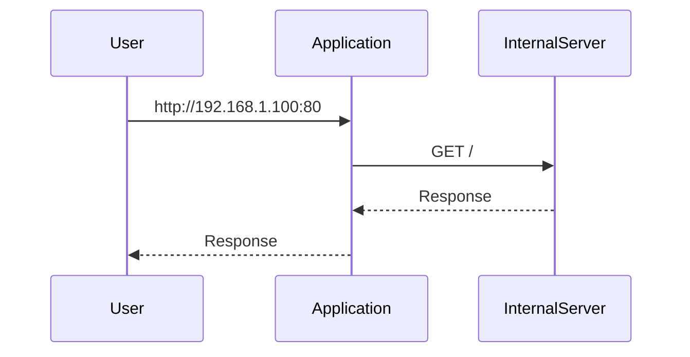
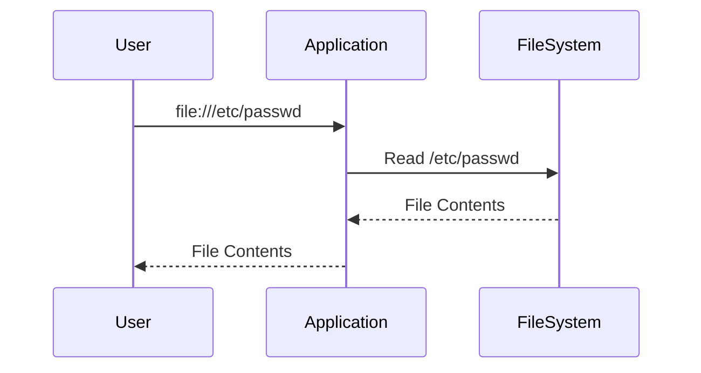
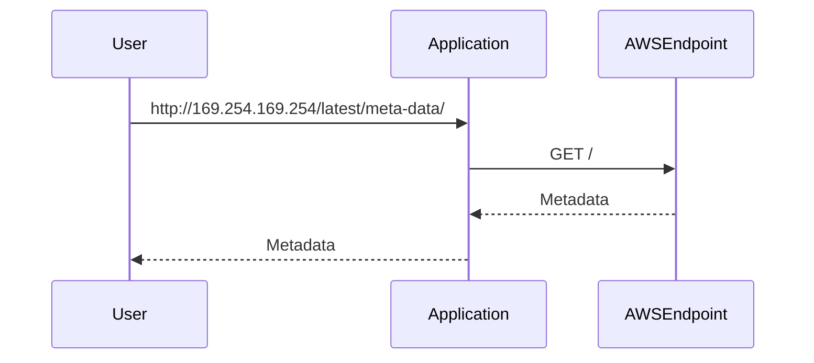

## Server-Side Request Forgery (SSRF)

### Introduction to SSRF

Server-Side Request Forgery (SSRF) is a type of web security vulnerability that occurs when an application takes input from a user and uses it to make a request to an external system without proper validation. This can lead to unauthorized access to internal systems, sensitive data exposure, and even remote code execution. SSRF attacks can be particularly dangerous because they can bypass network segmentation and firewalls, allowing attackers to access resources that should be protected.

### Understanding SSRF

#### What is SSRF?

SSRF is a vulnerability that arises when an application makes requests to other systems using input provided by the user. If the input is not properly validated, an attacker can manipulate it to make the application perform unintended actions. For example, an attacker might trick the application into making a request to an internal server, which could expose sensitive information or allow the attacker to perform further attacks.

#### Why Does SSRF Matter?

SSRF matters because it can lead to several serious security issues:

1. **Access to Internal Systems**: An attacker can use SSRF to access internal systems that are not exposed to the public internet. This can include databases, internal APIs, and other critical infrastructure.
   
2. **Sensitive Data Exposure**: By accessing internal systems, an attacker can potentially steal sensitive data such as passwords, API keys, and other confidential information.

3. **Remote Code Execution**: In some cases, SSRF can be used to execute arbitrary code on the server, leading to full compromise of the system.

4. **Bypassing Network Segmentation**: SSRF allows attackers to bypass network segmentation and firewalls, which are typically designed to protect internal systems from external threats.

### How SSRF Works

To understand how SSRF works, let's break down the process:

1. **User Input**: The attacker provides input to the application, which is then used to make a request to another system.
   
2. **Request Construction**: The application constructs the request using the user-provided input. If the input is not properly validated, the attacker can manipulate it to target internal systems.

3. **Request Execution**: The application sends the constructed request to the target system. Depending on the nature of the request, this can result in various outcomes, including data exposure or remote code execution.

4. **Response Handling**: The application processes the response from the target system. If the response contains sensitive information, the attacker can extract it.

### Example Scenarios

Let's look at some specific scenarios where SSRF can occur:

#### Scenario 1: Internal Port Scanning

In this scenario, an attacker uses SSRF to scan internal ports and identify running services. Here’s how it works:

1. **Attacker Input**: The attacker provides a URL that points to an internal IP address and port, such as `http://192.168.1.100:80`.

2. **Application Request**: The application constructs a request to the specified URL and sends it.

3. **Response Handling**: The application receives the response from the internal server and processes it. If the server is running a service, the response will indicate success; otherwise, it will indicate failure.



#### Scenario 2: Reading Local Files

In this scenario, an attacker uses SSRF to read local files on the server. Here’s how it works:

1. **Attacker Input**: The attacker provides a URL that points to a local file, such as `file:///etc/passwd`.

2. **Application Request**: The application constructs a request to the specified URL and sends it.

3. **Response Handling**: The application reads the contents of the file and returns them to the attacker.



#### Scenario 3: Accessing AWS Metadata

In this scenario, an attacker uses SSRF to access metadata from an AWS EC2 instance. Here’s how it works:

1. **Attacker Input**: The attacker provides a URL that points to the AWS metadata endpoint, such as `http://169.254.169.254/latest/meta-data/`.

2. **Application Request**: The application constructs a request to the specified URL and sends it.

3. **Response Handling**: The application retrieves the metadata and returns it to the attacker.



### Real-World Examples

#### CVE-2018-11776: Docker API SSRF

In 2018, a vulnerability was discovered in the Docker API that allowed SSRF attacks. The vulnerability was identified in the `docker` CLI tool, which could be tricked into making requests to internal systems. This led to the exposure of sensitive information and potential remote code execution.

**Vulnerable Code:**

```python
import requests

def fetch_image(url):
    response = requests.get(url)
    return response.content
```

**Exploitation:**

An attacker could provide a URL like `http://192.168.1.100:80` to the `fetch_image` function, causing the application to make a request to the internal server.

**Detection and Prevention:**

1. **Input Validation**: Ensure that user-provided URLs are validated to prevent SSRF attacks.
   
2. **Whitelist URLs**: Only allow requests to known, trusted URLs.

3. **Network Segmentation**: Use network segmentation to limit the ability of internal systems to communicate with each other.

#### CVE-2019-11510: Kubernetes API SSRF

In 2019, a vulnerability was discovered in the Kubernetes API that allowed SSRF attacks. The vulnerability was identified in the `kubectl` CLI tool, which could be tricked into making requests to internal systems. This led to the exposure of sensitive information and potential remote code execution.

**Vulnerable Code:**

```python
import requests

def fetch_resource(url):
    response = requests.get(url)
    return response.content
```

**Exploitation:**

An attacker could provide a URL like `http://192.168.1.100:80` to the `fetch_resource` function, causing the application to make a request to the internal server.

**Detection and Prevention:**

1. **Input Validation**: Ensure that user-provided URLs are validated to prevent SSRF attacks.
   
2. **Whitelist URLs**: Only allow requests to known, trusted URLs.

3.  **Network Segmentation**: Use network segmentation to limit the ability of internal systems to communicate with each other.

### How to Prevent / Defend Against SSRF

#### Detection

1. **Logging and Monitoring**: Implement logging and monitoring to detect unusual patterns of requests, especially those targeting internal systems.

2. **Security Tools**: Use security tools like intrusion detection systems (IDS) and web application firewalls (WAF) to detect and block SSRF attempts.

#### Prevention

1. **Input Validation**: Validate all user-provided URLs to ensure they do not point to internal systems. Use regular expressions or URL parsing libraries to enforce strict validation rules.

2. **Whitelist URLs**: Maintain a whitelist of allowed URLs and only permit requests to those URLs. This can be implemented using a configuration file or database.

3. **Network Segmentation**: Use network segmentation to isolate internal systems from external networks. This can be achieved using firewalls, VLANs, and other network segmentation techniques.

4. **Secure Coding Practices**: Follow secure coding practices to avoid introducing SSRF vulnerabilities. This includes validating all user inputs, using secure libraries, and avoiding direct use of user-provided data in requests.

#### Secure Code Fixes

Here’s an example of how to implement secure coding practices to prevent SSRF:

**Vulnerable Code:**

```python
import requests

def fetch_image(url):
    response = requests.get(url)
    return response.content
```

**Secure Code:**

```python
import requests
import re

def fetch_image(url):
    # Validate the URL to ensure it does not point to an internal system
    if not re.match(r'^https://example\.com/', url):
        raise ValueError("Invalid URL")
    
    response = requests.get(url)
    return response.content
```

In this example, the `fetch_image` function validates the URL to ensure it only points to a trusted domain (`https://example.com`). If the URL does not match the expected pattern, the function raises a `ValueError`.

### Complete Example: HTTP Requests and Responses

Let’s walk through a complete example of how SSRF can be exploited and how to defend against it.

#### Exploitation Example

**Attacker Input:**

```plaintext
http://192.168.1.100:80
```

**Application Request:**

```http
GET / HTTP/1.1
Host: 192.168.1.100
User-Agent: curl/7.64.1
Accept: */*
```

**Response Handling:**

```http
HTTP/1.1 200 OK
Date: Mon, 20 Mar 2023 12:00:00 GMT
Server: Apache/2.4.41 (Ubuntu)
Content-Type: text/html; charset=UTF-8
Content-Length: 1234

<!DOCTYPE html>
<html>
<head>
<title>Welcome</title>
</head>
<body>
<h1>Welcome to the Internal Server</h1>
</body>
</html>
```

#### Defense Example

**Secure Code:**

```python
import requests
import re

def fetch_image(url):
    # Validate the URL to ensure it does not point to an internal system
    if not re.match(r'^https://example\.com/', url):
        raise ValueError("Invalid URL")
    
    response = requests.get(url)
    return response.content
```

**Application Request:**

```http
GET / HTTP/1.1
Host: example.com
User-Agent: curl/7.64.1
Accept: */*
```

**Response Handling:**

```http
HTTP/1.1 200 OK
Date: Mon, 20 Mar 2023 12:00:00 GMT
Server: Apache/2.4.41 (Ubuntu)
Content-Type: text/html; charset=UTF-8
Content-Length: 1234

<!DOCTYPE html>
<html>
<head>
<title>Welcome</title>
</head>
<body>
<h1>Welcome to the External Server</h1>
</body>
</html>
```

### Practice Labs

To practice and gain hands-on experience with SSRF, consider the following labs:

- **PortSwigger Web Security Academy**: Offers a comprehensive set of labs covering various web security topics, including SSRF.
  
- **OWASP Juice Shop**: A deliberately insecure web application that includes SSRF vulnerabilities for educational purposes.

- **DVWA (Damn Vulnerable Web Application)**: A PHP/MySQL web application that is intentionally vulnerable to common web application vulnerabilities, including SSRF.

- **WebGoat**: An interactive, gamified training application that teaches web application security lessons.

These labs provide a safe environment to learn about SSRF and practice defending against it.

### Conclusion

Server-Side Request Forgery (SSRF) is a serious vulnerability that can lead to significant security risks. By understanding how SSRF works, recognizing real-world examples, and implementing robust defense mechanisms, you can protect your applications from these types of attacks. Always validate user input, maintain a whitelist of allowed URLs, and use network segmentation to limit the impact of SSRF attacks.

---
<!-- nav -->
[[API Security/14-Server Side Request Forgery/02-Access Application Running on Intranet/01-Introduction to Server-Side Request Forgery (SSRF)|Introduction to Server-Side Request Forgery (SSRF)]] | [[API Security/14-Server Side Request Forgery/02-Access Application Running on Intranet/00-Overview|Overview]] | [[API Security/14-Server Side Request Forgery/02-Access Application Running on Intranet/03-Practice Questions & Answers|Practice Questions & Answers]]
