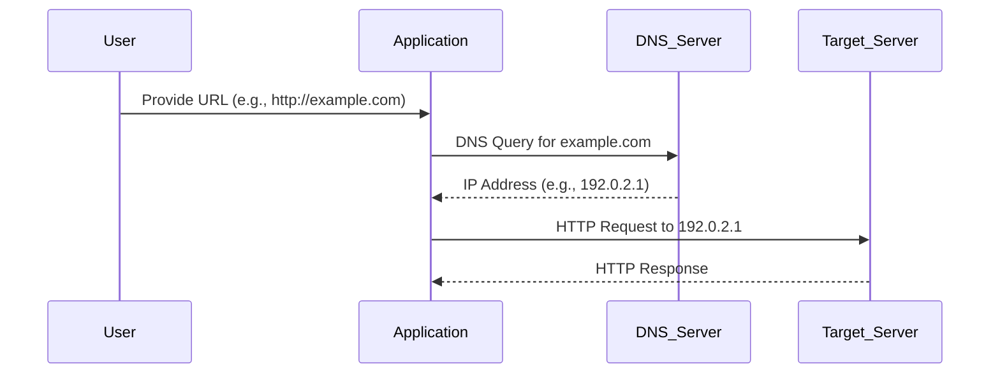
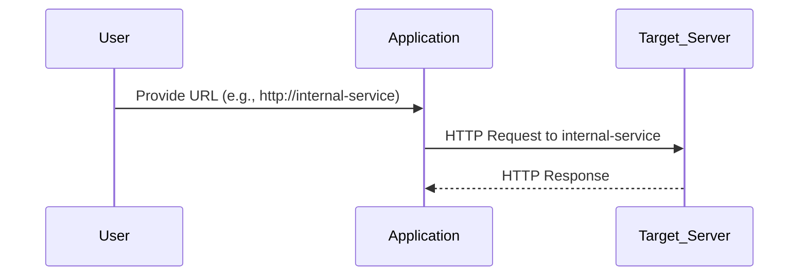
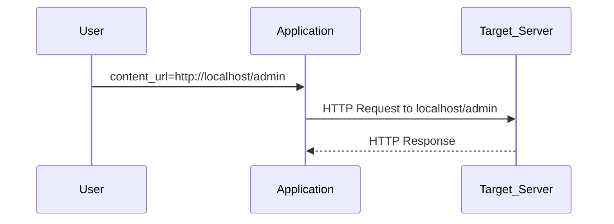
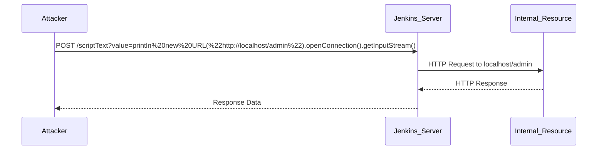
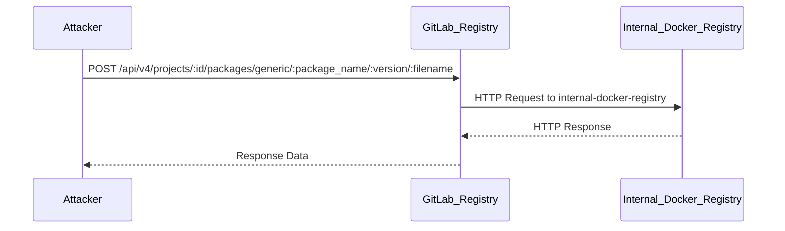

## Introduction to Server-Side Request Forgery (SSRF)

Server-Side Request Forgery (SSRF) is a type of web application vulnerability that allows an attacker to induce the server-side application to make HTTP requests to an unintended location. This can lead to various security issues, including information disclosure, internal network scanning, and unauthorized access to sensitive resources. SSRF vulnerabilities often arise due to improper validation or sanitization of user input used to construct HTTP requests.

### What is SSRF?

SSRF occurs when an application takes user input and uses it to make HTTP requests to other services. If the user input is not properly validated, an attacker can manipulate the input to make the server send requests to arbitrary destinations. This can result in the server accessing internal network resources, which might otherwise be inaccessible from the outside.

#### Why Does SSRF Matter?

SSRF can have significant security implications:

1. **Information Disclosure**: An attacker can use SSRF to access internal services and retrieve sensitive data.
2. **Internal Network Scanning**: SSRF can be used to scan internal networks and discover hidden services.
3. **Access to Restricted Resources**: SSRF can allow attackers to bypass network segmentation and access restricted resources.

### How SSRF Works

To understand SSRF, let's break down the process:

1. **User Input**: The attacker provides malicious input to the application.
2. **HTTP Request Construction**: The application uses the user input to construct an HTTP request.
3. **Request Execution**: The server sends the HTTP request to the specified destination.
4. **Response Handling**: The server processes the response, potentially revealing sensitive information to the attacker.

#### Example Scenario

Consider an application that allows users to fetch images from a URL provided by the user. If the application does not validate the URL, an attacker could provide a URL like `http://localhost/admin` to access internal administrative interfaces.

### DNS Lookup and STTP Requests

In the context of SSRF, DNS lookups and STTP (likely meant to be HTTP) requests play a crucial role. Let's explore these concepts in detail.

#### DNS Lookup

DNS (Domain Name System) is a hierarchical naming system for computers, services, or other resources connected to the Internet or a private network. A DNS lookup translates a human-readable domain name into an IP address.



#### STTP Requests

STTP likely refers to HTTP (Hypertext Transfer Protocol). HTTP is the protocol used to transfer data over the web. In the context of SSRF, an attacker can manipulate the HTTP requests sent by the server.



### XML Body and Content Parameters

XML (Extensible Markup Language) is a markup language that defines a set of rules for encoding documents in a format that is both human-readable and machine-readable. In the context of SSRF, XML bodies and content parameters can be manipulated to craft malicious requests.

#### XML Body Example

Consider an application that accepts XML payloads to perform certain actions. An attacker can craft an XML payload to trigger SSRF.

```xml
<request>
    <url>http://localhost/admin</url>
    <method>GET</method>
</request>
```

#### Content Parameters

Content parameters can also be manipulated to trigger SSRF. For instance, an application might accept a parameter like `content_url` to fetch content from a specified URL.



### Real-World Examples

Several real-world examples illustrate the impact of SSRF vulnerabilities:

#### CVE-2018-10933

In 2018, a vulnerability was discovered in the Jenkins Continuous Integration server. The vulnerability allowed attackers to perform SSRF attacks, leading to unauthorized access to internal resources.



#### CVE-2020-14882

In 2020, a vulnerability was found in the GitLab container registry. The vulnerability allowed attackers to perform SSRF attacks, leading to unauthorized access to internal Docker registries.



### Detection and Prevention

Detecting and preventing SSRF vulnerabilities is crucial to maintaining the security of web applications. Here are some strategies:

#### Detection

1. **Logging and Monitoring**: Implement logging and monitoring to detect unusual HTTP requests originating from your server.
2. **Network Segmentation**: Use network segmentation to limit the ability of servers to communicate with internal resources.
3. **Automated Scanning Tools**: Use automated scanning tools to identify potential SSRF vulnerabilities in your application.

#### Prevention

1. **Input Validation**: Validate and sanitize user input to ensure it does not contain malicious URLs.
2. **Whitelisting**: Use whitelisting to restrict the domains that can be accessed by your application.
3. **Firewall Rules**: Configure firewall rules to block outgoing requests to internal IP addresses.

### Secure Coding Practices

Here are some secure coding practices to prevent SSRF vulnerabilities:

#### Vulnerable Code Example

```python
import requests

def fetch_image(url):
    response = requests.get(url)
    return response.content
```

#### Secure Code Example

```python
import requests
from urllib.parse import urlparse

def fetch_image(url):
    parsed_url = urlparse(url)
    if parsed_url.scheme not in ['http', 'https']:
        raise ValueError("Invalid URL scheme")
    if parsed_url.hostname == 'localhost':
        raise ValueError("Access to localhost is not allowed")
    response = requests.get(url)
    return response.content
```

### Complete Example with HTTP Requests and Responses

Let's consider a complete example where an application fetches content from a URL provided by the user.

#### Vulnerable Example

```python
import requests

def fetch_content(url):
    response = requests.get(url)
    return response.text
```

#### Secure Example

```python
import requests
from urllib.parse import urlparse

def fetch_content(url):
    parsed_url = urlparse(url)
    if parsed_url.scheme not in ['http', 'https']:
        raise ValueError("Invalid URL scheme")
    if parsed_url.hostname == 'localhost':
        raise ValueError("Access to localhost is not allowed")
    response = requests.get(url)
    return response.text
```

#### HTTP Request and Response

```http
POST /fetch-content HTTP/1.1
Host: example.com
Content-Type: application/json

{
    "url": "http://localhost/admin"
}

HTTP/1.1 200 OK
Content-Type: text/html

<!DOCTYPE html>
<html>
<head>
    <title>Admin Panel</title>
</head>
<body>
    <h1>Welcome to the Admin Panel</h1>
</body>
</html>
```

### Hands-On Labs

For hands-on practice with SSRF vulnerabilities, consider the following labs:

- **PortSwigger Web Security Academy**: Offers interactive labs on SSRF vulnerabilities.
- **OWASP Juice Shop**: Provides a vulnerable web application for practicing SSRF attacks.
- **DVWA (Damn Vulnerable Web Application)**: Contains various web application vulnerabilities, including SSRF.

### Conclusion

Server-Side Request Forgery (SSRF) is a critical vulnerability that can lead to significant security risks. By understanding the underlying mechanisms, detecting potential vulnerabilities, and implementing secure coding practices, developers can mitigate the risks associated with SSRF. Always validate and sanitize user input, use whitelisting, and configure firewall rules to protect against SSRF attacks.

---
<!-- nav -->
[[01-Introduction to External Service Interaction HTTP|Introduction to External Service Interaction HTTP]] | [[API Security/14-Server Side Request Forgery/03-External Service Interaction HTTP/00-Overview|Overview]] | [[API Security/14-Server Side Request Forgery/03-External Service Interaction HTTP/03-Practice Questions & Answers|Practice Questions & Answers]]
