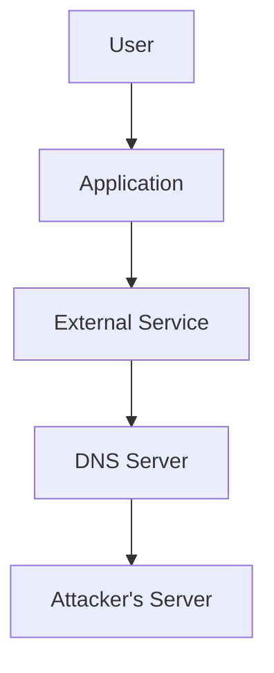
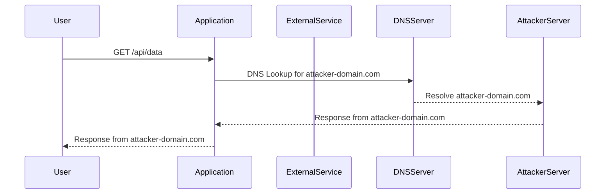

## Introduction to Server-Side Request Forgery (SSRF)

Server-Side Request Forgery (SSRF) is a type of web security vulnerability that allows an attacker to induce the application to make HTTP requests to an unintended endpoint. This can lead to unauthorized access to internal networks, sensitive data exposure, and even remote code execution. In this chapter, we will delve deep into SSRF vulnerabilities related to external service interactions, particularly focusing on DNS-based interactions.

### What is SSRF?

SSRF occurs when an application takes user input and uses it to make HTTP requests to other systems without proper validation or sanitization. An attacker can manipulate this input to make the application interact with unintended endpoints, such as internal servers, DNS servers, or even the attacker’s own server.

### Why Does SSRF Matter?

SSRF can be exploited in various ways:

1. **Accessing Internal Networks**: Attackers can use SSRF to access internal networks and services that are not exposed to the internet.
2. **Data Exposure**: By manipulating HTTP requests, attackers can potentially expose sensitive data stored within the application or its dependencies.
3. **Remote Code Execution**: In some cases, SSRF can be used to execute arbitrary commands on the server, leading to full compromise.

### How Does SSRF Work?

To understand SSRF, let's break down the typical scenario:

1. **User Input**: The application accepts user input, which is used to construct an HTTP request.
2. **Request Construction**: The application constructs the HTTP request using the user-provided input.
3. **Request Execution**: The application sends the constructed HTTP request to the specified endpoint.
4. **Response Handling**: The application processes the response from the endpoint.

If the user input is not properly validated or sanitized, an attacker can manipulate the input to make the application send requests to unintended endpoints.

### Example Scenario

Consider an application that allows users to fetch data from an external URL. The application might accept a `url` parameter and use it to make an HTTP GET request:

```python
import requests

def fetch_data(url):
    response = requests.get(url)
    return response.text
```

An attacker could provide a malicious URL, such as `http://internal-server:8080`, causing the application to make a request to an internal server.

### Real-World Examples

Recent real-world examples of SSRF vulnerabilities include:

- **CVE-2021-21972**: A vulnerability in VMware vCenter Server allowed attackers to perform SSRF attacks, leading to unauthorized access to internal networks.
- **CVE-2021-34473**: A vulnerability in Jenkins allowed attackers to perform SSRF attacks, leading to unauthorized access to internal networks and potential data exposure.

### DNS-Based Interactions

One specific type of SSRF involves DNS-based interactions. In this scenario, an attacker can induce the application to perform DNS lookups for arbitrary domain names. This can be achieved by manipulating HTTP headers or parameters.

#### Manipulating Headers

Attackers can manipulate HTTP headers to induce DNS lookups. Common headers that can be manipulated include:

- **Host Header**: The `Host` header is used to specify the hostname of the server being requested. An attacker can modify this header to point to an arbitrary domain.
- **X-Forwarded-For Header**: The `X-Forwarded-For` header is used to identify the original client IP address. An attacker can modify this header to point to an arbitrary domain.

#### Example: Host Header Manipulation

Consider an application that accepts a `Host` header and uses it to make an HTTP request:

```python
import requests

def fetch_data(host):
    headers = {'Host': host}
    response = requests.get('http://example.com', headers=headers)
    return response.text
```

An attacker could provide a malicious `Host` value, such as `attacker-domain.com`, causing the application to perform a DNS lookup for `attacker-domain.com`.

#### Example: X-Forwarded-For Header Manipulation

Consider an application that accepts an `X-Forwarded-For` header and uses it to make an HTTP request:

```python
import requests

def fetch_data(xff):
    headers = {'X-Forwarded-For': xff}
    response = requests.get('http://example.com', headers=headers)
    return response.text
```

An attacker could provide a malicious `X-Forwarded--For` value, such as `attacker-domain.com`, causing the application to perform a DNS lookup for `attacker-domain.com`.

### Full HTTP Message Example

Let's consider a full HTTP request and response example where an attacker manipulates the `Host` header:

#### HTTP Request

```http
GET /api/data HTTP/1.1
Host: attacker-domain.com
User-Agent: Mozilla/5.0
Accept: */*
```

#### HTTP Response

```http
HTTP/1.1 200 OK
Date: Mon, 20 Mar 2023 12:00:00 GMT
Content-Type: application/json
Content-Length: 123

{
  "data": "response from attacker-domain.com"
}
```

### How to Prevent / Defend Against SSRF

#### Detection

To detect SSRF vulnerabilities, you can:

1. **Monitor Network Traffic**: Monitor outgoing HTTP requests to identify unexpected or suspicious traffic patterns.
2. **Use Security Tools**: Utilize security tools like Burp Suite, ZAP, or OWASP Dependency-Check to scan for SSRF vulnerabilities.

#### Prevention

To prevent SSRF vulnerabilities, you can:

1. **Validate User Input**: Ensure that user-provided input is properly validated and sanitized before being used to construct HTTP requests.
2. **Whitelist Allowed Domains**: Maintain a whitelist of allowed domains and ensure that the application only makes requests to these domains.
3. **Use Secure Libraries**: Use secure libraries and frameworks that handle HTTP requests securely.

#### Secure Coding Fixes

Here are examples of both vulnerable and secure code:

##### Vulnerable Code

```python
import requests

def fetch_data(url):
    response = requests.get(url)
    return response.text
```

##### Secure Code

```python
import requests

ALLOWED_DOMAINS = ['example.com']

def fetch_data(url):
    if any(domain in url for domain in ALLOWED_DOMAINS):
        response = requests.get(url)
        return response.text
    else:
        raise ValueError("Invalid domain")
```

### Mermaid Diagrams

#### Application Architecture



#### Request/Response Flow



### Practice Labs

For hands-on practice with SSRF vulnerabilities, consider the following labs:

- **PortSwigger Web Security Academy**: Offers interactive labs on SSRF vulnerabilities.
- **OWASP Juice Shop**: Provides a vulnerable web application for practicing SSRF attacks.
- **DVWA (Damn Vulnerable Web Application)**: Contains a variety of web application vulnerabilities, including SSRF.

By thoroughly understanding and implementing the preventive measures discussed in this chapter, you can significantly reduce the risk of SSRF vulnerabilities in your applications.

---
<!-- nav -->
[[API Security/14-Server Side Request Forgery/04-External Service Intercation DNS/00-Overview|Overview]] | [[API Security/14-Server Side Request Forgery/04-External Service Intercation DNS/02-Practice Questions & Answers|Practice Questions & Answers]]
