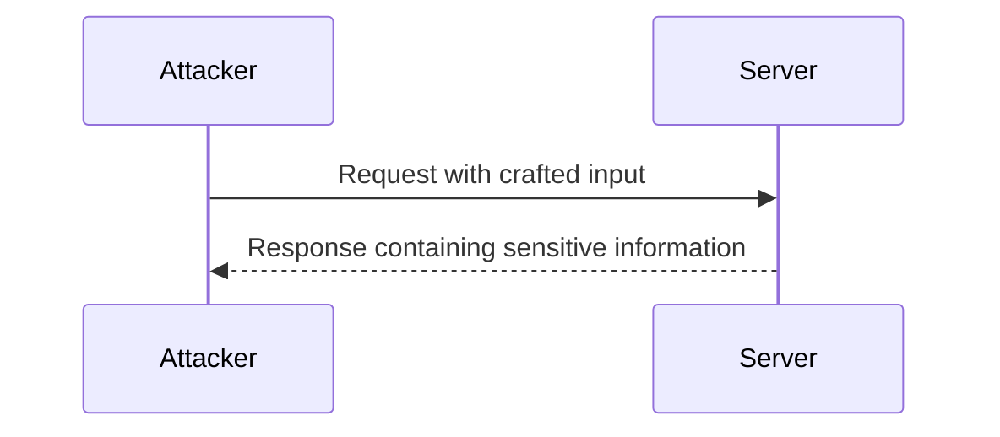
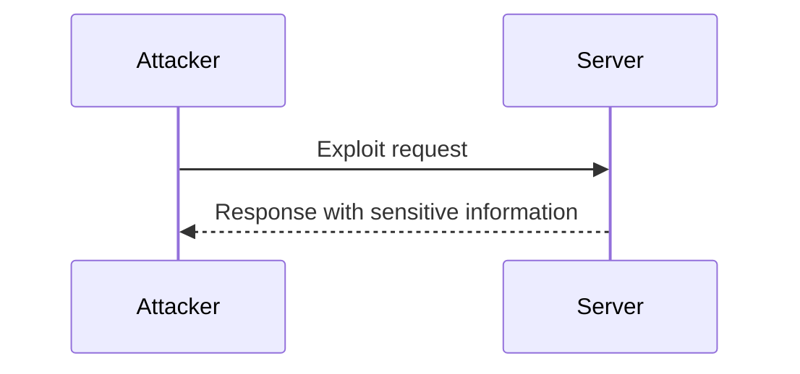

## Introduction to Information Disclosure

Information disclosure is a critical security issue that occurs when sensitive data is unintentionally exposed to unauthorized users. This can happen through various means, including errors, misconfigurations, and vulnerabilities in the application or infrastructure. In the context of APIs, information disclosure can reveal crucial details about the underlying technology stack, configuration settings, and even sensitive user data. Understanding and preventing information disclosure is essential for maintaining the security and integrity of web services.

### What is Information Disclosure?

Information disclosure refers to the unintended exposure of sensitive information to unauthorized parties. This can include:

- **Technical Details**: Information about the underlying technology stack, such as server versions, database types, and frameworks.
- **Configuration Settings**: Details about how the web service is configured, including paths, environment variables, and other internal settings.
- **Sensitive Data**: User data, credentials, and other confidential information that should not be accessible to unauthorized users.

### Why Does Information Disclosure Matter?

Information disclosure can have severe consequences for an organization. Here are some reasons why it is important to prevent:

- **Facilitating Further Attacks**: Exposed technical details can help attackers understand the architecture and identify potential vulnerabilities.
- **Data Breaches**: Sensitive data leaks can lead to identity theft, financial loss, and reputational damage.
- **Compliance Issues**: Exposure of personal data can violate regulations like GDPR, leading to legal penalties and fines.

### How Does Information Disclosure Occur?

Information disclosure can occur through various mechanisms, including:

- **Error Messages**: Detailed error messages that reveal internal system details.
- **HTTP Headers**: Headers that expose server configurations or other sensitive information.
- **API Responses**: Responses that contain more information than intended, such as debug information or internal data structures.

### Real-World Examples

#### CVE-2021-21972: Apache Struts Information Disclosure

In 2021, a vulnerability was discovered in Apache Struts, a popular Java framework. The vulnerability allowed attackers to extract sensitive information from the server, including the version number and other configuration details. This information could then be used to launch further attacks.



#### CVE-2022-22965: Microsoft Exchange Server Information Disclosure

Another notable example is the Microsoft Exchange Server vulnerability (CVE-2022-22965), which allowed attackers to extract sensitive information from the server. This included details about the server configuration and potentially other sensitive data.



### Identifying Information Disclosure Vulnerabilities

To identify information disclosure vulnerabilities, you need to look for patterns in the responses and error messages. Here are some steps to follow:

1. **Trigger Errors**: Intentionally cause errors to see if detailed error messages are returned.
2. **Inspect Responses**: Analyze the HTTP responses to see if they contain more information than intended.
3. **Check Headers**: Review HTTP headers to ensure they do not expose sensitive information.

### Example: Triggering a Stack Trace Error

Let's consider an example where we intentionally cause an error to see if a detailed stack trace is returned.

#### Vulnerable Code

```python
from flask import Flask, jsonify

app = Flask(__name__)

@app.route('/api/data')
def get_data():
    # Simulate a division by zero error
    result = 10 / 0
    return jsonify({"result": result})

if __name__ == '__main__':
    app.run(debug=True)
```

#### HTTP Request and Response

```http
GET /api/data HTTP/1.1
Host: localhost:5000
```

```http
HTTP/1.1 500 Internal Server Error
Content-Type: text/html; charset=utf-8
Content-Length: 1234

<!DOCTYPE HTML PUBLIC "-//W3C//DTD HTML 3.2 Final//EN">
<title>500 Internal Server Error</title>
<h1>Internal Server Error</h1>
<p>The server encountered an internal error and was unable to complete your request. Either the server is overloaded or there is an error in the application.</p>
```

#### Analysis

The response includes a detailed error message, which could reveal sensitive information about the server configuration and the application code.

### How to Prevent / Defend Against Information Disclosure

#### Detection

To detect information disclosure vulnerabilities, you can use automated tools and manual inspection:

- **Static Analysis Tools**: Tools like SonarQube, Fortify, and Veracode can analyze the codebase for potential information disclosure issues.
- **Dynamic Analysis Tools**: Tools like Burp Suite, OWASP ZAP, and Acunetix can test the live application for information disclosure vulnerabilities.

#### Prevention

To prevent information disclosure, follow these best practices:

1. **Configure Error Handling**: Ensure that error messages do not reveal sensitive information.
2. **Sanitize Responses**: Remove unnecessary information from responses.
3. **Secure HTTP Headers**: Configure HTTP headers to prevent information leakage.

#### Secure Coding Fixes

Here is an example of how to securely handle errors and sanitize responses:

##### Vulnerable Code

```python
from flask import Flask, jsonify

app = Flask(__name__)

@app.route('/api/data')
def get_data():
    # Simulate a division by zero error
    result = 10 / 0
    return jsonify({"result": result})

if __name__ == '__main__':
    app.run(debug=True)
```

##### Secure Code

```python
from flask import Flask, jsonify

app = Flask(__name__)

@app.errorhandler(500)
def handle_500_error(error):
    return jsonify({"error": "An unexpected error occurred."}), 500

@app.route('/api/data')
def get_data():
    try:
        result = 10 / 0
        return jsonify({"result": result})
    except Exception as e:
        return handle_500_error(e)

if __name__ == '__main__':
    app.run(debug=False)
```

#### HTTP Header Configuration

Ensure that HTTP headers are configured to prevent information leakage:

```http
Strict-Transport-Security: max-age=31536000; includeSubDomains
X-Frame-Options: DENY
X-Content-Type-Options: nosniff
X-XSS-Protection: 1; mode=block
Content-Security-Policy: default-src 'self'
Referrer-Policy: no-referrer
```

### Hands-On Practice

To practice identifying and preventing information disclosure vulnerabilities, you can use the following labs:

- **PortSwigger Web Security Academy**: Offers interactive labs to learn about various web security issues, including information disclosure.
- **OWASP Juice Shop**: A deliberately insecure web application for practicing web security skills.
- **DVWA (Damn Vulnerable Web Application)**: A PHP/MySQL web application that demonstrates web application vulnerabilities.

By thoroughly understanding and implementing the best practices outlined above, you can significantly reduce the risk of information disclosure vulnerabilities in your applications.

### Conclusion

Information disclosure is a serious security issue that can have far-reaching consequences. By understanding how it occurs, identifying vulnerabilities, and implementing robust preventive measures, you can protect your applications and data from unauthorized access. Regularly testing and auditing your applications using both static and dynamic analysis tools will help ensure that your systems remain secure against information disclosure attacks.

---
<!-- nav -->
[[API Security/16-Information Disclosure/01-Briefing Information Disclosure/00-Overview|Overview]] | [[API Security/16-Information Disclosure/01-Briefing Information Disclosure/02-Information Disclosure in APIs|Information Disclosure in APIs]]
