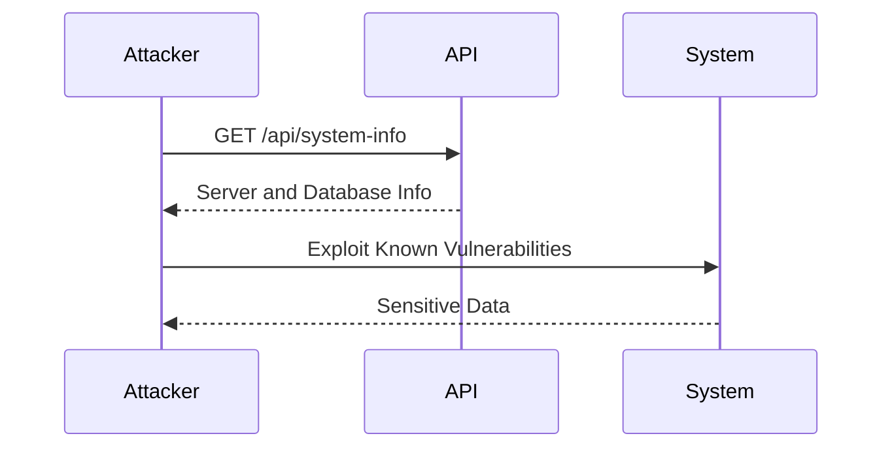

## Information Disclosure in APIs

### What is Information Disclosure?

Information disclosure is a type of vulnerability where sensitive information about a system or application is unintentionally exposed to unauthorized users. This can occur through various means, including API endpoints, error messages, and even through metadata embedded in files or responses. The exposure of such information can lead to further attacks, such as privilege escalation, data theft, or even full system compromise.

### Why Does Information Disclosure Matter?

Information disclosure is critical because it can provide attackers with valuable insights into the internal workings of a system. This knowledge can be used to craft more sophisticated attacks, bypass security measures, or gain unauthorized access to sensitive data. For instance, knowing the exact version of a server software can help an attacker identify specific vulnerabilities that can be exploited.

### How Does Information Disclosure Occur?

Information disclosure can occur in several ways:

1. **API Endpoints**: Unsecured or improperly configured API endpoints might return sensitive information such as database details, server configurations, or user data.
2. **Error Messages**: Detailed error messages can reveal internal system paths, database schemas, or other sensitive information.
3. **Metadata**: Metadata embedded in files or responses can contain sensitive information about the system or application.

### Real-World Examples

#### Recent CVEs and Breaches

One notable example of information disclosure is the CVE-2021-21972, which affected the Apache Log4j library. This vulnerability allowed attackers to inject malicious log messages that could disclose sensitive information, such as server configurations and environment variables. This led to widespread exploitation and numerous breaches across various industries.

Another example is the breach at Capital One in 2019, where an attacker exploited a misconfigured web application firewall (WAF) to access sensitive customer data. The WAF was supposed to protect against unauthorized access, but due to improper configuration, it inadvertently disclosed sensitive information.

### Detailed Example: Information Disclosure via API Endpoints

Consider an API endpoint `/api/system-info` that returns detailed system information:

```json
{
  "server": {
    "version": "Apache/2.4.41",
    "os": "Linux"
  },
  "database": {
    "type": "MySQL",
    "version": "5.7.29"
  }
}
```

This information can be highly valuable to an attacker, as it reveals the exact versions of the server and database software, which can be used to identify known vulnerabilities.

### Full HTTP Request and Response

Here is a complete example of an HTTP request and response for the `/api/system-info` endpoint:

```http
GET /api/system-info HTTP/1.1
Host: example.com
Accept: application/json

HTTP/1.1 200 OK
Content-Type: application/json
Date: Mon, 01 Jan 2024 00:00:00 GMT
Content-Length: 115

{
  "server": {
    "version": "Apache/2.4.41",
    "os": "Linux"
  },
  "database": {
    "type": "MySQL",
    "version": "5.7.29"
  }
}
```

### Mermaid Diagram: Attack Chain

A mermaid diagram can illustrate the attack chain involving information disclosure:



### Common Pitfalls

1. **Improper Error Handling**: Returning detailed error messages can expose sensitive information.
2. **Insecure Configuration**: Misconfigured API endpoints or services can leak sensitive data.
3. **Metadata Exposure**: Embedding sensitive metadata in files or responses can lead to information disclosure.

### How to Prevent / Defend Against Information Disclosure

#### Detection

1. **Static Analysis Tools**: Use tools like SonarQube or Fortify to scan code for potential information disclosure vulnerabilities.
2. **Dynamic Analysis Tools**: Use tools like Burp Suite or OWASP ZAP to test live applications for information disclosure.
3. **Logging and Monitoring**: Implement logging and monitoring to detect unusual patterns or access attempts.

#### Prevention

1. **Secure Configuration Management**: Ensure that all API endpoints and services are properly configured to avoid exposing sensitive information.
2. **Error Handling**: Implement generic error messages that do not reveal internal system details.
3. **Metadata Removal**: Remove or obfuscate metadata in files and responses to prevent information disclosure.

#### Secure Coding Fixes

Here is an example of a vulnerable API endpoint and its secure counterpart:

**Vulnerable Code**

```python
from flask import Flask, jsonify

app = Flask(__name__)

@app.route('/api/system-info')
def system_info():
    info = {
        "server": {
            "version": "Apache/2.4.41",
            "os": "Linux"
        },
        "database": {
            "type": "MySQL",
            "version": "5.7.29"
        }
    }
    return jsonify(info)

if __name__ == '__main__':
    app.run()
```

**Secure Code**

```python
from flask import Flask, jsonify

app = Flask(__name__)

@app.route('/api/system-info')
def system_info():
    info = {
        "server": {
            "version": "Apache",
            "os": "Linux"
        },
        "database": {
            "type": "MySQL",
            "version": "5.x"
        }
    }
    return jsonify(info)

if __name__ == '__main__':
    app.run()
```

### Configuration Hardening

Ensure that your API endpoints and services are properly hardened:

1. **Disable Debug Mode**: Disable debug mode in production environments to prevent detailed error messages.
2. **Use HTTPS**: Ensure that all API endpoints are served over HTTPS to encrypt data in transit.
3. **Rate Limiting**: Implement rate limiting to prevent abuse of API endpoints.

### Hands-On Labs

For hands-on practice with API security and information disclosure, consider the following labs:

- **PortSwigger Web Security Academy**: Offers comprehensive modules on API security, including information disclosure.
- **OWASP Juice Shop**: A deliberately insecure web application for practicing various security techniques, including identifying and fixing information disclosure vulnerabilities.
- **DVWA (Damn Vulnerable Web Application)**: Provides a range of web application vulnerabilities, including information disclosure, for educational purposes.

By thoroughly understanding and implementing these preventive measures, you can significantly reduce the risk of information disclosure vulnerabilities in your APIs.

---
<!-- nav -->
[[API Security/16-Information Disclosure/01-Briefing Information Disclosure/01-Introduction to Information Disclosure|Introduction to Information Disclosure]] | [[API Security/16-Information Disclosure/01-Briefing Information Disclosure/00-Overview|Overview]] | [[API Security/16-Information Disclosure/01-Briefing Information Disclosure/03-Practice Questions & Answers|Practice Questions & Answers]]
