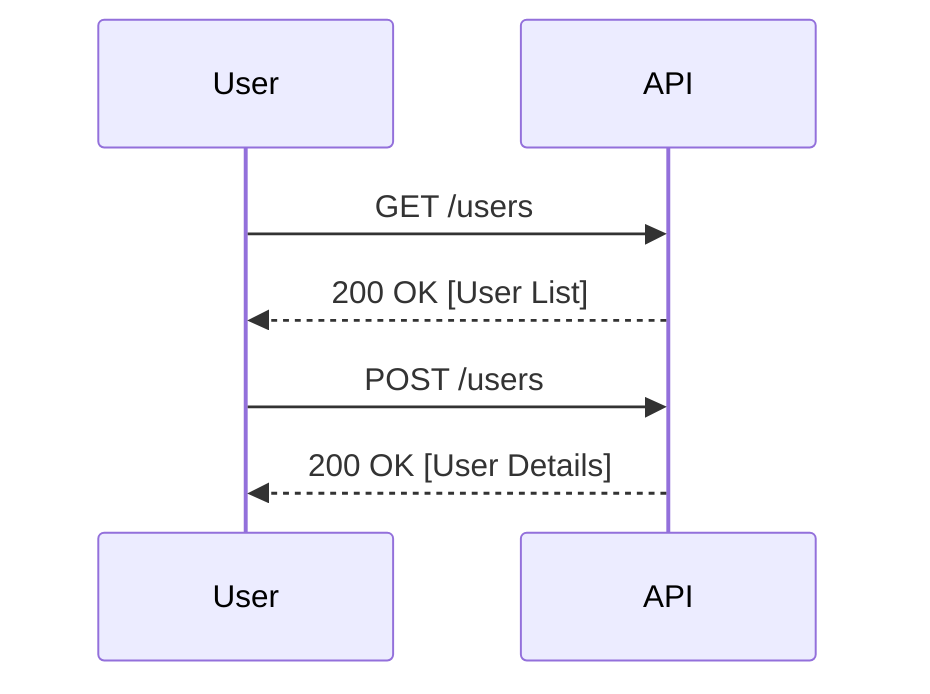

## Information Disclosure in APIs

### Introduction to Information Disclosure

Information disclosure is a type of vulnerability that occurs when sensitive data is unintentionally exposed through an application or system. In the context of APIs, this can happen when an endpoint returns more information than intended, such as internal server details, user data, or even database errors. This can lead to significant security risks, including unauthorized access, data breaches, and exploitation of vulnerabilities.

In this section, we will delve into the demonstration of information disclosure through API endpoints, focusing on how different HTTP methods and parameters can reveal sensitive information. We will also explore recent real-world examples, provide detailed code snippets, and offer comprehensive strategies for preventing and defending against such vulnerabilities.

### Understanding the Demonstration

Let's break down the demonstration provided in the transcript:

1. **Calling the `API/users` Endpoint**:
   - The endpoint `/users` is being called, which returns information about all users.
   - This could potentially expose sensitive user data, such as usernames, emails, and roles.

2. **Using Different HTTP Methods**:
   - The demonstrator attempts to use different HTTP methods (`OPTIONS`, `POST`) to interact with the endpoint.
   - The `OPTIONS` method is used to retrieve the allowed HTTP methods for the endpoint, but in this case, it does not return any useful information.
   - The `POST` method is used with specific parameters to retrieve more detailed information.

3. **Analyzing the Response**:
   - The demonstrator observes the response in the console and notices that certain parameters, such as `role_id`, are being returned.
   - This reveals that the API is disclosing internal details, such as database structure and user roles.

### Detailed Explanation of Information Disclosure

#### What is Information Disclosure?

Information disclosure occurs when an application or system inadvertently exposes sensitive data to unauthorized users. This can happen through various means, such as:

- **HTTP Responses**: Returning more information than necessary in HTTP responses.
- **Error Messages**: Exposing internal server errors or stack traces.
- **Database Errors**: Revealing database schema or query details.
- **Sensitive Data**: Exposing personal or confidential information.

#### Why Does Information Disclosure Matter?

Information disclosure can lead to several serious security issues:

- **Data Breaches**: Unauthorized access to sensitive data can result in data breaches.
- **Exploitation of Vulnerabilities**: Exposed internal details can help attackers identify and exploit vulnerabilities.
- **Reputation Damage**: Public exposure of sensitive information can damage an organization's reputation.

#### How Does Information Disclosure Occur?

Information disclosure typically occurs due to:

- **Improper Input Validation**: Failing to validate input properly can lead to unexpected responses.
- **Insufficient Access Controls**: Lack of proper access controls can allow unauthorized users to access sensitive data.
- **Inadequate Error Handling**: Poorly handled errors can reveal internal details.

### Real-World Examples

#### Recent CVEs and Breaches

Several recent CVEs and breaches highlight the importance of preventing information disclosure:

- **CVE-2021-21972**: A vulnerability in the WordPress REST API allowed unauthorized users to access sensitive data through improper input validation.
- **Equifax Data Breach (2017)**: A breach that exposed sensitive data due to a vulnerability in Apache Struts, leading to the exposure of personal information of millions of users.

### Detailed Code Example

Let's consider a hypothetical API endpoint `/users` that returns user information. We will demonstrate how improper handling can lead to information disclosure.

#### Vulnerable Code

```python
from flask import Flask, request, jsonify

app = Flask(__name__)

@app.route('/users', methods=['GET', 'POST'])
def users():
    if request.method == 'GET':
        # Return all user information
        users = [
            {"id": 1, "name": "Alice", "email": "alice@example.com", "role": "admin"},
            {"id": 2, "name": "Bob", "email": "bob@example.com", "role": "user"}
        ]
        return jsonify(users)
    
    elif request.method == 'POST':
        # Process POST request with parameters
        role_id = request.form.get('role_id')
        if role_id:
            # Return user information based on role_id
            user = next((u for u in users if u['role'] == role_id), None)
            if user:
                return jsonify(user)
            else:
                return jsonify({"error": "User not found"}), 404
        else:
            return jsonify({"error": "Invalid request"}), 400

if __name__ == '__main__':
    app.run(debug=True)
```

#### Vulnerability Analysis

- **GET Method**: Returns all user information, including sensitive details like email addresses and roles.
- **POST Method**: Allows retrieval of user information based on `role_id`, potentially exposing internal details.

### Full HTTP Request and Response

#### GET Request

```http
GET /users HTTP/1.1
Host: example.com
Accept: application/json
```

#### GET Response

```http
HTTP/1.1 200 OK
Content-Type: application/json

[
    {
        "id": 1,
        "name": "Alice",
        "email": "alice@example.com",
        "role": "admin"
    },
    {
        "id": 2,
        "name": "Bob",
        "email": "bob@example.com",
        "role": "user"
    }
]
```

#### POST Request

```http
POST /users HTTP/1.1
Host: example.com
Content-Type: application/x-www-form-urlencoded

role_id=admin
```

#### POST Response

```http
HTTP/1.1 200 OK
Content-Type: application/json

{
    "id": 1,
    "name": "Alice",
    "email": "alice@example.com",
    "role": "admin"
}
```

### Mermaid Diagrams

#### Sequence Diagram



### How to Prevent / Defend Against Information Disclosure

#### Detection

- **Logging and Monitoring**: Implement logging and monitoring to detect unusual patterns or unauthorized access attempts.
- **Security Scanning Tools**: Use tools like Burp Suite, OWASP ZAP, or commercial scanners to identify potential information disclosure vulnerabilities.

#### Prevention

- **Input Validation**: Ensure all inputs are properly validated to prevent unexpected responses.
- **Access Controls**: Implement strict access controls to restrict access to sensitive data.
- **Error Handling**: Handle errors gracefully without exposing internal details.

#### Secure Coding Fixes

##### Vulnerable Code

```python
@app.route('/users', methods=['GET', 'POST'])
def users():
    if request.method == 'GET':
        users = [
            {"id": 1, "name": "Alice", "email": "alice@example.com", "role": "admin"},
            {"id": 2, "name": "Bob", "email": "bob@example.com", "role": "user"}
        ]
        return jsonify(users)
```

##### Secure Code

```python
@app.route('/users', methods=['GET', 'POST'])
def users():
    if request.method == 'GET':
        users = [
            {"id": 1, "name": "Alice", "role": "admin"},
            {"id": 2, "name": "Bob", "role": "user"}
        ]
        return jsonify(users)
```

#### Configuration Hardening

- **Disable Debug Mode**: Ensure debug mode is disabled in production environments.
- **Secure Headers**: Use secure HTTP headers like `X-Content-Type-Options`, `X-XSS-Protection`, and `Strict-Transport-Security`.

### Conclusion

Information disclosure is a critical vulnerability that can lead to significant security risks. By understanding the mechanisms behind information disclosure and implementing robust prevention and detection strategies, organizations can protect their sensitive data and maintain the integrity of their systems.

### Hands-On Labs

For practical experience with API security and information disclosure, consider the following labs:

- **PortSwigger Web Security Academy**: Offers interactive labs on API security, including information disclosure.
- **OWASP Juice Shop**: Provides a vulnerable web application for practicing security testing and exploitation techniques.
- **DVWA (Damn Vulnerable Web Application)**: A deliberately insecure web application for learning and practicing web application security.

By engaging with these labs, you can gain hands-on experience and deepen your understanding of API security and information disclosure.

---
<!-- nav -->
[[01-Information Disclosure Demonstration Part 2|Information Disclosure Demonstration Part 2]] | [[API Security/16-Information Disclosure/02-Information Disclosure Demonstration Part 2/00-Overview|Overview]] | [[03-Information Disclosure via Error Messages|Information Disclosure via Error Messages]]
