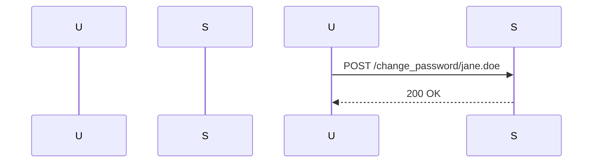
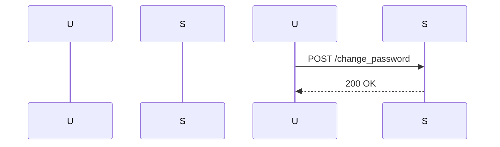

## Unauthorized Password Change Vulnerability

### Introduction

Unauthorized password change vulnerabilities occur when an attacker can modify the password of another user due to a flaw in the application's logic. This typically happens when the developer mistakenly uses the username from the URL or request body instead of the authenticated user's identity from the token. In this chapter, we will delve deep into the mechanics of this vulnerability, its implications, and how to prevent it.

### Background Theory

When a user updates their password, the application should ensure that the operation is performed by the correct user. This is usually achieved by validating the user's identity through a token (such as a JWT) and ensuring that the username in the request matches the authenticated user's identity.

#### JWT Tokens

JSON Web Tokens (JWTs) are a compact, URL-safe means of representing claims to be transferred between two parties. A JWT consists of three parts: header, payload, and signature. The payload typically contains claims such as `sub` (subject), which identifies the user.

```json
{
  "header": {
    "alg": "HS256",
    "typ": "JWT"
  },
  "payload": {
    "sub": "john.doe@example.com",
    "name": "John Doe",
    "iat": 1516239022,
    "exp": 1516242622
  },
  "signature": "<signature>"
}
```

### Scenario Explanation

Consider a scenario where a user wants to update their password. The typical flow involves:

1. **Token Validation**: Ensure the JWT token is valid.
2. **Username Extraction**: Extract the username from the token.
3. **Password Update**: Validate that the username in the request matches the authenticated user's identity before updating the password.

However, if the developer mistakenly uses the username from the URL or request body instead of the token, an attacker can exploit this to change another user's password.

### Example Code

Let's look at a vulnerable code snippet and its corrected version.

#### Vulnerable Code

```python
@app.route('/change_password/<username>', methods=['POST'])
def change_password(username):
    token = request.headers.get('Authorization')
    if not token:
        return jsonify({"error": "Missing token"}), 401
    
    try:
        decoded_token = jwt.decode(token, SECRET_KEY, algorithms=["HS256"])
    except jwt.ExpiredSignatureError:
        return jsonify({"error": "Expired token"}), 401
    except jwt.InvalidTokenError:
        return jsonify({"error": "Invalid token"}), 401
    
    new_password = request.json.get('password')
    
    # Vulnerable line: using username from URL instead of token
    user = User.query.filter_by(username=username).first()
    if user:
        user.password = new_password
        db.session.commit()
        return jsonify({"message": "Password changed successfully"}), 200
    else:
        return jsonify({"error": "User not found"}), 404
```

#### Corrected Code

```python
@app.route('/change_password', methods=['POST'])
def change_password():
    token = request.headers.get('Authorization')
    if not token:
        return jsonify({"error": "Missing token"}), 401
    
    try:
        decoded_token = jwt.decode(token, SECRET_KEY, algorithms=["HS256"])
    except jwt.ExpiredSignatureError:
        return jsonify({"error": "Expired token"}), 401
    except jwt.InvalidTokenError:
        return jsonify({"error": "Invalid token"}), 401
    
    username = decoded_token.get('sub')
    new_password = request.json.get('password')
    
    user = User.query.filter_by(username=username).first()
    if user:
        user.password = new_password
        db.session.commit()
        return jsonify({"message": "Password changed successfully"}), 200
    else:
        return jsonify({"error": "User not found"}), 404
```

### HTTP Request and Response

Here is a complete HTTP request and response for both the vulnerable and corrected scenarios.

#### Vulnerable HTTP Request and Response

**Request:**

```http
POST /change_password/jane.doe HTTP/1.1
Host: example.com
Authorization: Bearer <valid_jwt_token>
Content-Type: application/json

{
  "password": "new_secure_password"
}
```

**Response:**

```http
HTTP/1.1 200 OK
Content-Type: application/json

{
  "message": "Password changed successfully"
}
```

#### Corrected HTTP Request and Response

**Request:**

```http
POST /change_password HTTP/1.1
Host: example.com
Authorization: Bearer <valid_jwt_token>
Content-Type: application/json

{
  "password": "new_secure_password"
}
```

**Response:**

```http
HTTP/1.1 200 OK
Content-Type: application/json

{
  "message": "Password changed successfully"
}
```

### Mermaid Diagrams

#### Vulnerable Flow



#### Corrected Flow



### Real-World Examples

#### Recent Breaches

One notable example is the breach of a popular social media platform where an unauthorized password change vulnerability allowed attackers to reset passwords for millions of users. This led to widespread account hijacking and significant reputational damage.

#### CVEs

CVE-2021-3427 is an example of a vulnerability in a widely-used authentication library that allowed unauthorized password changes due to improper validation of user identities.

### Pitfalls and Common Mistakes

1. **Not Validating the Token**: Failing to validate the JWT token can lead to unauthorized access.
2. **Using Incorrect Username Source**: Using the username from the URL or request body instead of the token can allow an attacker to change another user's password.
3. **Insufficient Error Handling**: Not providing proper error messages can make it easier for attackers to identify vulnerabilities.

### How to Prevent / Defend

#### Detection

1. **Logging and Monitoring**: Implement logging and monitoring to detect unusual password change activities.
2. **Security Scanning**: Use automated tools to scan for vulnerabilities in your codebase.

#### Prevention

1. **Validate Tokens**: Always validate JWT tokens before performing any sensitive operations.
2. **Use Correct Username Source**: Ensure that the username used for operations is extracted from the token, not from the URL or request body.
3. **Secure Coding Practices**: Follow secure coding practices such as input validation and error handling.

#### Secure-Coding Fixes

Compare the vulnerable and corrected versions side by side:

**Vulnerable Code:**

```python
@app.route('/change_password/<username>', methods=['POST'])
def change_password(username):
    token = request.headers.get('Authorization')
    if not token:
        return jsonify({"error": "Missing token"}), 401
    
    try:
        decoded_token = jwt.decode(token, SECRET_KEY, algorithms=["HS256"])
    except jwt.ExpiredSignatureError:
        return jsonify({"error": "Expired token"}), 401
    except jwt.InvalidTokenError:
        return jsonify({"error": "Invalid token"}), 401
    
    new_password = request.json.get('password')
    
    # Vulnerable line: using username from URL instead of token
    user = User.query.filter_by(username=username).first()
    if user:
        user.password = new_password
        db.session.commit()
        return jsonify({"message": "Password changed successfully"}), 200
    else:
        return jsonify({"error": "User not found"}), 404
```

**Corrected Code:**

```python
@app.route('/change_password', methods=['POST'])
def change_password():
    token = request.headers.get('Authorization')
    if not token:
        return jsonify({"error": "Missing token"}), 401
    
    try:
        decoded_token = jwt.decode(token, SECRET_KEY, algorithms=["HS256"])
    except jwt.ExpiredSignatureError:
        return jsonify({"error": "Expired token"}), 401
    except jwt.InvalidTokenError:
        return jsonify({"error": "Invalid token"}), 401
    
    username = decoded_token.get('sub')
    new_password = request.json.get('password')
    
    user = User.query.filter_by(username=username).first()
    if user:
        user.password = new_password
        db.session.commit()
        return jsonify({"message": "Password changed successfully"}), 200
    else:
        return jsonify({"error": "User not found"}), 404
```

### Configuration Hardening

1. **Secure JWT Settings**: Configure JWT settings securely, including secret keys and algorithms.
2. **Rate Limiting**: Implement rate limiting to prevent brute-force attacks on password change endpoints.

### Hands-On Labs

For practical experience with unauthorized password change vulnerabilities, consider the following labs:

- **PortSwigger Web Security Academy**: Offers detailed labs on various web security topics, including unauthorized password change.
- **OWASP Juice Shop**: A deliberately insecure web application for security training purposes.
- **DVWA (Damn Vulnerable Web Application)**: A PHP/MySQL web application that is riddled with vulnerabilities.

These labs provide a safe environment to practice identifying and fixing such vulnerabilities.

### Conclusion

Unauthorized password change vulnerabilities can have severe consequences, but they can be prevented with proper validation and secure coding practices. By understanding the underlying mechanisms and implementing robust defenses, developers can significantly reduce the risk of such vulnerabilities.

---
<!-- nav -->
[[API Security/17-Unauthorized Password Change/01-Unauthorized Password Chnage Concept/00-Overview|Overview]] | [[API Security/17-Unauthorized Password Change/01-Unauthorized Password Chnage Concept/02-Practice Questions & Answers|Practice Questions & Answers]]
