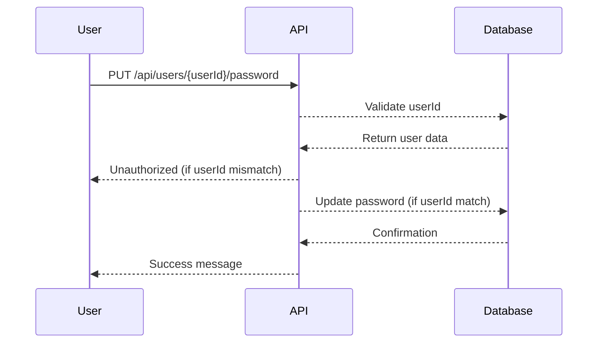

## Understanding Unauthorized Password Change Through API Calls

### Background Theory

In the realm of API security, one of the most critical vulnerabilities is the unauthorized modification of sensitive data, such as passwords. This issue often arises due to improper validation and authorization mechanisms within the API endpoints. In this section, we will delve into the details of how an unauthorized password change can occur through API calls and how to prevent it.

### Key Concepts

#### User Properties and Password Validation

When designing an API, it is crucial to ensure that only authorized users can modify their own sensitive information, such as passwords. This requires proper validation of user properties and strict enforcement of access controls.

- **User Properties**: These are attributes associated with a user account, such as `email`, `username`, and `password`.
- **Password Property**: This specifically refers to the field that stores the user’s password.

#### Request Body and Request Properties

API requests typically consist of a request body and various request properties (headers, parameters, etc.). The request body often contains the data being sent to the server, while request properties provide additional context about the request.

- **Request Body**: Contains the payload of the request, such as new password data.
- **Request Properties**: Include headers, query parameters, and path parameters that help identify the user making the request.

### Example Scenario

Consider an API endpoint designed to allow users to change their passwords:

```http
PUT /api/users/{userId}/password
Content-Type: application/json

{
  "newPassword": "securePassword123"
}
```

In this scenario, the `userId` in the URL path should uniquely identify the user whose password is being changed. The request body contains the new password.

### Vulnerability Analysis

#### Improper Validation

If the API does not properly validate the `userId` against the authenticated user making the request, an attacker could potentially change another user's password by simply altering the `userId` in the request.

#### Real-World Example

A notable real-world example of this vulnerability is CVE-2021-21972, which affected the WordPress REST API. The vulnerability allowed attackers to change the passwords of other users by manipulating the `userId` parameter in the API call.

### Detailed Mechanics

Let's break down the mechanics of how this vulnerability can occur and how to prevent it.

#### Vulnerable Code Example

Here is an example of a vulnerable API endpoint implementation in Python using Flask:

```python
from flask import Flask, request, jsonify

app = Flask(__name__)

users = {
    1: {"email": "user1@example.com", "password": "oldPassword"},
    2: {"email": "user2@example.com", "password": "oldPassword"}
}

@app.route('/api/users/<int:user_id>/password', methods=['PUT'])
def change_password(user_id):
    data = request.json
    new_password = data.get('newPassword')
    
    if user_id in users:
        users[user_id]['password'] = new_password
        return jsonify({"message": "Password updated successfully"}), 200
    else:
        return jsonify({"error": "User not found"}), 404

if __name__ == '__main__':
    app.run(debug=True)
```

In this example, the API endpoint allows changing the password of any user by specifying the `user_id` in the URL. However, it does not validate whether the authenticated user making the request is indeed the owner of the `user_id`.

#### Secure Code Example

To prevent unauthorized password changes, the API should validate the authenticated user against the `user_id` in the request. Here is the corrected version:

```python
from flask import Flask, request, jsonify, g

app = Flask(__name__)

users = {
    1: {"email": "user1@example.com", "password": "oldPassword"},
    2: {"email": "user2@example.com", "password": "oldPassword"}
}

@app.before_request
def set_current_user():
    # Simulate authentication
    g.current_user_id = 1  # Replace with actual authentication logic

@app.route('/api/users/<int:user_id>/password', methods=['PUT'])
def change_password(user_id):
    if user_id != g.current_user_id:
        return jsonify({"error": "Unauthorized to change this user's password"}), 403
    
    data = request.json
    new_password = data.get('newPassword')
    
    if user_id in users:
        users[user_id]['password'] = new_password
        return jsonify({"message": "Password updated successfully"}), 200
    else:
        return jsonify({"error": "User not found"}), 404

if __name__ == '__main__':
    app.run(debug=True)
```

In this secure version, the `set_current_user` function sets the `g.current_user_id` based on the authenticated user. The `change_password` function then checks if the `user_id` in the request matches the authenticated user's ID.

### Mermaid Diagrams

#### Request Flow Diagram



### Common Pitfalls

#### Lack of Authentication

One common pitfall is the absence of proper authentication mechanisms. Without authenticating the user, the API cannot determine who is making the request and whether they have the necessary permissions.

#### Insufficient Authorization Checks

Another pitfall is insufficient authorization checks. Even if the user is authenticated, the API must verify that the user has the right to perform the requested action.

### How to Prevent / Defend

#### Detection

To detect unauthorized password changes, implement logging and monitoring mechanisms. Log all password change requests and monitor for suspicious activity, such as multiple failed attempts or changes made outside of normal business hours.

#### Prevention

1. **Authentication**: Ensure that every request is authenticated. Use secure authentication mechanisms like OAuth2, JWT, or session-based authentication.
   
2. **Authorization**: Implement role-based access control (RBAC) to restrict actions based on user roles. Ensure that only the user themselves can change their password.

3. **Input Validation**: Validate all input parameters, including `user_id`, to ensure they are within expected ranges and formats.

4. **Secure Coding Practices**: Follow secure coding practices, such as least privilege and principle of least astonishment. Avoid hardcoding sensitive information and use environment variables or secure vaults.

#### Secure-Coding Fixes

**Vulnerable Code**

```python
@app.route('/api/users/<int:user_id>/password', methods=['PUT'])
def change_password(user_id):
    data = request.json
    new_password = data.get('newPassword')
    
    if user_id in users:
        users[user_id]['password'] = new_password
        return jsonify({"message": "Password updated successfully"}), 200
    else:
        return jsonify({"error": "User not found"}), 404
```

**Fixed Code**

```python
@app.route('/api/users/<int:user_id>/password', methods=['PUT'])
def change_password(user_id):
    if user_id != g.current_user_id:
        return jsonify({"error": "Unauthorized to change this user's password"}), 403
    
    data = request.json
    new_password = data.get('newPassword')
    
    if user_id in users:
        users[user_id]['password'] = new_password
        return jsonify({"message": "Password updated successfully"}), 200
    else:
        return jsonify({"error": "User not found"}), 404
```

### Configuration Hardening

#### API Gateway Configuration

Use an API gateway to enforce security policies. Configure the gateway to validate tokens and enforce rate limiting to prevent brute-force attacks.

```yaml
# Example API Gateway Configuration
paths:
  /api/users/{userId}/password:
    put:
      security:
        - bearerAuth: []
      x-amazon-apigateway-integration:
        type: aws_proxy
        uri: arn:aws:apigateway:{region}:lambda:path/2015-03-31/functions/{functionArn}/invocations
```

#### IAM Policy Configuration

Ensure that IAM policies are configured to restrict access to sensitive operations. Use least privilege principles to limit permissions.

```json
{
  "Version": "2012-10-17",
  "Statement": [
    {
      "Effect": "Allow",
      "Action": [
        "lambda:InvokeFunction"
      ],
      "Resource": "arn:aws:lambda:{region}:{account-id}:function:ChangePasswordFunction"
    }
  ]
}
```

### Hands-On Labs

For hands-on practice, consider the following labs:

- **PortSwigger Web Security Academy**: Offers interactive labs on API security, including unauthorized access and manipulation.
- **OWASP Juice Shop**: A deliberately insecure web application for practicing web security skills, including API vulnerabilities.
- **DVWA (Damn Vulnerable Web Application)**: Provides a range of web application vulnerabilities, including insecure APIs.

These labs will help you understand and practice the concepts discussed in this chapter.

### Conclusion

Unauthorized password changes through API calls pose significant security risks. By understanding the mechanics of these vulnerabilities and implementing robust authentication, authorization, and input validation mechanisms, you can significantly reduce the risk of such attacks. Always follow secure coding practices and regularly review and update your security measures to stay ahead of potential threats.

---
<!-- nav -->
[[01-Unauthorized Password Change Through API Calls|Unauthorized Password Change Through API Calls]] | [[API Security/17-Unauthorized Password Change/02-Another User Password Chnage Through API Calls/00-Overview|Overview]] | [[API Security/17-Unauthorized Password Change/02-Another User Password Chnage Through API Calls/03-Practice Questions & Answers|Practice Questions & Answers]]
