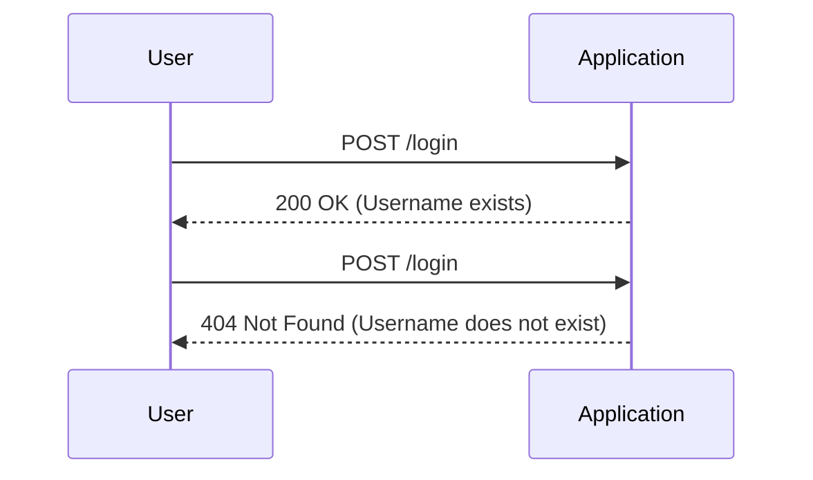
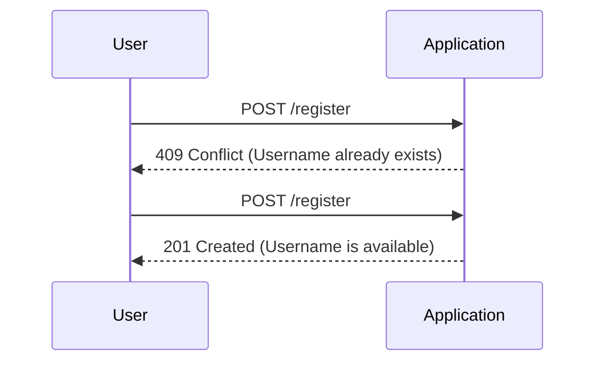
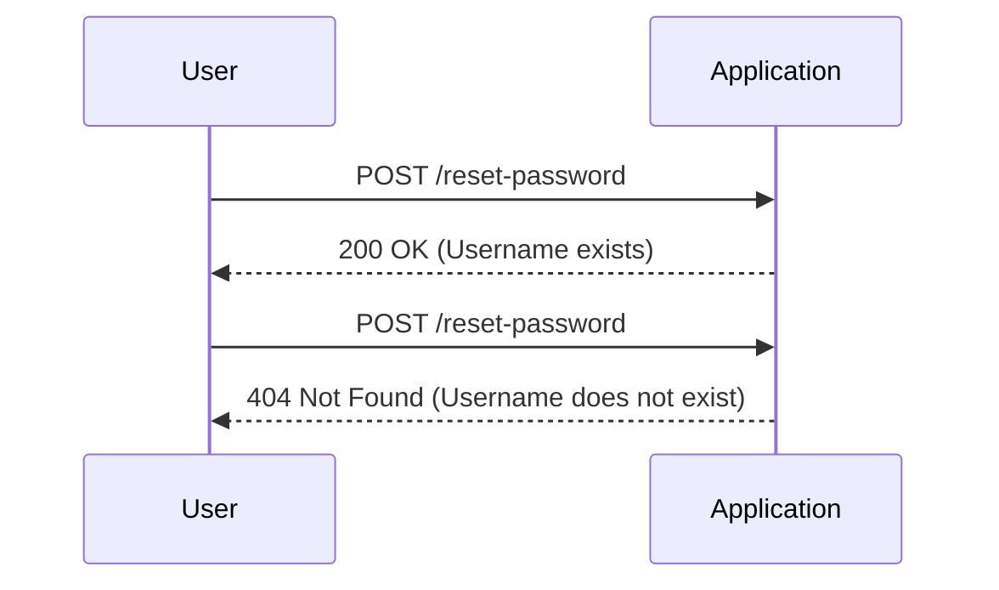

## User Enumeration Background Concept

### What is User Enumeration?

User enumeration is a reconnaissance technique used by attackers to identify valid usernames within a system. This technique is often employed during the initial stages of an attack to gather information about potential targets. The primary goal of user enumeration is to retrieve valid usernames from an application, which can then be used in subsequent attacks such as brute-force attacks or social engineering attempts.

### Types of User Enumeration Attacks

User enumeration can be categorized into two types: passive and active.

#### Passive User Enumeration

Passive user enumeration involves observing the behavior of the application without actively interacting with it. This can include analyzing error messages, response times, or other indirect indicators that reveal whether a username exists or not.

#### Active User Enumeration

Active user enumeration involves directly interacting with the application to determine the validity of usernames. This typically involves sending requests to the application and analyzing the responses to infer whether a username is valid.

### Why Does User Enumeration Matter?

User enumeration is significant because it provides attackers with a list of valid usernames, which can be used to launch more targeted and effective attacks. By knowing valid usernames, attackers can focus their efforts on these accounts, increasing the likelihood of success in subsequent attacks such as brute-forcing passwords or conducting phishing campaigns.

### How User Enumeration Works

User enumeration typically occurs through interactions with specific parts of an application, such as login pages, registration pages, and password reset pages. These pages often provide feedback to users based on the validity of the input, which can be exploited by attackers.

#### Example: Login Page

Consider a typical login page where users enter their username and password. If the application responds differently based on whether the username exists or not, this can be exploited for user enumeration.



In this example, the application returns different HTTP status codes based on the existence of the username. An attacker can use this information to determine valid usernames.

#### Example: Registration Page

Similarly, a registration page might provide feedback on whether a username is already taken, which can be used to enumerate existing usernames.



Here, the application returns a `409 Conflict` status code when the username is already taken, indicating that the username exists.

#### Example: Password Reset Page

A password reset page might also provide feedback on the existence of a username, allowing attackers to enumerate valid usernames.



In this case, the application returns different responses based on the existence of the username.

### Real-World Examples

Several real-world vulnerabilities have been discovered due to improper handling of user enumeration. Here are some notable examples:

#### CVE-2021-3520

This vulnerability was found in a popular web application framework where the login endpoint returned different error messages based on whether the username existed. Attackers could use this information to enumerate valid usernames.

#### CVE-2020-14776

Another example is a vulnerability in a web application where the registration endpoint provided feedback on the availability of usernames. This allowed attackers to determine valid usernames by attempting to register with various usernames.

### Common Pitfalls

When implementing user authentication mechanisms, developers often overlook the importance of preventing user enumeration. Some common pitfalls include:

1. **Different Error Messages**: Returning different error messages based on the existence of a username.
2. **Response Times**: Providing different response times based on the existence of a username.
3. **HTTP Status Codes**: Using different HTTP status codes to indicate the existence of a username.

### How to Prevent / Defend Against User Enumeration

To prevent user enumeration, it is crucial to ensure that the application does not provide any direct or indirect feedback on the existence of a username. Here are some strategies to achieve this:

#### Secure Coding Practices

1. **Consistent Error Messages**: Always return the same error message regardless of whether the username exists or not.
2. **Uniform Response Times**: Ensure that the response time is consistent, regardless of the existence of a username.
3. **Standard HTTP Status Codes**: Use standard HTTP status codes (e.g., `400 Bad Request`) for all authentication-related errors.

#### Example: Secure Login Endpoint

Here is an example of a secure login endpoint that prevents user enumeration:

```http
POST /login HTTP/1.1
Host: example.com
Content-Type: application/json

{
    "username": "john",
    "password": "password123"
}
```

```http
HTTP/1.1 400 Bad Request
Content-Type: application/json

{
    "error": "Invalid credentials"
}
```

In this example, the application always returns a `400 Bad Request` status code and a generic error message, regardless of whether the username exists or not.

#### Example: Secure Registration Endpoint

Here is an example of a secure registration endpoint that prevents user enumeration:

```http
POST /register HTTP/1.1
Host: example.com
Content-Type: application/json

{
    "username": "john",
    "password": "password123"
}
```

```http
HTTP/1.1 400 Bad Request
Content-Type: application/json

{
    "error": "Registration failed"
}
```

In this example, the application always returns a `400 Bad Request` status code and a generic error message, regardless of whether the username is available or not.

#### Example: Secure Password Reset Endpoint

Here is an example of a secure password reset endpoint that prevents user enumeration:

```http
POST /reset-password HTTP/1.1
Host: example.com
Content-Type: application/json

{
    "username": "john"
}
```

```http
HTTP/1.1 200 OK
Content-Type: application/json

{
    "message": "Password reset email sent"
}
```

In this example, the application always returns a `200 OK` status code and a generic message, regardless of whether the username exists or not.

### Detection and Prevention Tools

Several tools and techniques can help detect and prevent user enumeration:

1. **Web Application Firewalls (WAF)**: WAFs can be configured to monitor and block suspicious patterns of requests that may indicate user enumeration attempts.
2. **Security Scanners**: Automated security scanners can be used to test applications for vulnerabilities related to user enumeration.
3. **Logging and Monitoring**: Implementing logging and monitoring can help detect unusual patterns of requests that may indicate user enumeration attempts.

### Practice Labs

To gain hands-on experience with user enumeration, consider the following practice labs:

- **PortSwigger Web Security Academy**: Offers interactive labs on user enumeration and other web security topics.
- **OWASP Juice Shop**: A deliberately insecure web application for practicing web security skills.
- **DVWA (Damn Vulnerable Web Application)**: A PHP/MySQL web application that demonstrates web application vulnerabilities.

By understanding the concepts, techniques, and preventive measures associated with user enumeration, you can better protect your applications from this type of attack.

---
<!-- nav -->
[[API Security/18-User Enumeration/01-User Enumeration Background Concept/00-Overview|Overview]] | [[API Security/18-User Enumeration/01-User Enumeration Background Concept/02-User Enumeration in API Security|User Enumeration in API Security]]
